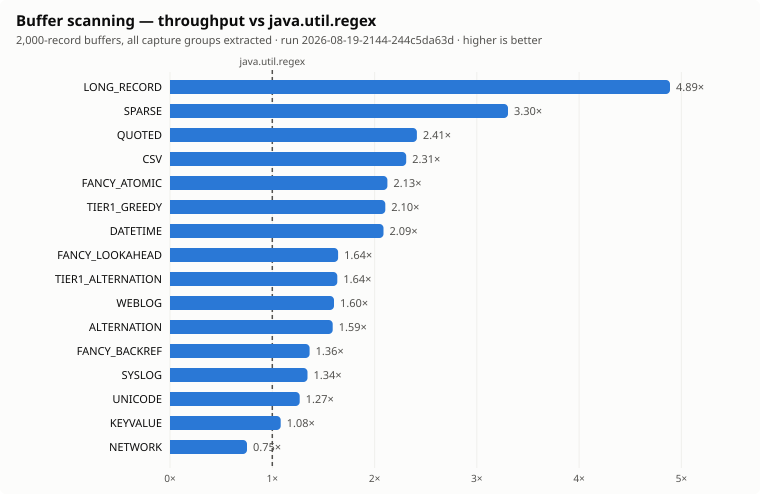

# stroom-shapeshifter

A byte-level parsing and transformation engine.

## Modules

| Module | Contents |
|---|---|
| `stroom-shapeshifter-regex` | Byte-level regex and combinator matching engine |

## Status

A first working slice of the matching engine exists: patterns compile to a byte-level scan
plan and match against `byte[]` with zero-copy capture groups.

```java
final BytePattern pattern = BytePattern.compile("^([^,]+),(\\d+)$");
final ByteMatcher matcher = pattern.matcher();          // one per thread, reusable
if (matcher.find(bytes)) {
    ByteSpan name = matcher.group(1);                   // offsets, not a copy
}
```

Supported now: the whole RE2 subset plus the constructs beyond it, over UTF-8 input, complete
or streaming, on engines chosen automatically. An unambiguous pattern becomes a straight-line
scan plan with no automaton. Anything else runs a tree-walking backtracker first —
`java.util.regex`'s own architecture, rebuilt over bytes, which measured at or ahead of the
JDK across the corpus — with a linear-time Pike VM simulation beneath it as both fallback and
guarantee: whatever the engines give up on, one machine finishes in linear time, so
catastrophic backtracking is unrepresentable rather than merely unlikely. Two further flat
backtrackers stay pinnable as differential witnesses. Results are identical whichever engine
runs — `explain()` reports the engine, and `ambiguities()` says why a pattern needed an
automaton, which is often an authoring mistake worth seeing.

The matching library has **no dependencies** — only the JDK. That is enforced, not hoped:
`verifyZeroDependencies` runs with `check` and fails the build naming any dependency that
appears. Use it anywhere.

The constructs that are not regular — backreferences, lookaround, atomic groups and
possessive quantifiers, `\Q...\E` and `\G` — compile natively; writing `\1` is the opt-in.
For those patterns the linear-time guarantee is exchanged for a step budget: a pathological
pattern-input pair raises `MatchLimitException` after bounded work instead of hanging a
pipeline. This closes the capability gap with `java.util.regex` without a delegated second
dialect, and with the same Rust-style spellings throughout — Rust's own `regex` crate has no
backreferences at all, so the fancy layer follows `fancy-regex`, its ecosystem's answer.

Character classes are compiled through UTF-8, so `.` and `[a-zé]` match whole characters and a
span never splits one, while ASCII-only classes and unbounded scans keep a byte-level fast path.
A match never begins inside a character, not even an empty one.

The dialect follows Rust's `regex` rather than Perl's inheritance: `$` is the end of the input,
`\w \d \s \b` are Unicode unless `(?-u)` says otherwise, `\p{...}` means Unicode properties
and the ASCII POSIX classes are spelt `[[:alpha:]]`. Rust's own warts are declined, and both the
choices and the refusals are listed in [design/01-regex-language.md](design/01-regex-language.md)
§2.4. Rust's test corpus runs as part of the suite, and Oniguruma's UTF-8 suite covers the
fancy tier — a backtracking engine's own corpus, dense in exactly the constructs the Rust one
deliberately has none of.

Also built: streaming (`StreamMatcher`, and a three-way `MATCH`/`NO_MATCH`/`NEED_MORE_INPUT`
outcome so a partial window is never mistaken for a decided one) and the combinator layer
(`comb.Matchers`), which flattens to the same plans as the equivalent regex.

Not yet built: encodings other than UTF-8 and the `transcode` stage. (A delegated
`java.util.regex` dialect was once planned and is deliberately gone — D27 made it unnecessary.)
A pattern outside the dialect is rejected with the reason — never matched approximately.

## Design

The design drafts, the decisions and the measurements:

- [00-decisions.md](design/00-decisions.md) — decision log, with consequences.
- [01-regex-language.md](design/01-regex-language.md) — the matching language: RE2-style
  regex dialect, encoding-aware character classes, atoms and nom-style combinators.
- [02-engine-design.md](design/02-engine-design.md) — engine architecture: the encoding
  compiler, the one-pass scan plan and Pike VM execution tiers, streaming, and the test
  strategy.
- [03-baseline-results.md](design/03-baseline-results.md) — JMH measurements taken before any
  engine code, confirming one design assumption and refuting two.
- [04-corpus-analysis.md](design/04-corpus-analysis.md) — which execution tier real DS3
  patterns would land on, and why.
- [05-engine-benchmarks.md](design/05-engine-benchmarks.md) — the engine measured against
  `java.util.regex` on realistic patterns, what the pattern corpora cover, and every
  divergence found so far.
- [06-performance-plan.md](design/06-performance-plan.md) — the performance work and its
  standing, the per-tier audit record, and the method notes; future sessions start here.

Prior art for both: the Rust `ds-rs`/shapeshifter prototype, and Stroom's existing DS3
implementation at `stroom-pipeline/src/main/java/stroom/pipeline/xml/converter/ds3/`.

## Benchmarks

```
./gradlew :stroom-shapeshifter:stroom-shapeshifter-regex:jmh
./gradlew :stroom-shapeshifter:stroom-shapeshifter-regex:jmh --args='.*PatternCorpus.*'
./gradlew :stroom-shapeshifter:stroom-shapeshifter-regex:jmh --args='-prof gc'
```

Two benchmarks measure different things and neither is the headline alone: `CorpusBenchmark`
runs sixteen workloads over 2,000-record buffers, measuring sustained scanning across every
engine and shape — including a never-matching workload, two-kilobyte records, accented text
and the fancy constructs; `PatternCorpusBenchmark` runs all 114 corpus patterns (every one of
them accepted) over short inputs, measuring per-match overhead at the engine mix a real
configuration would have, plus the whole corpus in one JVM.

### Where it stands

Against `java.util.regex` reading the same bytes, same run, best engine chosen automatically —
**ahead on 29 of 30 measured variants**, every per-match category included; the one sub-parity
line (buffer `NETWORK`) measures at parity in controlled fork-per-side comparison and is a
documented harness artifact ([06-performance-plan.md](design/06-performance-plan.md)).

<picture>
  <source media="(prefers-color-scheme: dark)" srcset="design/benchmarks/charts/buffer-dark.svg">
  
</picture>

<picture>
  <source media="(prefers-color-scheme: dark)" srcset="design/benchmarks/charts/permatch-dark.svg">
  
</picture>

The charts are rendered from the checked-in runs by `tools/render-scoreboard.py`, the same
rule as the tables: a number in this file can always be traced to the run that produced it.

Every run records its full results to [design/benchmarks](design/benchmarks), named by date and
commit, and `tools/render-benchmark.py` renders one run as a table or compares two — marking any
difference whose error bars overlap as indistinguishable. Both exist because of
[D21](design/00-decisions.md): a single-fork harness moved 25% between runs of the same binary,
and a number nobody can re-find cannot be compared with the next one.

## Re-taking the Rust `regex` corpus

The converted cases are checked in under `src/test/resources/rust-regex/`. To refresh them:

```
git clone --depth 1 https://github.com/rust-lang/regex /tmp/regex
stroom-shapeshifter/tools/convert-rust-corpus.py /tmp/regex/testdata \
    stroom-shapeshifter/stroom-shapeshifter-regex/src/test/resources/rust-regex
```

## Pattern corpus analysis

Classifies DS3 regex patterns by the execution tier they would compile to. Defaults to this
repository; point it at a content export for a representative answer.

```
./gradlew :stroom-shapeshifter:stroom-shapeshifter-regex:test \
    --tests '*CorpusAnalysisTest*' --rerun-tasks -i \
    -Dshapeshifter.corpus.dir=/path/to/content
```
