# Design 01 — Intelligence in the pipeline: a supervised stage, not an external controller

*Reframed 2026-09-11 from `full-design.md` (v0.4, May 2026). That document describes two components,
Shapeshifter Intelligence and Shapeshifter Engine. This design keeps only Intelligence, drops the
Engine entirely, and re-targets the whole mechanism at Stroom's existing Data Splitter and XSLT.*

*Twelve questions were put to the owner over two rounds on 2026-09-11 and ruled the same day, and a
further ruling on the regression set (A18) followed on 2026-09-14; §13 lists them. Two were ruled
against the recommendation — promotion is automatic (A9), and AI writes
extraction configs as well as transforms (A8) — and the sections below say what each of those
obliges in return. The design was then checked against the repository's own DS3 and translation test
corpus and against the event schema; §2.1 and §8 carry what that found, including one finding that
changes the scoring model outright. The extraction half of the §9 evaluation was built and first run
on 2026-09-16; §9.1 records what it found, including one proposed ruling (A19). The policy document
type was built the same day, and building it showed the routing table's unit of selection was a
hand-rolled copy of `PipelineData`; A20 proposes making a variant a pipeline fragment instead, and
A21 follows from it: an attempt becomes a dialogue that settles the fragment's shape before asking
for any document. A22 asks what selects a branch and answers: an expression over the stream's
metadata, as receive rules already do, with the content-derived shape as one field among them. On
2026-09-17 the owner added three: a model that occasionally judges single records for honesty
(A23), what perpetual failure looks like (A24), and a per-policy human-review mode (A25).*

The source design puts Intelligence outside Stroom: its own database, its own UI, its own
configuration, reaching into the pipeline to take data and hand it back. That was the right shape
when Intelligence drove a separate engine. It is the wrong shape now. Everything Intelligence wants
to do — run a transform, capture what it produced, judge it, run it again differently — Stroom
already does, in the pipeline stepper, for a human sitting at a screen. This design makes that
machinery headless and puts the loop where the data already is.

---

## 1. What this design keeps and what it discards

| From the source design | Status | Why |
|---|---|---|
| Quality scoring as the foundation | **Kept and substantially revised**, §8 | Re-based on Stroom's existing validators. The event schema turns out to contain a reward hack that the source design's scoring model would walk straight into. |
| The score → improve → rescore loop | **Kept**, §4, §6 | This is the whole idea. It gains a replay unit, two execution modes and a held-out validation set. |
| Phased transformation | **Kept**, §3 | Generalised: a phase becomes a *supervised stage*, and a pipeline may hold several. |
| Processor selection from feed attributes | **Kept**, §3, §7 | Promoted from name-matching to an explicit, versioned routing table. |
| Circuit breaker, retry limits, rate limiting | **Kept and load-bearing**, §11 | Ruled A9, promotion is automatic, so these stop being prudence and become the only control. |
| Immutable versioning of configurations | **Kept and hardened**, §7 | Becomes append-only *variants*, because Stroom documents have no readable version history. |
| AI mode per phase (automatic / assisted / disabled) | **Reduced to automatic / disabled**, §7 | Ruled A9. There is no human-approval mode; the guards in §7.4 replace it. |
| Shapeshifter Engine, node graph, visual editor | **Discarded** | Out of scope by instruction. The subject is DS3 and XSLT. |
| Pattern library | **Discarded** | An Engine feature. |
| Intelligence's own central database and UI | **Discarded**, §3 | Ruled A3: configuration is a Stroom document type. Duplicating permissions, import/export and audit outside Stroom content management buys nothing and costs all three. |
| "Replaces the Data Splitter + XSLT pair with one step" | **Inverted** | This design *supervises* that pair rather than replacing it. |
| AI writes to the visual editor | **Replaced**, §10 | AI writes DS3 XML and XSLT text, validated before use. |

The source design's three architectural claims that survive unchanged are worth stating plainly,
because everything below serves them: AI configures the engine rather than running the transforms;
the system must work with AI switched off; and the vast majority of data must never touch AI at all.

---

## 2. Where it stands

The central finding is that Stroom already contains almost all of the required machinery, built for
the interactive pipeline stepper, and that none of it is reachable from a running pipeline. The gap
is smaller than the source design assumes, but it is in an awkward place.

| Capability needed | What already exists | Where |
|---|---|---|
| Run a pipeline without committing output | `PipelineFactory.create(data, terminator, controller, stopAfter)` replaces **every** `DestinationProvider` with an `OutputRecorder` when a controller is present | `factory/PipelineFactory.java:115`, `insertRecorder` ~`:655` |
| Run an *unsaved* XSLT or DS3 config | `SupportsCodeInjection.setInjectedCode(...)`, fed from `PipelineStepRequest.getCode()` keyed by element id | `SupportsCodeInjection.java:23`; injection at `PipelineFactory.java:403-412` |
| Capture output in memory | `OutputRecorder` (bytes), `SAXEventRecorder` (replayable Saxon TinyTree), `TestAppender` (caller-supplied stream) | `writer/OutputRecorder.java:32`, `filter/SAXEventRecorder.java:51` |
| Re-run one interior element over stored upstream events | `PipelineFactory.createFrom(...)` with `MidPipelineScope.ELEMENT_ONLY` / `ELEMENT_AND_DESCENDANTS`, driven by `ReprocessDriver` | `PipelineFactory.java:187-280`, `stepping/capture/ReprocessDriver.java:88` |
| Keep several candidate results side by side | `ElementFingerprinter` content-addresses captured IO by the element's effective config | `stepping/fingerprint/ElementFingerprinter.java:70` |
| Spill intermediate results to disk | `StepDataStore`, `{temp}/{session}/{metaId}/{part}/{elementId}/{fingerprint}.dat` | `stepping/store/StepDataStore.java:67` |
| Nested pipeline inside a running pipeline | Reference data loading already does it, synchronously, via a child task context | `refdata/ReferenceData.java:616` → `ReferenceDataLoadTaskHandler.java:186` |
| Recompile when a config changes | Parser and XSLT pool keys are the **whole document**, so a rewritten config self-invalidates; `usePool=false` bypasses the pool | `cache/AbstractPoolCache.java:42-140`, `XsltDoc.java:105-122` |
| Select a config at runtime by feed | `namePattern` / `xsltNamePattern` with `${feed}` substitution | `filter/PipelineDocFinder.java:50-153` |
| Drop records that errored | `RecordOutputFilter` buffers each record and discards any that raised ERROR or FATAL | `filter/RecordOutputFilter.java:38` |
| Validate **per record** against a schema | `SchemaFilterSplit` wraps `SchemaFilter` so errors are reported per top-level element | `filter/SchemaFilterSplit.java:73-74` |
| Business-rule signalling from a transform | `<xsl:message>` with a severity element name is already an error channel | `filter/XsltFilter.java:361-420` |
| Per-stream quality counters | `RecordCount`, `ErrorStatistics` | `state/RecordCount.java`, `errorhandler/ErrorStatistics.java:23-49` |
| Call an LLM | `AiService.chat(DocRef, String systemPrompt, String message)`; models are documents with a configurable `baseUrl` | `stroom-ai-api/.../AiService.java:67`, `OpenAIModelDoc.java:55-109` |

Two things are absent, and both shape the design.

**Code injection is gated on stepping.** `PipelineFactory.setProperty` consults the injected-code map
only when a `SteppingController` is present. There is no headless route to "run this element with
that configuration". This is the single change on which the whole design rests; §12 lists it first.

**Stroom documents have no readable history.** `AbstractDoc` carries a `version` UUID and
`DBPersistence` does a genuine `UPDATE ... WHERE version = ?` with `DataChangedException` on a stale
write, so optimistic locking is real and free. But there is no diff and no revert. The
`doc_data_snapshot` tables *do* store a content-deduplicated copy of every asset on every write;
nothing reads them back. Section 7 declines to build on that substrate and explains why.

### 2.1 The corpus, and what it can settle

The repository already contains paired configurations, inputs and expected outputs for both stages.
This is the material against which every threshold in this design will eventually be set, and §9
argues it is also the material that can test the design's central premise before anything is built.

| Corpus | Contents | Use |
|---|---|---|
| `stroom-pipeline/src/test/resources/TestDS3/` | 19 cases as `.ds3.xml` + `.in` + `.out.xml` triples; four `_FAIL` cases add `.err`. Harness `TestDS3.java` discovers stems by globbing and diffs against the golden. | Extraction-stage ground truth |
| `stroom-shapeshifter-engine/src/test/resources/fixtures/legacy/` | The same 19 plus `020_escaped_values`, `021_trimmed_values`, `022_empty_input`, each with a `.messages` file of normalised diagnostics | Extraction-stage ground truth, with error text |
| `stroom-core/src/test/resources/samples/config` | 50 Pipelines, 27 XSLTs, 6 TextConverters, 51 Feeds, serialised as content | Transformation-stage ground truth |
| `samples/input/*.in`, `samples/output/*.out` | 80 inputs, 79 goldens, matched by feed name | End-to-end ground truth |
| `stroom-app/.../TranslationTest.java` | Imports the whole sample config, creates a processor filter per pipeline, runs every feed, diffs against goldens **and** validates against the schema | The ready-made harness |

What the corpus covers, and does not: CSV headed and unheaded, quoted CSV, pipe-delimited
single-line, regex-captured fixed-shape lines, multi-line block records, `key=value` (Linux auditd),
application log lines, single-column, and nested list-in-field. There is **no syslog case, no true
fixed-width case and no JSON case** among the DS3 tests, despite those being the formats most often
cited as the target. Inputs run from 43 B to 2 KB and yield **2–9 records**; sample XSLTs are 19–129
lines against the "thousands of lines" the source design describes for real translations.

The consequence is a sharp division. The corpus is sufficient to validate *mechanism* — can a model
reconstruct a working config, do the scorers rank good output above bad. It is nowhere near
sufficient to set *thresholds*: at 2–9 records per case, a yield-based scorer has almost no
resolution, and no DS3 case is large enough to exercise sampling, streaming or cost. Every number in
an implementation must therefore be a configured default with a recorded justification, and the
thresholds remain open until real feeds arrive.

**Both schemas are external.** The event schema arrives via the downloaded
`event-logging-xml-schemas` content pack, and `data-splitter-v3.0` via `core-xml-schemas`. Neither is
checked in. The compile gate of §8.1 and the schema scorer of §8.2 both depend on those packs being
installed, which makes content-pack availability a deployment prerequisite of the feature rather
than an incidental detail.

---

## 3. The shape

Five pieces. Nothing here is an external service; all of it is Stroom content and Stroom pipeline
elements.

```mermaid
flowchart TB
    subgraph Pipeline["A Stroom pipeline"]
        Src["Source"] --> S1["Supervisor\n(extraction stage)"]
        S1 --> S2["Supervisor\n(transformation stage)"]
        S2 --> Good["Schema XML\n→ downstream"]
        S2 -.->|"quarantined"| Bad["Quarantine\nappender"]
    end

    subgraph Content["Stroom content"]
        Policy["AI Transform Policy\n(new doc type)"]
        Routing["Routing table\n(in the policy doc)"]
        Variants["Transform variants\n(pipeline fragments)"]
    end

    Scoring["Scoring service"]
    AI["stroom-ai\nAiService"]

    S1 -.-> Policy
    S2 -.-> Policy
    Policy --> Routing
    Routing --> Variants
    S1 <--> Scoring
    S2 <--> Scoring
    S1 -.->|"on failure"| AI
    S2 -.->|"on failure"| AI

    style S1 fill:#223355,stroke:#4477aa
    style S2 fill:#223355,stroke:#4477aa
    style AI fill:#3a2255,stroke:#7744aa
    style Bad fill:#553333,stroke:#aa5555
    style Good fill:#225533,stroke:#44aa77
```



**A transform variant** is the unit of selection: a **pipeline fragment** — an ordinary Pipeline
document whose element chain starts at the implicit `Source` and ends at a filter, with no writer or
destination. `Source → DSParser(tc-syslog)` is a variant. `Source → XSLTFilter(xslt-syslog-v3)` is a
variant. `Source → DSParser(tc-syslog) → XSLTFilter(xslt-syslog-v3)` is also one. This single
abstraction covers every case asked for: switching between JSON, XML and DS3 parsing is a stage whose
candidates are fragments containing a `JSONParser`, an `XMLParser` or a `DSParser`; supervising XSLT
alone is a stage of single-filter fragments; combining the two is a stage whose fragments hold both.
A variant is not a new document type — it is a `DocRef` to a Pipeline in the routing table.

The first cut of the policy document encoded a variant as an ordered list of `(element type,
configuration DocRef)` pairs. That is a poorer copy of `PipelineData`, which already expresses
elements, their properties and the links between them, and which the supervisor was going to
synthesise anyway. A fragment is strictly more expressive — several filters, element properties such
as splitter options or XSLT parameters, a `RecordOutputFilter` to drop bad records — and it is
something an operator can open in the pipeline editor, step, and diff against the variant it
replaced. Its dependencies on the configuration documents it references are remapped on import by the
pipeline store, so the policy depends only on its model and on fragments. `parentPipeline` gives a
fragment a template to inherit from, so a structural change common to every variant of a stage is
made once, in the template. The supervisor must reject a fragment that contains a destination.

**Ruling A10.** *The variant model is generic over element types. The initial set is `DSParser`,
`XSLTFilter`, `JSONParser` and `XMLParser`. Shapeshifter documents are deliberately not in the
initial set but require no structural change to add: `ShapeshifterParser` and `ShapeshifterFilter`
already implement `SupportsCodeInjection`, which is the only hook the supervisor needs.*

**Proposed ruling A20.** *A variant is a pipeline fragment: a Pipeline document with no destination,
referenced from the routing table by `DocRef`. This takes A10 to its conclusion — a fragment is
generic over every element, so A10's initial set becomes a statement about what the AI is asked to
write rather than about what the routing table can hold.*

**The supervisor element** is one new pipeline element, parameterised entirely by its policy. It
takes its input, runs a variant as a nested sub-pipeline, captures the output, scores it, and decides
what to do next. It builds the nested pipeline by merging the fragment's `PipelineData` with its own
capture filter at the tail — the same substitution the stepper makes — and runs it inside a child task
context, exactly as reference data loading already does.

**The policy document** is the new Stroom document type (ruled A3). One policy describes one stage:
its replay unit, its candidate pool and how to select from it, its scorers with their weights and
thresholds, its AI instructions, its retry and budget limits, its redaction setting and its execution
mode. Policies are ordinary content: permissioned, importable, exportable. Because a policy is
referenced by a pipeline element property, the same policy can be shared by many pipelines, which is
what the source design wanted its scoring-profile library for.

**The routing table** maps a selector to a variant. As first drawn, a selector was `(feed, stream
type, record shape signature)` with wildcards, resolved most-specific-first. That uses two of the
stream's metadata fields and ignores the rest, and the rest is often the better signal: a stream
carries an attribute map — the receipt headers `Content-Type`, `Compression`, `System`,
`Environment`, `File` and whatever else the sender set — that `stroom:meta()` already exposes to
XSLT through `MetaDataHolder`. `Content-Type: application/json` names the parser outright, before
a byte has been sniffed; a `System` header separates two senders sharing one feed. Content-derived
shape is the fallback for when the sender said nothing.

**Proposed ruling A22.** *A routing rule's selector is an `ExpressionOperator` over the stream's
metadata — the `MetaFields` and the attribute map — with the record shape signature (§5) as one more
matchable field, evaluated by the `ExpressionMatcher` that receive rules already use at the front
door. Rules are ordered, and order is specificity: the first rule whose expression matches binds the
variant, exactly as `ReceiveDataRule` works, so no most-specific-first resolution has to be invented.
Feed and stream type become expression terms rather than columns.*

It lives inside the policy document, and §7 explains why that placement is what makes
reproducibility tractable. The shape remains the unit of learning, validation and quarantine (§5);
A22 changes only how a selector is written, not what a shape is for. The routing-table editor, when
it comes, is the receive-rules expression editor reused rather than a bespoke one.

Three decisions taken with A22 on 2026-09-16, each the option that keeps the table honest:

- **No matching rule means an unknown shape, and the stage learns.** The table grows by learning;
  there is no catch-all to write and no dispatcher. A rule bound to nothing is a rule the operator
  has reserved, not a fall-through.
- **A learned rule's selector is exactly `Feed AND Type AND Shape Signature`** — the three terms the
  variant was validated on under A14 and A15, and nothing wider. Adding the headers seen on the
  learning stream would be narrower still but brittle: one sender omitting a header is a new shape
  and a new call. Binding on shape alone would let a promotion on one feed apply to another that
  §7.4 never validated. Operators widen a learned rule by hand.
- **The shape question sees an allow-list of headers, not the attribute map.** `Format`, `Schema`,
  `Compression`, `System`, `Environment` and `RemoteFile` say what the data is and where it came from;
  sender-set headers are excluded because they carry hostnames, paths and tokens. Header values go
  through the same A17 redaction as the sample. `RoutingRule.learnedSelector` and `Sample` carry
  the first two of these; the third waits on redaction being built.

The routing table has its editor: a Routing tab on the policy, built the same day, that is the
receive-rules screen re-pointed — an ordered grid (selector, fragment as an openable document link,
score, promotion time, pin) with add/edit/copy/delete/move, and an edit dialog holding the standard
expression editor over `RoutingFields` and the standard document picker. The picker cannot tell a
fragment from a full pipeline, so the policy store refuses to save a rule whose pipeline, merged
across its inheritance stack, contains a writer or destination, naming the element. The scorer set
has the same treatment on a Scoring tab: one row per scorer with its weight, threshold, gate flag and
parameters (§8.4), each scorer at most once. The rest of the policy is split by what it governs:
Settings (replay unit, execution mode, AI mode), Learning (model, allowed elements, instructions,
attempts, budgets, redaction) and Promotion (floor, held-out fraction, minimum records, regression
set) — six tabs, plus Documentation and Permissions, each a plain form.

**The scoring service** is an SPI with built-in scorers wrapping validators Stroom already has; §8.

---

## 4. The replay unit

*Ruled A1.*

A loop needs to run the same input more than once. A pipeline element does not get that for free: it
receives SAX events pushed at it, once. This constraint decides the design's structure, and the
answer differs by stage.

The ruling is that scoring and transformation are **per record wherever records exist**, because
quality is not measurable in aggregate — a stream that is 90% correct and 10% garbage scores the same
as one that is uniformly mediocre, and only the first is fixable. `SchemaFilterSplit` already reports
validation errors per top-level element, so the per-record signal exists without new machinery.
Stages divide into two kinds:

| Stage kind | Replay unit | Where replayed input comes from | Cost of a retry |
|---|---|---|---|
| **Extraction** — raw bytes to records. Nothing has been split, so there is no smaller unit. | The stream, or a bounded prefix | Re-open the source stream from the data store; it is re-readable by construction | Re-runs the split. Bounded by using a probe prefix for selection and the full stream only once a variant is chosen. |
| **Transformation** — records to schema-compliant output | One record | Buffer the record's SAX events; `SAXEventRecorder` already does this and replays as a `ContentHandler` source | One record's work. Trivial. |

So the design does not need to buffer whole streams, and should not.

**Ruling A1.** *Every stage declares its replay unit, `STREAM` or `RECORD`. A `RECORD` stage must be
positioned after a parser, enforced at pipeline build time rather than discovered at run time.*

### 4.1 Extraction learns too, and needs a second signal

The recommendation was that extraction should select among known variants but never invoke AI,
because its only signal is record yield and yield is too weak to steer a model — a splitter that
breaks on the wrong boundary can still produce a plausible count. **Ruled otherwise (A8): AI writes
DS3 configurations at the extraction stage.**

That ruling is workable, but only with a signal stronger than yield, because the failure it invites
is specific and silent: a configuration that produces a believable number of records by quietly
discarding everything it could not match. DS3 will do this happily — `ignoreErrors` exists precisely
to permit it, and test cases 011 and 012 exercise it.

**Ruling A11.** *Extraction scoring is record yield **and input coverage** — the proportion of input
bytes and lines actually consumed by the split. A configuration that matches half the input and
discards the rest scores as the half-failure it is. Coverage is the primary guard against the
dominant failure mode of a generated splitter, and it is cheap: the parser already knows its
position.*

The asymmetry between the stages remains and should shape their AI instructions. At stage two the
system knows precisely what is wrong, because a strict schema says so per record. At stage one it
knows only how much it consumed and how many records fell out. Extraction prompts should therefore
lean on worked examples — the corpus in §2.1 is exactly that — rather than on diagnostics.

---

## 5. Record shapes and the quarantine

A record that has defeated the system must not defeat it again, at cost, every time a record of the
same shape arrives in a later stream.

**A shape signature** is a hash of a record's structure with its values removed. For a transformation
stage it is the element and attribute skeleton — names and nesting, no text. For an extraction stage,
operating on raw text, it is the token-class skeleton of a line: runs of digits, letters, punctuation
and whitespace reduced to classes, so two syslog lines differing only in hostname and timestamp share
a signature. Signatures are cheap, stable under value variation and sensitive to structural
variation, which is the discrimination wanted. The exact normalisation is unsettled (A6).

Shapes drive four things:

1. **Routing.** A variant can be bound to a shape, not just a feed or a header (A22). One feed
   carrying five kinds of record is handled by five transforms without anyone writing a dispatcher.
2. **Learning economy.** The AI is consulted about a *shape*, once, not about every record having it.
   The first record of a new shape may cost a call; the ten million after it cost nothing. This is
   how "minimal AI usage" is achieved rather than merely asserted.
3. **Validation.** A shape is the unit over which the held-out split of §7.4 is taken.
4. **Quarantine.** A shape that has exhausted its retry budget is recorded as given-up for that
   `(feed, stage)`. Later records of that shape skip the loop and are emitted as sentinels without
   consulting AI. The record is a ledger of inputs, not a store of records; §5.2 says why.

### 5.1 Where the sentinel comes from

The instruction suggested the final AI attempt should produce a transform emitting a `<BAD_RECORD>`
output. The instinct is right — the give-up outcome must be durable, surviving into future streams
without re-deciding — but the mechanism should be inverted, for two reasons.

**The sentinel must not depend on the AI.** If the give-up path is AI-authored, the one path that
exists specifically to handle "the AI could not do this" is written by the thing that could not do
it. A malformed give-up template is unfixable by the mechanism that produced it. The supervisor knows
the record failed, its shape, the attempt count and the scoring detail, and can emit a sentinel
deterministically and identically across every feed, stage and model.

**The sentinel must not enter the main output.** A `<BAD_RECORD>` element is not valid against the
event schema — §8.2 shows how strict that schema is. Putting it in the main output means either the
downstream validator rejects the stream or validation is relaxed, and relaxing it to accommodate
known-bad data destroys the signal everything else depends on.

**Ruling A4.** *The supervisor emits the sentinel, not the AI. Quarantined and exhausted records fork
to a separate quarantine branch carrying the raw record, its shape signature, every attempt's score,
and the reason for give-up. The main branch receives only records that passed.*

This turns "flag for manual review" — a phrase in the source design with no mechanism behind it —
into queryable data, and gives the dashboard its most useful view for free: the quarantine stream
grouped by shape, ordered by how much data each shape is costing.

### 5.2 Leaving the quarantine

**Ruling A12.** *Promoting a variant whose selector covers a quarantined shape automatically triggers
reprocessing of the quarantined records for that shape. Recovery does not depend on anyone
remembering to go back for it.*

Two consequences to handle in implementation. Reprocessing must be idempotent with respect to
downstream output — records carry their source stream and record index, and the reprocessed output
supersedes rather than duplicates. And the reprocessing load is bursty by nature, since a single
promotion can release a large backlog; it belongs on the normal processing queue at low priority, not
executed inline at promotion time.

**Nothing is held.** Read literally, "quarantined records" and "release" suggest a place where
records wait. There is none, and there cannot be: a processing task on a node ends in output, an
error stream, or output with errors, and a cluster has no parked state between them. What there is
instead is Stroom's own idiom — the input stream stays in the store, and processing it again
replaces what it produced. `MetaService.findReprocess` finds inputs by criteria over their outputs,
and `AbstractProcessorTaskExecutor.deleteDuplicateOutput` marks the earlier output of the same input
and pipeline deleted when a reprocess task runs, which is the idempotency the paragraph above asks
for, already built.

So the quarantine is a **ledger**, not a store: which input streams, and which record ranges within
them, were emitted as sentinels for which `(feed, stage, shape)`, and why. A stream of a given-up
shape produces an error stream saying so — one `ERROR` per input stream, or per record range where
the shape is one of several, naming the shape and the reason — and the ledger records it. A12's
release is then the creation of a reprocess filter for the inputs the ledger names; Stroom does the
rest. The same mechanism serves review mode (A25): a draft's error names the draft rule and its
fragment, and a reviewer sees what the draft would produce by stepping the fragment against the
erroring stream — real input, no copy — before approving. Holding the draft's *output* in a review
feed or a review stream type was considered and set aside on 2026-09-17: the first duplicates data
under a second retention and permission regime for a view the stepper already gives, and the second
needs a re-typing of streams that Stroom does not have and downstream processors keyed on type
would not survive.

---

## 6. Inline and deferred learning

An LLM call takes seconds to minutes, and the instruction places it inside a processing task, holding
a task slot and a volume handle while it waits. Stroom's AI service has no timeout beyond the model
document's HTTP configuration (defaulting to ten minutes), no retry policy, no rate limiting and no
concurrency ceiling. A feed producing unfamiliar records at volume would convert a processing queue
into a queue blocked on an HTTP endpoint.

The original draft ruled deferred learning the default on exactly that reasoning. **Ruling A13
(on-premises hosting) weakens it.** With an OpenAI-compatible endpoint inside the deployment, the
latency argument is much reduced, and inline learning — which fixes the current stream rather than
the next one — becomes genuinely attractive.

| | **Inline** | **Deferred** |
|---|---|---|
| On failure | Call AI, apply, rescore, loop to the retry limit, then emit | Quarantine, emit the sentinel, raise a learning request, continue |
| Latency impact | Task blocks for the loop | None |
| When a fix takes effect | Immediately, for the current stream | For later streams; quarantined data reprocessed per A12 |
| Correct for | On-premises model, backfills, onboarding, moderate volume | Hosted endpoints, high volume, any model outside the deployment |

**Ruling A5 (revised, and owed confirmation).** *Inline is permitted as the default **only** where the
configured model is on-premises and the stage carries a wall-clock budget for the whole loop. Any
stage pointing at an endpoint outside the deployment is deferred, without exception. The budget is
mandatory in both modes: exceeding it quarantines the record and converts the remaining attempts into
a deferred learning request, so the loop degrades rather than blocks.*

This revision follows from A13, which was ruled after the original deferred-by-default position was
written. It should be confirmed rather than assumed.

---

## 7. Reproducibility

*The approach below was proposed in response to the owner's question about whether improvements
break already-processed streams, and accepted.*

### 7.1 The problem is not new, and that is the clue

Stroom has this property today. An operator edits an XSLT; every stream reprocessed afterwards
produces different output than before. Nothing records which stylesheet processed which stream. The
pipeline references the XSLT by `DocRef`, the `DocRef` is stable, and the content behind it is
mutable. Reprocessing has never been reproducible.

This design does not introduce the problem; it changes its *frequency*, from a rare deliberate human
act to an automatic and continuous one, and that is what makes the existing situation intolerable
rather than untidy. The right response is not a special mechanism for AI-authored changes but to fix
the underlying gap in a way that happens to make them safe.

### 7.2 Rejected alternatives

**Build version history on the snapshot tables.** `doc_data_snapshot` already holds every version of
every document's content, deduplicated, linked to the audit row that wrote it. A read API would give
Stroom real history, diff and revert. This is the most valuable item on the list and the one most
worth existing — but it is a change to Stroom's content foundations, it benefits far more than this
feature, and making this design depend on it would make this design hostage to it (A7).

**Branch the pipeline.** Give each variant its own pipeline document and route streams to pipelines.
Coherent, and what the question anticipated. Rejected because what varies is not the pipeline's
*structure* — the element graph is identical across variants — but which configuration document one
element resolves. Branching pipelines to express that multiplies the structural definition by the
number of behavioural variants, so every genuine structural change must then be applied N times.
Stroom's own `xsltNamePattern` makes the opposite choice, varying the document and not the pipeline,
and makes it correctly. This rejection stands for the *production* pipeline, which stays single and
holds the supervisor element. A20 branches only the supervised segment, as a fragment, and the
fragment's `parentPipeline` is what keeps a common structural change to one edit.

### 7.3 The model

Three rules, and one does all the work.

1. **Never mutate a configuration document that has processed data.** An improvement creates a *new
   document* — a sibling, not a new version. Because the document is new its `DocRef` is new, so any
   stream that recorded the old `DocRef` still points at content that has not changed and cannot.
   This sidesteps the absence of version history: Stroom cannot give us "version 3 of document X",
   but it can give us document X3, and for this purpose they are the same thing.
2. **The routing table is the only mutable part.** Improvement is expressed by rebinding a selector
   to a newer variant, never by editing content. The routing table is small, is a single document,
   and is the natural home for effective-dating, score history and pinning.
3. **Every output stream records the bindings that produced it** — the selector that matched, the
   fragment's `DocRef` and `version` UUID and those of every configuration document it references,
   the policy and its version, the scores and the attempt count — in the output stream's metadata.

Reprocessing then becomes a choice rather than an accident:

- **As-processed** — read the recorded bindings and use exactly those documents. Rule 1 guarantees
  the content is immutable, so the result is identical to the original. This is what an audit needs.
- **As-current** — resolve the selector against today's routing table. This is what "we fixed it,
  reprocess the backlog" needs, and the mode in which A12's quarantine release runs.

The reprocessing request says which. That is the whole answer, and it costs one field in the routing
table, one metadata block on output streams, and a discipline about not mutating documents.

### 7.4 The promotion gate

**Ruled A9: promotion is automatic whenever the score improves — there is no human approval step.**
The recommendation was a human gate with per-feed opt-in to automation; the ruling went the other
way, which is defensible but transfers the entire burden of safety onto what "improves" means. Five
conditions, all required:

1. **Held-out validation (A14).** The score that decides promotion is measured on records of the
   shape that the model **was not shown**. Without this, the cheapest way to satisfy any scorer is a
   transform that handles exactly the examples in the prompt, and a gradient-following process will
   find it. Where a shape has too few records to split, promotion waits for more rather than
   proceeding on the training set.
2. **An absolute floor (A15).** The candidate must clear a configured minimum, not merely beat a poor
   incumbent. Without it a feed that starts badly ratchets upward forever without becoming correct.
3. **No regression (A15).** The candidate must not score worse than the incumbent on the same
   held-out records. Without it an "improvement" can silently downgrade a feed that was already good.
4. **Anti-degeneracy (A16).** The candidate must not have gamed the schema; §8.3. This is a
   promotion condition and not merely a scorer, because the degenerate output is *schema-valid* and
   would otherwise pass every other test here.
5. **Cumulative regression (A18).** The candidate must not score lower than the recorded score on
   any input the selector has previously been promoted against. Condition 3 compares against the
   incumbent on *today's* held-out sample only, so a candidate that fixes shape X can silently break
   shape Y that was fixed three promotions ago and is absent from the current sample. This condition
   closes that gap by making the regression check cumulative over the selector's whole history.

**The regression set.** Every promotion appends the records it was validated on — input, the
promoted variant's output, the per-record scores, and the bindings — to a **regression stream** for
the selector, capped per shape. Three properties are deliberate:

- *Score-not-lower, not byte-equal.* The stored output cleared the floor; it is not a golden. A
  better variant will legitimately produce *different* output, so a byte diff against it is the wrong
  test. The candidate is re-scored on the stored inputs and must not fall below the stored score; the
  diff is kept as an informational signal, not a gate.
- *A stream, not part of the policy document.* A stream per selector gets retention, permissions and
  search for free and keeps the policy document small. It is also the natural mirror of the
  quarantine stream in §5: quarantine records what the selector cannot yet do, the regression stream
  records what it must keep doing.
- *It is the harness of §9, made permanent.* The regression set has exactly the `(input, expected
  output)` shape of `TestDS3` and `TranslationTest`, so the same inverted-corpus harness runs it, and
  the corpus of accepted behaviour grows with every promotion rather than being fixed at whatever the
  repository shipped with.

**Ruling A18.** *Every promotion appends its validation records to a per-selector regression stream.
A candidate is promoted only if its score on the full regression stream is not lower than the
recorded score for any record in it. The stream is capped per shape and carries the feed's data
classification; its retention is a policy setting, not the source stream's.*

Because no human sees the change, the circuit breaker in §11 is not prudence but the control itself:
consecutive-failure detection, score-regression rejection, rate limiting, spend limiting, and a
global off switch. Every promotion is an audited event recording the before and after documents, the
held-out scores and the model that produced it.

### 7.5 The cost, stated honestly

Append-only produces a lot of documents: a feed with thirty shapes each improved four times is a
hundred and twenty XSLT documents and, under A20, as many fragments, and the explorer is not designed
for that. Mitigations: variants
live in a dedicated folder per feed, hidden from the default explorer view, and the routing table is
the UI through which they are actually browsed. This is real work, but it is bounded and
presentational, where the alternatives are architectural.

---

## 8. Scoring

The source design lists five scoring factors. All map onto machinery that exists; the contribution
here is to run them in a harness that *collects* judgements instead of failing the stream, and to add
two the source design lacks — one because extraction now learns (A11), and one because the event
schema turns out to be gameable.

### 8.1 The compile gate is attempt zero

Before a candidate runs it must compile: Saxon must accept the XSLT, and a DS3 configuration must
pass the `data-splitter-v3.0` schema that `DS3ParserFactory` already validates against — the
corpus's case 008 is exactly a deliberately malformed config failing at configure time. Both paths
capture diagnostics in a `StoredErrorReceiver` and replay them, so the failure is available as text.
A candidate that does not compile scores zero and never runs, and its diagnostics are the
highest-value feedback the model can receive, because they say exactly what is wrong rather than
merely that something is.

### 8.2 The schema is a strong signal

Checked against `event-logging-v3.0.0.xsd`: 3,178 lines, 195 complex types, 128 enumerations.
Effectively everything is `xs:sequence`, so **element order is enforced**. There is exactly one
wildcard in the whole schema and it is not reachable from the mandatory event skeleton. Datetimes are
pattern-constrained to millisecond precision with a trailing `Z`; MAC addresses, IP addresses, ports
and email addresses are likewise pattern-bound. `EventTime`, `EventSource` and `EventDetail` are all
mandatory; `System` itself requires `Name` and `Environment`; `EventSource` requires `Generator` and
a choice of `Device`/`Client`/`Server`/`Door`; `EventDetail` requires `TypeId` and one of 22 branches.

A mostly-right event does not validate. Schema conformance therefore deserves heavy weight, and the
realistic failure modes for a model are predictable and worth naming in the prompt: wrong element
order, missing `System` or `Generator` or `Device`, a wrong `EventDetail` branch, a datetime without
milliseconds, and invented enumeration values.

Stroom's validation messages are already post-processed for humans — the `cvc-` prefix stripped and
namespace URIs removed from "One of …" lists, at `SchemaFilter.java:105-120` — yielding text like
`Invalid content was found starting with element 'EventDetail'. One of '{EventSource}' is expected.`
That is usable as model feedback unmodified.

### 8.3 The degeneracy trap

**This is the finding that changes the scoring model.** The last branch of the `EventDetail` choice
is `Unknown` (`event-logging-v3.0.0.xsd:955`), and its content model is `Data*` with `minOccurs="0"`.
So this validates:

```xml
<EventDetail><TypeId>T</TypeId><Unknown/></EventDetail>
```

`Data` — a `Name`/`Value` pair, nestable — is declared in 44 places across the schema and is
available at `Event`, at `EventSource` and inside most detail branches. A transform can therefore
emit the mandatory skeleton, put `Unknown` in the one place a decision was required, dump every
extracted field into untyped `Data` elements, and **score full marks on the strongest scorer while
extracting no meaning whatsoever**.

This is not a hypothetical. It is the cheapest way to satisfy a schema-conformance objective, so it
is what an optimising process finds first — and under A9 a variant that scores well is promoted with
no human looking at it. The source design's scoring model, which treats schema conformance as the
principal signal, would walk directly into it.

**Ruling A16.** *Schema conformance is a gate, not a maximand. A separate extraction-quality scorer
measures how much of the output is typed: the ratio of schema-named elements to `Data` elements, the
proportion of records whose `EventDetail` names a real branch rather than `Unknown`, and coverage of
the fields the policy declares required. `Unknown` is permitted only where the policy explicitly
allows it, and never counts toward a passing score. A candidate failing this check cannot be
promoted regardless of its schema score.*

The schema's own annotations are a useful source of the policy's required-field list — it states, for
instance, that all interactive events must provide the user's Id, a rule the XSD itself does not
enforce because `User` is optional everywhere. Statements like that should be lifted into both the
required-field policy and the model prompt.

### 8.4 The scorer set

| Scorer | Signal | Built on |
|---|---|---|
| Compile | Does it compile or schema-validate as a config at all | Saxon; `data-splitter-v3.0` via `SchemaFilter` |
| Input coverage *(extraction)* | Proportion of input bytes and lines consumed rather than discarded | Parser position; see A11 |
| Yield | Output records per input record or byte, against an expected ratio | `RecordCount`, `RecordCountFilter` |
| Schema conformance | Proportion of records validating, **per record** | `SchemaFilterSplit` wrapping `SchemaFilter` |
| Extraction quality *(anti-degeneracy)* | Typed-element ratio, `Unknown` rate, required-field coverage | XPath over the captured `SAXEventRecorder` tree |
| Business rules | Configured XPath assertions over the record | The same tree; `<xsl:message>` severities from the transform |
| Error load | Errors and fatals per record | `ErrorStatistics.getTotal(Severity)`, `getRecords(Severity)` |
| Event classification | Records assigned a recognised type, and the distribution | XPath over the captured tree |
| AI review *(advisory)* | Does this output faithfully represent this input, judged by a model on a sample of single records | `stroom-ai`; see A23 |

Scores are recorded per record; the stream figure is derived, never primary. `FullPipelineTest`
already demonstrates this shape working — 200 records of which 59 are deliberately invalid, counted
by severity with the bad ones dropped by the record output filter.

Each scorer a policy applies carries a weight, a threshold and a gate flag, and the parameters its
signal needs, which the policy document holds as one class per scorer (`ScorerParameters`, built
2026-09-16 with its editor on the policy's Scoring tab):

| Scorer | Parameters |
|---|---|
| Compile, Input coverage | none |
| Yield | expected ratio; basis — input records, lines or bytes |
| Schema conformance | schema group, `EVENTS` by default |
| Extraction quality | whether `Unknown` is tolerated; the required-field XPaths (both moved here from the policy's general settings, where the first cut had put them) |
| Business rules | named XPath assertions; whether the transform's own `xsl:message` warnings count as failed rules |
| Error load | the severity counted from, `ERROR` by default |
| Event classification | the recognised `TypeId` values; empty means anything but `Unknown` |
| AI review | sample rate (records per thousand), calls per hour, the rubric put to the model; never a gate |

**Proposed ruling A23.** *An AI review scorer samples emitted records, occasionally and
asynchronously, and asks a model whether each output faithfully represents its input — the one
signal the deterministic scorers cannot see: a datetime mapped to the wrong field, a logon that was
a logoff. It is advisory and a trigger, never a gate: a model judging a model's output can be wrong
in the same direction as the transform it judges, so the anti-degeneracy scorer of A16 remains the
safety mechanism. When a shape's rolling review score falls below the scorer's threshold the shape is
marked for relearning, and the judge's critique is the feedback of the next attempt — a fourth
question of the A21 dialogue, `Critique`, which a scripted model answers like any other. Its
findings are written as an audit stream. It is budgeted per hour, separately from learning's
per-attempt budgets, so that honesty-checking and learning cannot starve each other.*

---

## 9. Evaluating the design before building it

The riskiest assumption here is not architectural. It is that a model can write a working DS3
configuration or XSLT from examples at all, and well enough that automatic promotion is safe. The
corpus in §2.1 can answer that now, with no part of this design implemented.

**The inversion.** Each `TestDS3` case is a `(config, input, expected output)` triple. Withhold the
config, give the model the input and the expected output, ask for a configuration, and run it through
the existing `TestDS3` harness. The same inversion works for transformation: the sample content pairs
80 inputs with 79 golden outputs through known XSLTs, and `TranslationTest` already imports the
content, runs every feed and diffs the result. Withholding an XSLT and asking for a replacement is a
few lines of harness change, not a new system.

This yields three things that are otherwise guesswork:

1. **A reconstruction rate per stage.** What proportion of the 19 extraction cases and 27 XSLTs can be
   rebuilt to a clean diff. Ruling A8 put AI at the extraction stage against the recommendation; this
   measures whether that was right, on the cases whose formats the corpus actually covers.
2. **Calibration of the scorers against ground truth.** Every case has a known-good config, so the
   scorers can be checked for the property they must have: a known-good config must score at or near
   the top. A scorer that ranks the shipped, golden-diffing config poorly is broken, and that is
   worth discovering before it gates promotion.
3. **A degeneracy probe.** Hand-write the `Unknown`-and-`Data` transform of §8.3 for one feed and
   confirm the scorer set rejects it. If the anti-degeneracy scorer cannot catch a deliberately
   degenerate transform, it will not catch an accidentally degenerate one.

A fourth use is negative and equally valuable: the corpus's four `_FAIL` cases, plus the `.messages`
files in the shapeshifter fixtures, give real diagnostic text for the feedback loop, so the prompt's
error-reporting format can be designed against real messages rather than imagined ones.

What this cannot settle is thresholds. At 2–9 records per case the yield scorer barely resolves, and
no case is large enough to exercise sampling or cost. Those wait for real feeds.

### 9.1 The harness, and what its first run found

The extraction half of this section exists, in `stroom-shapeshifter-ai`, and was first run on
2026-09-16. The transformation half waits on the `TranslationTest` stack and the event-logging content
pack and is not started.

**What was built.** Three main-source pieces, each the smallest thing the design names:
`DataSplitterCompiler` is the compile gate of §8.1 — configuration text in, a runnable parser or the
diagnostics out, nothing persisted on the way; `DataSplitterRunner` is the extraction replay unit of §4,
running a compiled configuration over one input and capturing the records document, the input span of
every record and every diagnostic; `InputCoverage` is the A11 scorer, computed from those spans.
`ConfigurationReply` is the response grammar of §10 — one fenced block or a bare document, anything else
refused. The test sources hold the corpus loader, an in-memory schema store standing in for the node
(the Data Splitter schema arrives from the `core-xml-schemas` pack, as §2.1 said it must), and four
evaluations: calibration, the compile gate on model-shaped mistakes, the degeneracy probe, and the
inversion itself. The inversion runs only when `SHAPESHIFTER_AI_BASE_URL` and `SHAPESHIFTER_AI_MODEL`
name an OpenAI-compatible endpoint, and has not yet been run against one. The scorer SPI of §3 is not
built; the measurements it will wrap are.

**Calibration held.** All sixteen golden configurations compile, reproduce their expected output
byte-for-byte and raise no diagnostic; all four failing cases are rejected at compile or raise errors
when run. Coverage for the goldens:

| Case | Records | Char coverage | Line coverage | Why not 1.0 |
|---|---|---|---|---|
| 001 csv with header | 6 | 0.936 | 6/7 | header line consumed into a `var`, not a record |
| 011 ignore group errors | 2 | 0.600 | 2/3 | `ignoreErrors` discards the bad line — by design |
| 012 ignore root errors | 2 | 0.436 | 2/3 | likewise |
| 019 single line split | 1 | 0.687 | 1/1 | header segment consumed into a `var`; the input is one line |
| the other twelve | 1–8 | 1.000 | all | |

Two things follow. Coverage as measured is *record* coverage: text a configuration consumes into a `var`
and uses later reads as uncovered, which is wrong in principle and, on a real feed where the header is
one line in thousands, negligible in practice — but it means the coverage floor cannot sit near 1.0,
and case 019 shows why a floor is a policy number and not a constant. And the `ignoreErrors` goldens
score low *correctly*: a known-good configuration that discards a third of its input is, for A11's
purposes, a third-failure, and the calibration expectation for coverage is "at the top for the input's
matchable content", not "at the top".

**The degeneracy probe found the lever.** Against case 002 — six quoted CSV lines, golden at six
records and full coverage — two hand-written degenerate configurations:

- One that matches only the lines mentioning the office and sets `ignoreErrors`. Two tidy records, no
  diagnostic, coverage 0.32. Yield calls it less productive; coverage calls it what it is. A11 works.
- One that takes every line as a record but keeps only the first field. Six records, full coverage —
  a record's span is the whole of what it was split from, however little of it the configuration kept —
  so coverage is blind. But the Data Splitter itself is not: without `ignoreErrors` it raises one
  "expressions failed to match all of the content" error per record, and the error-load scorer sees
  six. With `ignoreErrors` it raises nothing, and no signal at the extraction stage sees the loss.

So `ignoreErrors` is the single lever by which a generated splitter silences both guards, and it has no
legitimate use in a configuration that is supposed to consume its input.

**Ruling A19 (proposed).** *A generated extraction configuration may not set `ignoreErrors`. Its
presence rejects the candidate at the compile gate, before it runs. The prompt says so as well, but the
gate is what enforces it.*

**The compile gate speaks the model's language.** A configuration without `xsi:schemaLocation` is
rejected with *"No schema locations specified. You must use one of the following schema locations where
namespace URI='data-splitter:3': file://data-splitter-v3.0.xsd"*; a schema violation with
*"Attribute 'delimiter' must appear on element 'split'"*; an unclosed element with the parser's own
message. All three are usable as feedback unmodified, as §8.2 found for the event schema. The
schemaLocation requirement is not obvious and belongs in the prompt (§10), since a model that omits it
burns an attempt learning it.

**One implementation note that will recur.** Schema validation behind the Data Splitter reports through
a pipeline-scoped `ErrorReceiverProxy`, not through the error handler handed to `configure`. Without
the proxy pointed at a receiver, an unexpected validation error is a null-pointer exception. The
compiler points the proxy at its own receiver for the duration of each compile, which is what a
pipeline run does; the supervisor element will need the same discipline for every element it hosts.

---

## 10. The AI seam

`stroom-ai` is the right place to plug in and already does the hard parts: models are documents with
per-document permissions, the API key resolves indirectly through the credentials service, the base
URL is configurable so an on-premises OpenAI-compatible endpoint works — which ruling A13 makes the
deployment — and `SsrfGuard` rejects metadata and wildcard addresses. There is even precedent for AI
inside a pipeline, in the `stroom:ask-ai` XSLT function.

What is missing matters, and this design must supply it:

| Gap | Consequence here | Required |
|---|---|---|
| No structured or JSON output; `chat` returns free text | The response must be parsed to recover a configuration | Extract from a fenced code block with a strict grammar; refuse anything ambiguous. Extraction failure is a failed attempt with feedback, not an error. |
| `chat(model, systemPrompt, message)` is one-shot; there is no message history | An attempt is a dialogue (A21), and every turn after the first needs the turns before it | Add a multi-turn call taking the transcript. `getChatModel()` already exposes langchain4j's `ChatModel`, which takes a message list, so this is a thin addition; the `AiChat`/`AiChatMessage` store can hold the transcript for audit. |
| No retry on transient failure | A dropped connection burns an improvement attempt | Separate *transport* retries from *improvement* attempts. A 503 is not a failed attempt. |
| No rate limiting or concurrency ceiling | A bad feed at volume becomes unbounded spend | Per-feed and global token and call budgets, enforced before the call. |
| No token or cost accounting | No way to see or cap spend | Read `tokenUsage()` and record per feed, stage and shape. |
| `chat()` emits no audit event — only REST callers are logged | AI-authored changes to a security product's transforms would be untraceable | Log every invocation through `DocumentEventLog` with the prompt, model, target document and outcome. Non-negotiable, and doubly so under A9. |
| Response cache keyed on `(modelUuid, systemPrompt, message)` | **A retry with an unchanged prompt returns the cached failure** | Bypass the cache explicitly on retries rather than relying on the prompt having varied. |

**The prompt contract.** An attempt is not one request but a **dialogue of typed questions, asked
in chain order, each answered by running the fragment as far as it has been built**:

1. **Shape.** Given the redacted sample (A17), the stream's metadata (A22 — `Content-Type` and its
   kin answer half of this question before the sample is read) and the policy's allowed elements,
   which chain of elements fits? The answer is drawn from a vocabulary of element type names and
   nothing else, so it is validated by lookup, and the supervisor builds the fragment skeleton from it
   (A20). The model never writes pipeline structure. When the policy allows exactly one element the
   question is not asked — a single-purpose stage costs no extra call.
2. **Configuration, one element at a time.** For each element in the chain that takes a document,
   ask for that document, then **run the fragment up to and including that element** before asking
   for the next. The question for the XSLT therefore carries the parser's *actual* output as the input
   it must transform, not a description of it. A transform written against an imagined parser output
   is the likeliest way to get one that compiles and scores zero. Elements that take no document
   (`JSONParser`, `XMLParser`) are run-only steps.
3. **Score after the step that has a scorer.** Compile, input coverage (A11) and yield after the
   parser; schema conformance, anti-degeneracy (A16) and business rules after the transform.
4. **Feedback goes to the step that lost the marks.** Low coverage re-asks the parser question with
   the diagnostics; low conformance re-asks the transform question only, keeping the parser that
   passed. Retrying the whole chain for a fault in its last element wastes the budget and, worse,
   re-rolls the part that worked.

Every question carries the stage's objective and policy instructions; the sample; the transcript of
the attempt so far; the current document for that step, if any, with the output it produced, the
scores with the specific failures that lost marks, and compiler diagnostics if it did not compile.
For transformation, it also carries the schema's named failure modes (§8.2) and the required-field
list (§8.3). For extraction, it carries the mandatory `xsi:schemaLocation` and the `ignoreErrors`
prohibition, both of which §9.1 found the compile gate enforcing. The response to a configuration
question must be a single document of the declared type and nothing else. Prior attempts and their
failures accumulate across the loop — without that, the second attempt commonly repeats the first.
The attempt's wall-clock and token budgets (A5, §3) bound the whole dialogue, not each question.

Running a prefix of the chain is the headless harness of §12 item 2 invoked on a partial fragment; it
is not additional machinery, but it is a requirement the harness must be built to.

**Proposed ruling A21.** *An attempt is a dialogue: a shape question, then one configuration question
per document-bearing element in chain order, each asked with the real output of the elements before
it, with feedback returned to the step that failed. The policy carries the allowed-element list from
which the shape is chosen; A10's initial set is its default. Depends on A20.*

The dialogue was built on 2026-09-16 as `Dialogue` in `stroom.shapeshifter.ai.learning`, behind an
`Advisor` seam that a node will implement over `stroom-ai` and that `TestDialogue` implements with
canned replies. Against the corpus's CSV case it settles the shape, asks for the splitter, runs it, asks
for the stylesheet with the real `records:2` output, runs that, and hands a chain to `FragmentWriter`,
which writes the two configuration documents and the fragment into real stores. The step runners drive
the Data Splitter and Saxon directly; the fragment is not yet run through `PipelineFactory`, which is
§12 item 2. The writer creates its documents through the explorer, into a folder its caller names
(§7.5), so that learned content has a node in the tree and the folder's permissions; a document
created straight through its store would have neither.

---

## 11. Safety

Three risks absent from the source design, all consequences of putting AI inside a security-audit
product rather than a general data tool.

**AI-authored XSLT is executable code.** It runs inside Stroom with the full `stroom:` extension
function library: reference data lookup, `http-call`, `fetch-json`, and `ask-ai` itself. An XSLT is
not a passive configuration artefact and must not be treated as one. AI-authored transforms run
against a **restricted function library** with network-capable and AI-capable functions removed,
enforced at execution rather than by asking the model not to use them. `XsltPoolImpl.createValue`,
where `StroomXsltFunctionLibrary` is registered, is where the restriction is imposed.

**Raw log data leaves the platform.** The mechanism works by sending samples to a model. For a
platform ingesting logs whose contents are an organisation's most sensitive material, this decides
whether the feature can be switched on at all.

**Ruling A17.** *Samples are value-redacted by default — reduced to token classes — with raw samples
permitted only by explicit per-feed override. The model needs shape far more than it needs values.
Samples are size-capped in all cases. Combined with A13, the default posture is redacted data to an
in-deployment endpoint; the per-feed override exists for the cases where literal values carry the
parsing clue, such as delimiters, keywords and field markers.*

A17 governs what reaches the *model*. The regression stream of A18 is a separate exposure: it is a
persistent copy of real, unredacted log samples living outside the source stream's lifecycle, because
a regression set of redacted inputs would test nothing. It therefore needs its own retention rule and
inherits the feed's classification; deleting or shortening a feed's retention must reach its
regression streams too, or the feature quietly becomes a place where data outlives its policy.

AI must be **opt-in per feed**, never globally on, and the system must remain usable with AI disabled
entirely — in which case it degrades to automatic variant *selection* and scoring, which is
independently worth having and is the mode in which the source design's "manual fallback" principle
is honoured.

**Concurrent learning about the same shape.** Several nodes will meet the same unfamiliar shape
simultaneously, and without coordination each calls the model and each creates a variant. A lease per
`(feed, stage, shape)` is required before a learning request is actioned; losers wait for the
winner's outcome.

The circuit breaker is kept as the source design specifies — consecutive-failure detection,
score-regression rejection, per-feed rate limiting, global off switch — with a **spend** breaker
added, since cost is not otherwise visible and a feed quietly burning budget produces no other
symptom. Under A9 these are the only thing standing between a generated transform and production.

**Perpetual failure.** The quarantine of §5 handles failure per *shape*: a sentinel goes out, the
rest of the stream flows. It does not handle the stage failing wholesale — every shape new, every
attempt abandoned, every stream burning model calls — and nothing upstream can be told to stop:
the processor keeps handing streams over, and disabling its filter from inside a pipeline element
is the wrong lever. What the breaker's open state should do is what a pipeline already does when a
stream cannot be processed: write a fatal error stream and move on.

**Proposed ruling A24.** *The circuit breaker's open state is an* error mode *per (policy, feed),
entered when a streak of given-up shapes or abandoned attempts crosses a policy threshold, or the
spend breaker trips. While it is open the supervisor does no routing, learning or fragment runs; it
writes a fatal error stream for each input stream, naming the reason, and returns. Error mode sits
above the per-shape sentinel, which continues to serve shapes that fail alone. It is left by an
operator's reset from the policy's Status panel, which shows which feeds are in error mode and why;
optionally, after a configured period, one stream is processed normally and its success closes the
breaker while its failure re-opens it. The state is cluster state, not the document, as §3 says of
all runtime state.*

**The lever that makes waiting free: the processor waits.** Both A24 and A25 accept that nothing
upstream can be told to stop, and pay for it in error streams and reprocessing. That is not quite
true, and the price is higher than it looks: error mode as A24 describes it stops the *model* being
called, but every stream still costs a task, a run to the short-circuit and an error stream written
to disk, and review mode costs the same for a feed that is perfectly healthy, for every stream, until
a person clicks Approve. Task creation
already waits on *feed dependencies*: `ProcessorTaskCreatorImpl.getMaxMetaId` computes the highest
stream id a filter may create tasks up to from its `QueryData.feedDependencies`, and an empty answer
means "nothing yet". A **dependency on the AI transform policy document** would be a second
condition in the same place: a filter names the policy it depends on, as it names the feeds it
depends on, and creates no tasks while the policy's *recorded state* — what the A26 tables say of
it — is `AWAITING_REVIEW` or `ERROR`. It is the document's state that gates, not a feed's: the same
state the policy's Status panel shows, read from the same rows. Streams accumulate at the tracker,
nothing is written, nothing is reprocessed; an approval or a reset clears the state and task
creation resumes from where it stopped. This is cleaner than errors and a ledger for everything the
gate can see, and the ledger remains for what it cannot — a single unknown shape inside a stream
the filter has already released.

**Proposed ruling A27.** *A processor filter may depend on an AI transform policy document as it
depends on feeds, and creates no tasks while that document's recorded state is `AWAITING_REVIEW` or
`ERROR`. This is the intended mechanism for the wholesale states, not an optimisation of the error
path: without it error mode and review mode still cost a task, a run and an error stream per input
stream, and a waiting system that keeps processing is not waiting. It is sequenced after the rest
because it changes `stroom-processor`, which the owner wants left alone until the stage itself is
proven; until it lands, the error-and-reprocess path of A24 and A25 is the behaviour, correct but
not free, and the ledger remains afterwards for the per-shape case the gate cannot see.*

**Where runtime state lives.** §3 says runtime state is not in the document, and §5.2 says the
quarantine is a ledger. Both need a home that every node can read on the hot path — the given-up
check runs for every stream — write on every sentinel, query as a set on release, and clear. That is
row work, not stream work, and Stroom's modules do it the same way each time: a
`stroom-<x>-impl-db` module with a Flyway migration, jOOQ-generated classes and a connection
provider of its own, the DAO implemented over them in the impl module.

**Proposed ruling A26.** *The stage's runtime state is three tables in a
`stroom-shapeshifter-ai-impl-db` module, one row per thing the design names:*

| Table | One row per | Holds |
|---|---|---|
| `shapeshifter_shape` | `(policy, feed, shape signature)` | status — learning, bound, awaiting review, given up — with reason and attempts; the `uuid` of the routing rule for the shape, draft or active; the learning lease of §11 (node, expiry); the rolling AI-review score of A23 |
| `shapeshifter_ledger` | sentinelled input | the shape, the input stream's meta id, the record range where the shape was one of several, when and why |
| `shapeshifter_feed_state` | `(policy, feed)` | the failure streak and error-mode state of A24: since when, why, last reset and by whom |

*The given-up check is one indexed lookup; a sentinel is one ledger insert; release selects the
ledger's meta ids, creates a reprocess filter for them through `ProcessorFilterService`, deletes the
rows and sets the shape bound. A scheduled job prunes ledger rows whose input retention has since
deleted, and shape rows nothing references after a policy-set age, so the tables do not outlive the
data they point at. Routing rules gain a `uuid`, assigned on creation, so that approval, the shape
row and the bindings of §7.3 rule 3 can name a rule stably; a rule read without one is given one.
A23's findings — input, output, score, critique — stay a stream, for retention and reading; only
the rolling score is a column.*

**Human review.** A9 ruled promotion automatic and §7.4 supplies the guards that make that
workable. Some feeds will want a person to look before a learned transform goes live all the same
— not as the primary control, which stays the guards, but as an option a cautious feed can take.

**Proposed ruling A25.** *Promotion mode is per policy:* automatic*, as A9 ruled, or* review*. In
review mode the stage learns, judges and writes exactly as in automatic mode, but the rule it
appends to the routing table is a* draft*: the router does not bind it, and a stream of the shape
produces an error stream —* Awaiting review: draft rule N on policy P binds fragment F for shape S
*— and a ledger entry, as an unknown shape's would (§5.2). The policy's Routing tab shows the draft
with its fragment openable and steppable against the erroring stream, and* Approve *or* Reject*.
Approve is the promotion — time, score, and the A12 release, which is a reprocess filter for the
inputs the ledger names, so nothing is lost while waiting and nothing was held. Reject discards the
rule, records the reason, and leaves the shape given up until an operator says otherwise, so the
model is not re-asked the same question daily. The toggle lives on the policy, and so is opt-in per
feed as this section requires; there is no global switch. A third mode — process with the draft and
flag the output — is noted as a follow-up for feeds that would rather have unreviewed data than none;
it is the automatic path plus a marker, and needs nothing reworked to add.*

---

## 12. What has to change in Stroom

In dependency order.

1. **Decouple code injection from stepping.** `PipelineFactory.setProperty` consults the injected-code
   map only when a `SteppingController` is present (`PipelineFactory.java:403-412`). Introduce a
   configuration-override carrier that does not imply stepping, supplied by both the stepper and the
   supervisor. Without this, running a candidate requires either faking a stepping session or writing
   it to the document store first — and writing before scoring is what §7 forbids.
2. **A headless capture-and-score harness.** The recorder substitution in `insertRecorder` and the
   mid-pipeline entry in `createFrom` are driven from `SteppingService`, outside the processing path.
   Extract the reusable core so an element can drive it, and so it can run a prefix of a fragment
   (A21) and hand the captured output to the next question.
3. **The new document type.** The `Doc` and `Resource` in `stroom-core-shared`; `DocumentTypeRegistry`
   — both the constant *and* the `put` in the static block; a `DocumentTypeGroup` and `SvgImage`; the
   store, serialiser and resource implementation; one `DocumentStoreBinder.create(...).bind(...)`,
   which registers the explorer handler, import/export and content indexing together; and on the
   client the plugin, presenter, view, gin module, ginjector, `AppGinjectorUser` entries and an
   `App.gwt.xml` inherit.
4. **The supervisor element**, merging the fragment's `PipelineData` with a capture filter and running
   it in a child task context, following `ReferenceDataLoadTaskHandler`.
5. **The scorer set of §8.4**, including the input-coverage scorer (A11) and the anti-degeneracy
   scorer (A16), which have no existing equivalent.
6. **Additions to `stroom-ai`:** a multi-turn chat call with message history (A21); transport
   retries, budgets and rate limiting, token accounting, audit logging of invocations — the whole
   transcript, not each call in isolation — and explicit cache bypass.
7. **Output stream metadata for bindings** (§7.3 rule 3), and a reprocessing mode that honours it.
8. **A regression stream type per selector** (A18), appended at promotion and re-scored by the
   promotion gate; retention tied to the feed's classification rather than the source stream.
9. **A restricted XSLT function library** for AI-authored transforms (§11).
10. **Content-pack prerequisite checks** — the event and data-splitter schemas are downloaded content,
   not in-repo; the feature should refuse to start rather than silently score everything zero.
11. **Error mode** (A24): per-(policy, feed) breaker state in cluster state, the fatal error stream
   written while open, a Status panel on the policy with reset, and the optional half-open retry.
12. **Review mode** (A25): `promotionMode` on the policy, `draft` on a routing rule, the router
   skipping drafts, Approve and Reject on the Routing tab, and rejection recorded against the shape.
13. **The runtime-state schema** (A26): a `stroom-shapeshifter-ai-impl-db` module in the pattern of
   `stroom-ai-impl-db` — Flyway migration, jOOQ codegen, its own connection provider — holding the
   three tables of §11's "where runtime state lives"; the DAO in the impl module; the error stream
   text for a given-up and for a draft shape; release as the creation of a reprocess filter for the
   ledger's inputs; a scheduled prune job; and a `uuid` on `RoutingRule`.
14. **A policy dependency on processor filters** (A27): a filter naming the AI transform policy it
   depends on, and task creation waiting while the policy's recorded state (A26) is
   `AWAITING_REVIEW` or `ERROR`, in `ProcessorTaskCreatorImpl.getMaxMetaId` beside feed
   dependencies. Sequenced last because it changes `stroom-processor`; the intended mechanism, not
   an optimisation.
15. **The AI review job** (A23): sampling of emitted records under an hourly budget, the audit
   stream of findings, the rolling score per shape, the relearn trigger and the `Critique` question.

Items 1 and 2 are changes to `stroom-pipeline` that benefit the stepper too, and should be proposed
on that basis rather than as private to this feature.

`02-scenarios.md` orders this list by the scenario that forces each item, and is where the
behaviour of the finished stage is stated as tests.

---

## 13. Rulings

| | Question | Status |
|---|---|---|
| A1 | Replay unit per stage; per-record scoring where records exist | **Ruled** |
| A2 | Write-back model — branch rather than mutate; §7.3 as proposed | **Ruled** |
| A3 | Stage configuration is a Stroom document type, not a separate database | **Ruled** |
| A4 | The supervisor emits the sentinel; quarantine is a forked branch | **Ruled** |
| A5 | Deferred vs inline default | **Revised, §6** — owed confirmation, since A13 postdates the original position |
| A6 | Shape signature normalisation | **Open** — needs real feeds |
| A7 | Whether to propose document version history over `doc_data_snapshot` separately | **Open** |
| A8 | AI writes extraction configs, not selection-only | **Ruled** against the recommendation; A11 is the compensating guard |
| A9 | Promotion is automatic on score improvement; no human gate | **Ruled** against the recommendation; §7.4 is the compensating guard. A25 adds a per-policy review mode as an option, not a replacement |
| A10 | Variant model generic over element types; DS3/XSLT/JSON/XML initially | **Ruled**; A20 proposes the unit that carries it |
| A11 | Extraction scored on yield **and input coverage** | **Ruled** |
| A12 | Promotion automatically releases the matching quarantine | **Ruled**; restated 2026-09-17 — the quarantine is a ledger of inputs, release is a reprocess filter, nothing is held (§5.2) |
| A13 | On-premises OpenAI-compatible endpoint | **Ruled** |
| A14 | Promotion measured on a held-out sample the model never saw | **Ruled** |
| A15 | Absolute floor **and** no regression against the incumbent | **Ruled** |
| A16 | Anti-degeneracy scorer; schema conformance is a gate, not a maximand | **Proposed, §8.3** — arises from the schema review and is owed a ruling |
| A17 | Redacted samples by default, raw by per-feed override | **Ruled** |
| A18 | Per-selector regression stream; promotion must not regress on any previously-accepted record | **Ruled** 2026-09-14 |
| A19 | Generated extraction configurations may not set `ignoreErrors`; rejected at the compile gate | **Proposed, §9.1** — arises from the degeneracy probe and is owed a ruling |
| A20 | A variant is a pipeline fragment — a Pipeline document with no destination — not a list of element/document pairs | **Proposed, §3** — arises from building the policy document and is owed a ruling |
| A21 | An attempt is a dialogue: shape first, then one configuration per element in chain order, each with the real output of the elements before it; feedback to the failing step; the policy carries the allowed-element list | **Proposed, §10** — depends on A20 and is owed a ruling |
| A22 | A routing selector is an expression over stream metadata and the attribute map, with the shape signature as a field; rules are ordered and first match binds | **Proposed, §3** — arises from asking what selects a branch, and is owed a ruling |
| A23 | An AI review scorer samples single records asynchronously; advisory and a relearn trigger, never a gate; its critique feeds the next attempt | **Proposed, §8.4** — the owner's, 2026-09-17 |
| A24 | The circuit breaker's open state is an error mode per policy and feed: fatal error streams, no model calls, operator reset with optional half-open retry | **Proposed, §11** — the owner's, 2026-09-17 |
| A25 | Promotion mode per policy, automatic or review; a reviewed rule is a draft the router skips, its shape erroring into the ledger until Approve promotes it and reprocesses | **Proposed, §11** — the owner's, 2026-09-17; an option beside A9, not a revision of it |
| A26 | Runtime state — shape status and lease, the ledger, feed error-mode state — is three tables in a `stroom-shapeshifter-ai-impl-db` module; routing rules get a `uuid`; a job prunes | **Proposed, §11** — the owner's, 2026-09-17 |
| A27 | Processor filters may depend on a policy document and create no tasks while its recorded state is `AWAITING_REVIEW` or `ERROR`; the intended mechanism for waiting, sequenced last because it touches `stroom-processor` | **Proposed, §11** — the owner's, 2026-09-17 |

Two rulings went against the recommendation, A8 and A9, and both traded a human control for an
automated one. Each is workable, and each is only workable with the guard that replaces it: A8
depends on input coverage (A11) to catch splitters that discard what they cannot match — and, §9.1
found, on A19 to keep the one lever that silences A11 out of a generated configuration — and A9
depends on held-out validation (A14), the floor-and-no-regression pair (A15) and the anti-degeneracy
check (A16) to catch transforms that satisfy the scorer without doing the work. Those guards are not
refinements. Under automatic promotion they are the entire safety mechanism, and §9 exists so that
they can be tested against the corpus before anything depends on them.
