# Shapeshifter — Intelligent Data Transformation for Stroom

> **Version**: 0.4 — May 2026
> **Status**: Draft
> **Author**: Stroomworks

---

## Table of Contents

1. [Introduction](#introduction)
2. [Design Overview](#design-overview)
3. [The Approach](#the-approach) — Phased transformation, quality scoring, and AI feedback
4. [System Components](#system-components) — Overview
5. [Shapeshifter Intelligence](#shapeshifter-intelligence) — The automated controller
6. [Shapeshifter Engine](#shapeshifter-engine) — The transformation tool
7. [Integration with Stroom](#integration-with-stroom)
8. [Benefits](#benefits)

---

# Introduction

The contract with suppliers of data to Stroom is that they are responsible for all data they supply being compliant with the XML event schema that the A&A team produce. This contract is formalised in policy. Data suppliers are permitted to produce log data at source in this XML format or provide raw logs from the system they are implementing and then provide the necessary transformation that can be run inside the Stroom product to get the data into the XML event schema format.

At present the Stroom product relies on various bits of technology to transform raw logs into event schema compliant data. Stroom has multiple parser options for reading raw data in many forms including any unique custom text format. These parsers turn the raw log data into XML. Stroom then provides the XSLT (eXtensible Stylesheet Language Transformations) language to transform XML data into the schema compliant format.

Writing parsers and XSLT in Stroom is labour intensive. It requires knowledge of XSLT which is a niche language in 2026. XSLT is hard to write and translations for complex logs can be 1000s of lines long. XSLT is not very modular in design and it is difficult to reuse code. Producing and maintaining XSLT is also difficult as data supplying team members often move to other projects once delivery is completed. As a result many projects opt to produce schema compliant data direct from the source system but this also comes with many challenges. It is also not possible to produce schema compliant logs from systems or components over which the supplying team have no control, e.g. operating system logs.

All of the effort required to either adapt source systems or write complex parsers and XSLT comes at considerable cost to the organisation. This cost may not be that visible as it is just a normal part of system delivery across the whole organisation and therefore business as usual. There is a more visible cost to training people on how to write XSLT and get data into the schema format but this is handled by just a few team members.

### The cost of the current approach

The current data transformation process carries costs in three areas:

- **Specialist skills** — XSLT is a niche language. Few team members can write it, creating bottlenecks and knowledge concentration risk.
- **Development time** — Complex translations can take weeks to develop and test. Changes to source data formats require rework of fragile XSLT that is difficult to understand and maintain.
- **Ongoing maintenance** — When team members move on, the XSLT they wrote becomes difficult for others to understand and update. There is no visual representation of what the transformation is doing.

Stroomworks have been asked to design and build software to simplify data parsing and transformation. Ideally this would represent a black box process where any data could be supplied as an input and XML schema compliant data would be emitted as an output. This design document aims to illustrate how this could be achieved with the use of better parsing and transformation technology coupled with AI.

Simplifying the process of transforming data would provide considerable savings in time and effort. However it should be noted that the process of identifying the appropriate data to send to meet audit requirements would still be needed. Configuration of source system components to produce adequate log data, or the design and modification of source system code to capture rich logging information cannot be avoided and will remain the responsibility of data suppliers.

> **Note:** This design addresses the *transformation* of data — turning raw logs into schema-compliant output. It does not address the separate responsibility of deciding *what* data to collect or *how* to configure source systems to produce it.

---

# Design Overview

The ideal behaviour for this AI-assisted data transformation is for it to be a black box process where raw data goes in one end and correctly transformed schema compliant data comes out the other end.


From an end user perspective this is exactly what the process should look and feel like. There should be minimal need for any user intervention.

The simplest way to achieve the above process would be for an AI agent to be told about the schema that the output data needs to conform to and it would read input and transform it perfectly, fitting the various fields from the source data into the appropriate output structure. This can be done for a small single input file as long as the instruction does not exceed the token limit for the AI model. Large inputs could be broken into individual records and transformed too. However each AI agent request takes several minutes to complete, has to transmit and receive all data to/from a model, and would be prohibitively expensive to run. Data transformation needs to be ultra fast with minimal overhead to deal with vast quantities of data so an AI-only solution is completely impractical.

What is needed is an ultra fast parser and transformer that can be adapted by AI whenever it encounters data that it doesn't currently know how to process. Almost all of the data it receives would be processed without any AI involvement because the system would already know how to produce output. The use of AI would be extremely minimal and only be involved when the system needed to learn a new data pattern.

It should also be possible to use the system without the availability of any AI agent. This would require users to create transforms themselves rather than have AI assistance but the system ought to make the process much easier than it is today and not require specialist knowledge of XSLT. Even with the use of AI it might be necessary for some transforms to be corrected manually when AI makes mistakes.

### Design Principles

The design is guided by four core principles:

1. **Speed first** — The transformation engine must be ultra fast. AI is used to *configure* the engine, not to *run* the transforms. Once a transform is learned, it runs at full speed without any AI involvement.
2. **Minimal AI usage** — AI is only invoked when the system encounters data it doesn't know how to process. The vast majority of data flows through without any AI interaction.
3. **Manual fallback** — The system must be fully usable without AI. Users can create and edit transforms visually without needing specialist programming knowledge.
4. **Reusability** — Common parsing and transformation patterns are stored in a library and shared across many transforms, avoiding duplicated effort.

---

# The Approach

This section describes the overall approach to intelligent data transformation — how output quality is measured, how AI is used to continuously improve the process, and how the work is broken into manageable phases. These principles apply regardless of the specific components involved.

## Quality Scoring

Quality scoring is the foundation that makes everything else possible — the feedback loop, automated processor selection, and AI-assisted improvement all depend on the ability to measure how well a transformation is performing.

Scoring the output of any part of the process is essential to understand how well it is behaving — is it producing output and is it the sort of output we expect? There are a variety of factors that will need to be combined to score a process and they may need to be tunable. Factors will include:

1. **Quantity of output** — lines, words, letters etc. Does the output contain a reasonable amount of data relative to the input?
2. **Schema conformance** — Does the output validate against the events XML schema (or another configured schema)?
3. **Business rule checks** — Are expected output fields present and populated, such as event date/time, user, action?
4. **Entity count estimates** — Does the number of output records match expectations based on the input?
5. **Event type classification** — Can the output be categorised into meaningful event types, and are the counts reasonable?

Each scoring factor can be weighted differently depending on the context, and thresholds can be set to define what constitutes an acceptable result. This configurability is important because different stages of the transformation process have different quality criteria.

## The Feedback Loop

With the ability to score output, a feedback process becomes possible. When a transformation produces output that scores below the acceptable threshold, AI is asked to improve it:

```mermaid
flowchart LR
    Source["Source\nData"] --> Process["Best Fit\nProcessing"]
    Process --> Output["Output"]
    Output --> Score["Score\nOutput"]
    Score -->|"Good"| Accept["Accept\nOutput"]
    Score -->|"Low"| AI["AI\nImprovement"]
    AI -->|"New attempt"| Process

    style Source fill:#553322,stroke:#997744
    style Process fill:#223355,stroke:#4477aa
    style Output fill:#335533,stroke:#66aa66
    style Score fill:#554422,stroke:#aa8844
    style Accept fill:#225533,stroke:#44aa77
    style AI fill:#3a2255,stroke:#7744aa
```



This score-improve-rescore cycle is the core mechanism through which the system learns. It is not unlimited — a finite number of attempts would be made to improve the score. Ultimately it might be that no improvement can be made due to deficiencies in the input data or AI capability, in which case the data would be flagged for manual review.

### Loop Safety Controls

The feedback loop is not unconditional. Without safeguards, a persistently low-scoring feed could trigger repeated AI calls that consume resources without improvement, or worse, an AI "improvement" could produce a lower score than the version it replaced, creating a deteriorating loop.

The system includes a **circuit breaker** that automatically disables the AI loop when it detects harmful patterns:

- **Consecutive failure detection** — If AI fails to produce an acceptable score across multiple consecutive batches for the same feed, the loop is disabled for that feed and the data is flagged for manual review.
- **Score regression protection** — If an AI-generated version scores lower than the version it was intended to improve, the new version is automatically rejected and the system rolls back to the previous version.
- **Rate limiting** — AI calls are rate-limited per feed to prevent runaway costs during periods of high data volume or repeated failures.

When the circuit breaker trips, the feed falls back to its best-scoring existing transform (or flags for manual review if none exists). The dashboard shows a clear alert and a supervisor can reset the breaker once the issue is understood. The entire AI feedback loop can also be disabled globally if needed, for example during an AI provider outage.

In addition to driving the AI process, scoring provides visibility to system supervisors who need to monitor data processing and make adjustments.

## Phased Transformation

Rather than attempting to transform an entire input file in a single step, the system applies the scoring and feedback approach across distinct **phases**. Each phase has a clear objective and its own scoring criteria, allowing the system to isolate and address problems at each stage independently.

The system employs two default phases to transform source data:

1. **Record extraction** — Break source data into individual records
2. **Record transformation** — Transform each individual record into schema-compliant output

```mermaid
flowchart LR
    Raw["Raw Source\nData"] --> Phase1["Phase 1\nRecord\nExtraction"]
    Phase1 --> Records["Individual\nRecords"]
    Records --> Phase2["Phase 2\nRecord\nTransformation"]
    Phase2 --> Output["Schema-Compliant\nOutput"]

    Phase1 -.-> Score1["Score"]
    Phase2 -.-> Score2["Score"]

    style Raw fill:#553322,stroke:#997744
    style Phase1 fill:#223355,stroke:#4477aa
    style Records fill:#335533,stroke:#66aa66
    style Phase2 fill:#223355,stroke:#4477aa
    style Output fill:#225533,stroke:#44aa77
    style Score1 fill:#554422,stroke:#aa8844
    style Score2 fill:#554422,stroke:#aa8844
```



Scoring output on an individual event basis makes it easier for AI to add additional transforms for new types of events rather than trying to process the entire input. Each phase runs its own feedback loop independently.

**Record extraction** will break source data into individual records and in some cases will perform some simple transformation into an intermediate format. Source data will be split into individual records (events). The record splitting process would be scored to assess accuracy in producing the expected quantity of data. The appropriate record splitting parser/transformer will be found using feed attributes. If one can't be found then a set of standard record splitting transformers will be tried to see if one can be found that produces correct output. If none can be found then an AI agent will be asked to create an appropriate transformation.

**Record transformation** will then perform a similar process on each individual event, trying to find an appropriate transformation, applying it and scoring the output. If no transformation can be found or the score is too low the feedback loop will ask an AI agent to create or improve the transformation. The process will be serial so that any improvements can be applied to subsequent events that may be the same shape. The scoring model will be more complex and will involve the XML schema and business logic to improve useful scoring accuracy.

The transform phases will be fully configurable so that more phases could be introduced if needed. Each phase will allow the user to configure the output objective for the transformer and AI instructions for feedback processing.

### Example

Consider a syslog input:

```
Mar 18 14:30:00 server01 sshd[1234]: Failed password for admin from 192.168.1.1
Mar 18 14:30:05 server01 sshd[1235]: Accepted password for jsmith from 10.0.0.5
```

**Phase 1 (Record Extraction)** splits this into two individual records — one per line. The scoring confirms that two records were produced from two lines of input.

**Phase 2 (Record Transformation)** takes each record and transforms it into the schema-compliant format, extracting the timestamp, host, service, user, action, and source IP into the appropriate output fields. Each record's output is scored against the schema and business rules.

## Processor Selection

When the system receives source data it is tagged with what Stroom calls "Feed Attributes". These attributes provide clues about the type of data provided and the system it comes from. These attributes are the initial key to trying to find an existing transformation.

```mermaid
flowchart TD
    Start["New Data\nArrives"] --> Attrs{"Match feed\nattributes to\nexisting transform?"}
    Attrs -->|"Found"| Apply["Apply matched\ntransform"]
    Attrs -->|"Not found"| Try{"Try other known\ntransforms and\nscore output"}
    Try -->|"Good score"| Use["Use best-scoring\ntransform"]
    Try -->|"No good match"| AI["Ask AI to\ncreate transform"]
    AI --> Score{"Score\nacceptable?"}
    Score -->|"Yes"| Store["Store new transform\nfor future use"]
    Score -->|"No"| Retry{"Retries\nremaining?"}
    Retry -->|"Yes"| AI
    Retry -->|"No"| Flag["Flag for manual\nreview"]

    Apply --> Done["Process data"]
    Use --> Done
    Store --> Done

    style Start fill:#553322,stroke:#997744
    style Done fill:#225533,stroke:#44aa77
    style AI fill:#223355,stroke:#4477aa
    style Flag fill:#553333,stroke:#aa5555
```



If a transformation cannot be found for data with specific attributes then the system needs to find one by trying other transforms or create one with AI assistance. Once a working transform is found or created, it is stored and associated with those feed attributes so that future data from the same source is processed immediately without any AI involvement.

## AI-Assisted Transform Creation

AI is used in two ways within the system:

**Automated transform creation** — When the system encounters data it doesn't know how to process, it asks an AI agent to create an appropriate transform configuration. The AI is given the sample data, any existing configuration, current errors, and current output to provide full context. The AI generates a transform that is automatically applied and scored. If the score is acceptable the transform is stored for future use. If not, the AI is asked to improve it, up to a configurable retry limit.

**Interactive assistance** — The visual editor includes an AI chat assistant that users can interact with directly when creating or debugging transforms manually. The assistant understands the transformation system and can suggest configurations, explain parsing issues, or help design complex data extraction patterns.

The system is designed to be AI provider-agnostic. AI is treated as an external capability that the system consults when needed — the core transformation engine operates entirely independently of any AI service.

## Version Management

As the system creates and evolves transform configurations over time — through AI feedback loops, manual editing, and pattern updates — it is essential to track every change. Without version management, an AI improvement that works well for one batch of data could silently break another, and there would be no way to know exactly which configuration was used to process historical data.

The system uses an **immutable versioning** model. Every change to a transform configuration, pattern, or scoring profile creates a new version. Versions are never modified — they are permanent snapshots that can be referenced, compared, and rolled back to. All versions are retained indefinitely.

### What is versioned

| Domain | What changes | Versioning approach |
|---|---|---|
| **Transform configurations** | The node graph that defines parsing and transformation | Every AI improvement or manual edit creates a new immutable version with its score recorded |
| **Pattern library** | Reusable parsing patterns | Versioned independently. Transforms pin to a specific pattern version so updates don't cascade unexpectedly |
| **Scoring profiles** | Scorer weights, thresholds, parameters | Fully versioned to ensure old results are repeatable under the same scoring criteria |
| **Engine capabilities** | Available node types, node behaviour | Stamped on each configuration. Forward compatibility guaranteed — deprecated nodes continue to function |

### Active version and rollback

One version of each transform is marked as the **active version** used for processing. This is usually the latest, but can be pinned to an older version if a regression is detected. Changes can be tested against specific versions and promoted incrementally, providing safe upgrade paths without the complexity of branching.

### Audit trail

Every piece of data processed by Shapeshifter records the **transform version**, **pattern versions**, **scoring profile version**, **engine version**, **quality score**, and **timestamp**. This provides full traceability from input to output — "what processed this data and when?" can always be answered, and data can be reprocessed with any historical version if needed.

---

# System Components

The approach described above is delivered through two complementary components:

```mermaid
flowchart TB
    subgraph Intelligence["Shapeshifter Intelligence"]
        direction TB
        Controller["Phase Pipeline\n& Scoring"]
        Dashboard["Quality\nDashboard"]
        AIOrch["AI\nOrchestration"]
        TransformLib["Transform\nLibrary"]
    end

    subgraph Engine["Shapeshifter Engine"]
        direction TB
        Parser["Transformation\nEngine"]
        Editor["Visual\nEditor"]
        Patterns["Pattern\nLibrary"]
    end

    Controller -->|"Select transform"| TransformLib
    TransformLib -->|"Transform config"| Parser
    AIOrch -->|"Create/improve"| Editor

    style Intelligence fill:#223355,stroke:#4477aa
    style Engine fill:#3a2255,stroke:#7744aa
```



**Shapeshifter Intelligence** is the command-and-control layer. It manages the processing pipeline, selects or creates the right transforms, scores output quality, drives the AI feedback loop, and provides monitoring dashboards. It decides *which* transform to use and *how well* it is working.

**Shapeshifter Engine** is the data transformation tool. It is the fast, configurable parser and transformer that does the actual work of turning raw data into structured output. It can be used standalone by users creating transforms manually, or it can be driven automatically by Shapeshifter Intelligence.

The two components are independent — the Engine can operate without Intelligence (for manual transform creation), and Intelligence depends on the Engine for execution but manages the automation layer above it.

---

# Shapeshifter Intelligence

Shapeshifter Intelligence implements the approach described above — the phased pipeline, quality scoring, feedback loop, and processor selection — through a dedicated configuration and monitoring interface. Configuration is stored in a **central database** and managed through its own UI, separate from both the Shapeshifter Engine's visual editor and Stroom's pipeline configuration.

## Phase Pipeline Configuration

The transformation pipeline is defined as an **ordered list of phases**. Each phase specifies:

- **Name** — A human-readable identifier (e.g. "Record Extraction", "Event Transformation")
- **Output objective** — What the phase is trying to produce
- **Scoring profile** — A reference to a reusable scoring profile (see below)
- **AI mode** — Controls how AI is used for this phase:
  - *Automatic* — Full AI feedback loop (create, improve, rescore) — the default
  - *Assisted* — AI can suggest improvements but they are queued for human review before being applied
  - *Disabled* — No AI involvement; data that can't be processed is flagged immediately
- **AI instructions** — Free-text guidance for AI when creating or improving transforms, with starter templates available for common scenarios
- **Retry limit** — Maximum AI improvement attempts before flagging for manual review
- **Circuit breaker settings** — Thresholds for automatic AI disabling: consecutive failure count, rate limit window, and whether score regression protection is enabled

The default pipeline has two phases (record extraction and record transformation) but additional phases can be added as needed.

## Scoring Profile Library

Scoring profiles are managed as a **reusable library** — the same profile can be shared across multiple phases and multiple pipelines. Each profile defines:

- Which **scorers** to use (quantity, schema conformance, business rules, entity count, event type classification)
- The **weight** of each scorer (how heavily it influences the overall score)
- **Thresholds** for individual scorers and the overall pass/fail score
- Scorer-specific **parameters** (e.g. which schema to validate against, which fields are required)

Event type classification is itself a scoring step — a scorer that categorises transformed events by type and counts them, providing both a quality signal and the data for the event type distribution dashboard.

## Quality Dashboard

Shapeshifter Intelligence includes a **quality dashboard** providing runtime visibility into transformation performance. The dashboard is accessible through Stroom's existing user interface and permissions system.

### Audience

The dashboard serves two audiences:

- **Supervisors** — See all feeds, all phases, AI invocation history, and flagged data. Monitor overall system health and manage the transform library.
- **Data suppliers** — See their own feeds. Understand the quality of the data they are supplying, what event types are being captured, and how well their data is being transformed.

### Configurable Statistics

The dashboard presents **configurable statistics** derived from the scoring system. Statistics are based on field categorisation — simple field-based aggregations that users can configure to build the view they need. Available statistics include:

- **Quality score** — Per-feed, per-phase quality over time
- **Schema compliance rate** — Percentage of records passing schema validation
- **Field coverage** — Which output fields are being populated across events
- **Record yield** — Input-to-output record ratio
- **Event type distribution** — Breakdown of event types being transformed (from the event type classification scorer)
- **AI intervention rate** — How often AI is being invoked per feed
- **Failure rate** — Data that couldn't be processed

### Version History

The dashboard provides visibility into the version history of transforms, patterns, and scoring profiles:

- **Version timeline** — All versions of a transform with their scores and creation context (AI-generated, AI-improved, manually edited)
- **Active version indicator** — Which version is currently processing data for each feed
- **Version comparison** — Visual diff between any two versions to see what changed
- **Pattern dependencies** — Which patterns (and which versions) each transform depends on
- **Score trend by version** — How quality changed across versions, highlighting which version introduced an improvement or regression

---

# Shapeshifter Engine

Shapeshifter Engine is the **data transformation tool** — the fast, configurable parser and transformer that does the actual work of turning raw data into structured output. It can be used standalone by users creating transforms manually through the visual editor, or it can be driven automatically by Shapeshifter Intelligence.

A working prototype of Shapeshifter Engine has been created that demonstrates the core concepts described below.

## The Transformation Engine

The core of Shapeshifter is an ultra-fast streaming parser and data transformation engine. It is designed to process very large data volumes efficiently — the engine processes data as a stream without needing to load entire files into memory.

Key capabilities:

- **Configuration-driven** — Transformations are defined as configurations, not code. Users do not need to learn a programming language. The engine interprets configurations at runtime, so changes take effect immediately without recompilation.
- **Wide format support** — The engine can parse a wide range of data formats including delimited data (CSV, TSV), fixed-width fields, pattern-matched text (using regular expressions), structured formats (XML, JSON), syslog, and raw binary data.
- **International character support** — 31 character encodings are supported including UTF-8, all ISO-8859 variants, Windows code pages, UTF-16, and East Asian encodings (Shift_JIS, GBK, Big5, EUC-JP). The encoding is auto-detected where possible and can be overridden per section of the data.
- **Composable building blocks** — The engine provides a rich set of composable building blocks for data parsing. Simple matchers (match a literal string, take characters while a condition holds, take until a pattern is found) can be composed into more complex structures (sequences, choices, repeating patterns, delimited content). This compositional approach allows complex data formats to be parsed step by step.
- **Runtime-optimised execution** — Although transformations are defined as configurations, they are not simply interpreted at face value. Before data is processed the engine performs a virtual compilation step that pre-computes matching strategies, pre-encodes string patterns into the input's character encoding, pre-compiles regular expressions, and eliminates unused processing paths. This means the engine achieves near-native performance from a configuration-driven system — the configuration is easy to edit but the execution is highly optimised.
- **Backward compatibility** — Existing Stroom Data Splitter configurations can be automatically imported and converted to the new format.

## The Visual Editor

Shapeshifter includes a browser-based visual editor for creating, viewing and editing transformations. The editor presents transformations as a node graph — a visual canvas where processing steps are represented as nodes that can be connected, configured and rearranged.

Key features:

- **Drag-and-drop construction** — A palette of 35+ node types organised by category (expressions, matchers, combinators, transforms, output structures) can be dragged onto the canvas. Nodes are connected visually to define the data flow.
- **Live preview** — As a transformation is built, a preview panel shows sample input data alongside the resulting output. Input data is colour-highlighted to show which parts were matched by which nodes, giving immediate visual feedback on the parsing process.
- **Performance profiling** — Per-node timing information identifies which parts of a transformation are the most expensive, helping users optimise complex configurations.
- **AI chat assistant** — A built-in AI assistant can answer questions about the transformation system, suggest configurations for specific data formats, and help debug parsing issues.
- **Project management** — Transformation configurations can be saved, loaded, and managed as projects.

## The Pattern Library

Shapeshifter includes a library of reusable patterns for common data elements. Rather than rebuilding common parsing logic for every transformation, users can reference pre-built patterns from the library.

Built-in patterns include common elements such as:

- IP addresses, MAC addresses
- Date and time formats (ISO 8601, syslog timestamps, custom formats)
- Email addresses, URLs
- Quoted strings, key-value pairs
- CSV and delimited fields

Users can create their own patterns and add them to the library for reuse across multiple transformations. Patterns can be composed — a "syslog header" pattern might be built from a date pattern, a hostname pattern, and a service name pattern.

## Output Flexibility

Shapeshifter is not limited to producing the flat `records/record/data` XML format that the current Data Splitter produces. The transformation can define the shape of the output directly — nested objects, arrays, and typed fields — eliminating the need for a separate XSLT step.

Supported output formats include:

- **XML** — Including schema-compliant events XML and custom XML schemas
- **JSON** — Structured JSON objects with arbitrary nesting
- **CSV** — Flat delimited output
- **Key-value pairs** — Simple key=value format

Data can be transformed before output using a range of built-in operations: formatting, string replacement, value mapping, concatenation, case conversion, trimming, and conditional logic. These operations replace the string manipulation that would previously have been done in XSLT.

---

# Integration with Stroom

Shapeshifter's two components integrate into Stroom's existing architecture at different levels:

```mermaid
flowchart TB
    subgraph Stroom["Stroom"]
        Feeds["Feed\nAttributes"]
        Pipeline["Processing\nPipeline"]
        UI["Stroom\nUI"]
    end

    subgraph Intelligence["Shapeshifter Intelligence"]
        Controller["Phase Pipeline\n+ Scoring"]
        Dashboard["Quality\nDashboard"]
        AIOrch["AI\nOrchestration"]
        TransformLib["Transform\nLibrary"]
    end

    subgraph Engine["Shapeshifter Engine"]
        Parser["Transformation\nEngine"]
        Editor["Visual\nEditor"]
        Patterns["Pattern\nLibrary"]
    end

    DB[("Central\nDatabase")]

    Pipeline --->|"Data"| Controller
    Feeds -->|"Attributes"| Controller
    Controller -->|"Select/create transform"| TransformLib
    TransformLib -->|"Transform config"| Parser
    Controller -->|"Transformed data"| Pipeline
    AIOrch -->|"Create/improve"| Editor
    Controller --> Dashboard
    UI --> Dashboard
    Intelligence --> DB

    style Intelligence fill:#223355,stroke:#4477aa
    style Engine fill:#3a2255,stroke:#7744aa
    style Stroom fill:#554422,stroke:#aa8844
```



### Pipeline Integration

```mermaid
flowchart LR
    subgraph Current["Current Pipeline"]
        direction LR
        C_In["Source"] --> C_DS["Data\nSplitter"]
        C_DS --> C_XSLT["XSLT\nTranslation"]
        C_XSLT --> C_Out["Schema\nXML"]
    end

    subgraph New["New Pipeline"]
        direction LR
        N_In["Source"] --> N_SS["Shapeshifter"]
        N_SS --> N_Out["Schema\nXML"]
    end

    style C_DS fill:#553333,stroke:#aa5555
    style C_XSLT fill:#553333,stroke:#aa5555
    style N_SS fill:#223355,stroke:#4477aa
    style C_Out fill:#225533,stroke:#44aa77
    style N_Out fill:#225533,stroke:#44aa77
```



Key integration points:

- **Pipeline element** — Shapeshifter replaces the Data Splitter + XSLT pair as a single pipeline step. Shapeshifter Intelligence orchestrates the processing; Shapeshifter Engine executes the transforms.
- **Feed attribute driven** — Shapeshifter Intelligence uses Stroom's existing feed attributes (feed name, type, environment, etc.) to select the appropriate transform from the transform library.
- **Automatic migration** — Existing Data Splitter configurations can be automatically converted to the Shapeshifter Engine format, allowing a gradual transition.
- **Quality dashboard** — Accessible through Stroom's existing UI and permissions system, giving both supervisors and data suppliers visibility of transformation quality.
- **Version traceability** — Every piece of processed data records the exact transform, pattern, scoring profile, and engine versions used, providing a complete audit trail retrievable at any time.
- **Central database** — Shapeshifter Intelligence stores its configuration (phase pipelines, scoring profiles, transform mappings, quality statistics, and full version history) in a central database, separate from Stroom's content management.

---

# Benefits

| Benefit | Component | Description |
|---|---|---|
| **Reduced cost** | Engine | Eliminates the need for specialist XSLT skills. Transforms can be created and maintained by a wider pool of team members. |
| **Faster delivery** | Engine | The visual editor and AI assistance significantly accelerate the creation of new transforms. |
| **Automated learning** | Intelligence | The system can learn new data patterns automatically through the AI feedback loop, without human intervention. |
| **Quality visibility** | Intelligence | Supervisors and data suppliers can monitor transformation quality through configurable dashboards and statistics. |
| **Maintainability** | Engine | Visual node-graph configurations are far easier to understand and modify than XSLT. New team members can quickly understand existing transforms. |
| **Reusability** | Both | The pattern library (Engine) and scoring profile library (Intelligence) prevent duplication of effort across the organisation. |
| **Performance** | Engine | The streaming engine with virtual compilation achieves near-native throughput, processing large data volumes with minimal memory usage. |
| **Flexibility** | Engine | Multiple output formats (XML, JSON, CSV) can be produced directly without needing a separate transformation step. |
| **Simplified pipeline** | Both | Replaces the Data Splitter + XSLT two-step process with a single unified step, reducing pipeline complexity. |
| **Gradual migration** | Engine | Existing Data Splitter configurations are automatically imported, allowing a phased transition. |
| **Traceability** | Both | Full version history with audit trail. Every piece of processed data can be traced to the exact transform, pattern, and scoring versions used. |
