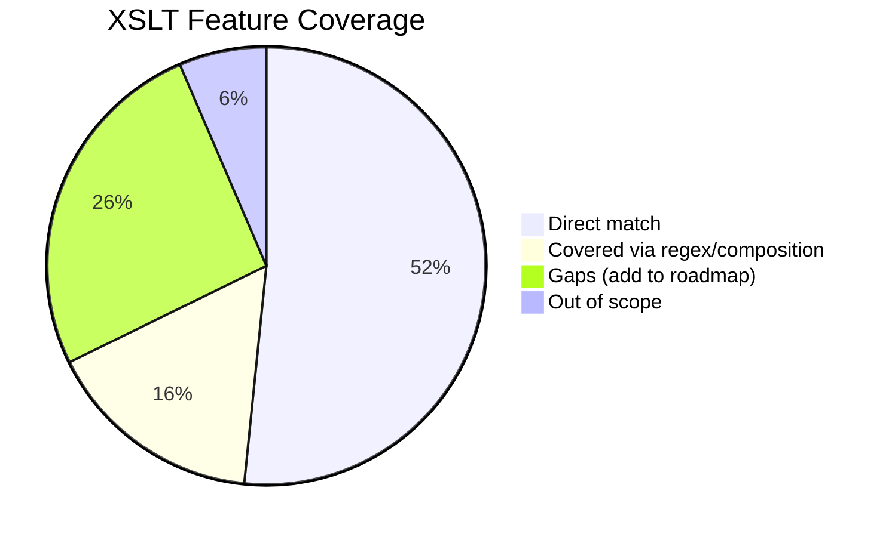

# Ausearch → Event-Logging XML: Node Configuration Plan

## Input Format

Events are `----\n` delimited. Each has a `time->` line + multiple `type=` lines with key=value payloads. See [input.txt](file:///home/stroomdev66/stroomworks_work/ds-rs/engine/tests/fixtures/ausearch/input.txt).

### Transformation Rules

| Input `type=` | Input `key=` | Output Action Element |
|---|---|---|
| SYSCALL | user_modification | `<Create>` |
| SYSCALL | password_change / permission_change | `<Update>` |
| SYSCALL | file_deletion | `<Delete>` |
| SYSCALL | privilege_escalation | `<Authorise>` |
| SYSCALL | network_connection | `<Network>` |
| USER_LOGIN / USER_START / USER_AUTH | — | `<Authenticate><Action>Logon` |
| USER_ACCT | — | `<Authorise><Action>Request` |
| USER_END / USER_LOGOUT | — | `<Authenticate><Action>Logoff` |

---

## New Node Types Required

### 1. `Switch` — Simple Value-Based Branching

For common cases where you branch on a single captured value with exact-match cases:

```rust
/// Simple value-based branching. Evaluates `on_ref` and executes
/// the first case whose `value` matches exactly.
Switch {
    id: Option<String>,
    on_ref: RefExpression,           // e.g. "$type" or "$key"
    cases: Vec<SwitchCase>,
    default_children: Vec<NodeConfig>,
}

struct SwitchCase {
    value: String,                   // literal to match
    children: Vec<NodeConfig>,
}
```

**Project JSON:**
```json
{
  "type": "Switch",
  "on": "$key",
  "cases": [
    { "value": "user_modification", "children": [ ... ] },
    { "value": "file_deletion", "children": [ ... ] }
  ],
  "default": [ ... ]
}
```

---

### 2. `Choose` / `When` — Compound Conditional Logic

For complex cases requiring multiple conditions, regex matching, or boolean logic — like XSLT's `<xsl:choose>/<xsl:when>/<xsl:otherwise>`:

```rust
/// Conditional branching with compound predicate logic.
/// Evaluates each `when` branch in order; executes the first whose
/// predicate is true. Falls back to `otherwise` if no branch matches.
Choose {
    id: Option<String>,
    when_branches: Vec<WhenBranch>,
    otherwise: Vec<NodeConfig>,  // default branch
}

struct WhenBranch {
    condition: Condition,
    children: Vec<NodeConfig>,
}
```

**Condition predicates** support compound logic:

```rust
enum Condition {
    /// Exact string equality: $var == "literal"
    Equals { ref_expr: RefExpression, value: String },

    /// Inequality: $var != "literal"
    NotEquals { ref_expr: RefExpression, value: String },

    /// Compare two refs: $var1 == $var2
    RefEquals { left: RefExpression, right: RefExpression },

    /// Regex match: $var matches "pattern"
    Matches { ref_expr: RefExpression, pattern: String },

    /// Substring check: $var contains "sub"
    Contains { ref_expr: RefExpression, substring: String },

    /// Prefix check: $var starts-with "prefix"
    StartsWith { ref_expr: RefExpression, prefix: String },

    /// Numeric greater-than: number($var) > threshold
    GreaterThan { ref_expr: RefExpression, value: f64 },

    /// Numeric less-than: number($var) < threshold
    LessThan { ref_expr: RefExpression, value: f64 },

    /// Logical AND of sub-conditions
    And(Vec<Condition>),

    /// Logical OR of sub-conditions
    Or(Vec<Condition>),

    /// Logical NOT
    Not(Box<Condition>),

    /// Test if a variable is set/non-empty
    Exists { ref_expr: RefExpression },
}
```

**Examples of compound logic:**

```xml
<!-- Simple: single value match (like XSLT <xsl:when test="$type='SYSCALL'">) -->
<when test="$type == 'SYSCALL'">

<!-- Compound AND: two values (like <xsl:when test="$type='SYSCALL' and $key='user_modification'">) -->
<when test="$type == 'SYSCALL' and $key == 'user_modification'">

<!-- OR: multiple values -->
<when test="$type == 'USER_LOGIN' or $type == 'USER_START' or $type == 'USER_AUTH'">

<!-- NOT: exclusion -->
<when test="not($auid == '4294967295')">

<!-- Regex match -->
<when test="$comm matches '^user(add|del|mod)$'">
```

This enables the same expressiveness as XSLT's `test=` attributes while being composable.

**Project JSON representation:**

```json
{
  "type": "Choose",
  "when": [
    {
      "condition": { "op": "eq", "ref": "$type", "value": "SYSCALL" },
      "children": [ ... ]
    },
    {
      "condition": {
        "op": "or",
        "conditions": [
          { "op": "eq", "ref": "$type", "value": "USER_LOGIN" },
          { "op": "eq", "ref": "$type", "value": "USER_START" },
          { "op": "eq", "ref": "$type", "value": "USER_AUTH" }
        ]
      },
      "children": [ ... ]
    }
  ],
  "otherwise": [ ... ]
}
```

---

### 3. `ValueMap` — Value Translation

Simple lookup table for 1:1 value mappings:

```rust
ValueMap {
    id: Option<String>,
    on_ref: RefExpression,
    entries: Vec<(String, String)>,   // from → to
    default_value: Option<String>,
}
```

Used inline in Data values: `<Success>$success_bool</Success>` where `success_bool` is a Var set via ValueMap.

---

### 4. Dynamic Var IDs

`Var(id="$1")` where the id comes from a captured group. When the engine stores a var, it resolves the id expression first. This lets `key=value` pairs like `comm=useradd` auto-create `$comm = "useradd"` without pre-declaring every possible field.

---

### 5. `If` — Simple Conditional Guard

For the common case of "emit this block only if a condition is true" without needing an else branch (maps to `<xsl:if>`):

```rust
/// Simple conditional — emit children only if condition is true.
/// Equivalent to a Choose with one When and no Otherwise.
If {
    id: Option<String>,
    condition: Condition,
    children: Vec<NodeConfig>,
}
```

**Example:** Only emit the `<User>` block if `$auid` exists and isn't the unset sentinel:
```json
{
  "type": "If",
  "condition": { "op": "notEquals", "ref": "$auid", "value": "4294967295" },
  "children": [
    { "type": "Data", "value": "<User><Id>$auid</Id></User>" }
  ]
}
```

---

### 6. String Transforms on Var

A transform pipeline on Var for string manipulation (maps to XSLT's `upper-case()`, `lower-case()`, `normalize-space()`, `substring()`):

```rust
Var {
    id: String,
    value_ref: Option<RefExpression>,
    /// Optional chain of transforms applied to the resolved value.
    transforms: Vec<StringTransform>,
}

enum StringTransform {
    UpperCase,
    LowerCase,
    NormalizeSpace,                      // collapse whitespace
    Substring { start: usize, length: Option<usize> },
    Replace { pattern: String, replacement: String },  // regex replace
    Trim,
}
```

**Example:** Normalize and lowercase a captured value:
```json
{
  "type": "Var",
  "id": "normalized_name",
  "value": "$1",
  "transforms": [
    { "op": "normalizeSpace" },
    { "op": "lowerCase" }
  ]
}
```

---

## Record-Scoped Deferred Output

> [!IMPORTANT]
> The engine processes input in a single forward pass and cannot hold the entire file in memory. However, **per-record** buffering is practical — one ausearch event is typically <1KB.

### Approach: Group-level two-pass execution

When a Group contains output nodes (Data, Choose) that reference variables captured by **sibling** expressions within the same Group, the Group operates in two passes:

1. **Capture pass** — execute all expression children (Split, Regex, All) and their Var descendants. Buffer the record's input text. Do NOT emit Data output yet.
2. **Output pass** — with all vars populated, execute Data and Choose nodes, emitting output using the resolved var values.

```rust
Group {
    // ... existing fields ...
    /// When true, buffer output and run a capture pass before output pass.
    /// Automatically set if the Group contains Choose/Switch nodes.
    deferred_output: bool,
}
```

**Scope:** Only the matched text for this one record (Group match) is buffered — the rest of the input stream is untouched. This keeps memory bounded.

**Detection:** The engine can automatically detect the need for deferred output:
- If a Group has Data children that reference `$var_name` (named vars) rather than `$N` (positional groups), AND
- Those vars are set by sibling/descendant expression nodes

Then the Group must defer output.

---

## Complete Node Structure

```
Root
  header: <?xml ...?><Events xmlns="event-logging:3" ...>
  footer: \n</Events>\n
  └─ Split(delimiter="----\n")
       └─ Group [deferred_output=true]
            ├─ Regex("^time->(.+)\n([\s\S]+)$", dotAll=true)
            │    ├─ Var(id="timestamp", value="$1")
            │    └─ Split(delimiter="\n") on $2        ← body lines
            │         └─ Group(value="$1")
            │              └─ Regex("^type=(\S+)\s+msg=audit\(([^)]+)\):\s*(.*)")
            │                   ├─ Var(id="type", value="$1")
            │                   └─ Split(delimiter=" ") on $3    ← key=val pairs
            │                        └─ Group(value="$1")
            │                             └─ Regex("^(\w+)=(?:\"([^\"]*)\"|'([^']*)'|(\S+))")
            │                                  └─ Var(id="$1", value="$2$3$4")
            │
            ├─ Data: "\n  <Event>\n    <EventTime>..."
            ├─ Data: "$timestamp"
            ├─ Data: "...</EventTime>\n    <EventSource>...<User><Id>$auid</Id></User>..."
            │
            ├─ Choose
            │    ├─ When($type == "SYSCALL")
            │    │    └─ Choose
            │    │         ├─ When($key == "user_modification")
            │    │         │    └─ Data: "...<Create><Object><Type>UserAccount</Type>..."
            │    │         ├─ When($key == "password_change" or $key == "permission_change")
            │    │         │    └─ Data: "...<Update>..."
            │    │         ├─ When($key == "file_deletion")
            │    │         │    └─ Data: "...<Delete>..."
            │    │         ├─ When($key == "privilege_escalation")
            │    │         │    └─ Data: "...<Authorise>..."
            │    │         ├─ When($key == "network_connection")
            │    │         │    └─ Data: "...<Network>..."
            │    │         └─ Otherwise
            │    │              └─ Data: "...<Process>..."
            │    ├─ When($type == "USER_LOGIN" or $type == "USER_START" or $type == "USER_AUTH")
            │    │    └─ Data: "...<Authenticate><Action>Logon</Action>..."
            │    ├─ When($type == "USER_ACCT")
            │    │    └─ Data: "...<Authorise><Action>Request</Action>..."
            │    ├─ When($type == "USER_END" or $type == "USER_LOGOUT")
            │    │    └─ Data: "...<Authenticate><Action>Logoff</Action>..."
            │    └─ Otherwise
            │         └─ Data: "...<Unknown/>"
            │
            └─ Data: "\n    </EventDetail>\n  </Event>"
```

---

## XSLT Comparison — Conditional & Transformation Logic

### Conditional Constructs

| XSLT Construct | Our Equivalent | Status | Notes |
|---|---|---|---|
| `<xsl:if test="...">` | Choose with 1 When, no Otherwise | ✅ Covered | Could add a dedicated `If` node for brevity |
| `<xsl:choose>` | **Choose** | ✅ Direct | Multi-branch conditional |
| `<xsl:when test="...">` | **When** (branch of Choose) | ✅ Direct | Predicate-guarded branch |
| `<xsl:otherwise>` | **Otherwise** (default of Choose) | ✅ Direct | Fallback branch |
| No XSLT equivalent | **Switch** (simple exact-match) | ✅ New | Shorthand for common single-value dispatch |

### Predicate / Test Expressions

| XSLT Expression | Our Condition | Status | Notes |
|---|---|---|---|
| `$var = 'value'` | `Equals { ref, value }` | ✅ Direct | |
| `$var != 'value'` | `Not(Equals { ... })` | ✅ Composed | Could add `NotEquals` for convenience |
| `$var1 = $var2` | — | ⚠️ Gap | Var-to-var comparison — add `RefEquals { left, right }` |
| `and` | `And(Vec<Condition>)` | ✅ Direct | |
| `or` | `Or(Vec<Condition>)` | ✅ Direct | |
| `not(...)` | `Not(Box<Condition>)` | ✅ Direct | |
| `$var` (existence / truthy) | `Exists { ref }` | ✅ Direct | True if var is set and non-empty |
| `matches($var, 'regex')` (XSLT 2.0) | `Matches { ref, pattern }` | ✅ Direct | |
| `contains($var, 'sub')` | `Matches` with `.*sub.*` | ✅ Via regex | Could add `Contains` for clarity |
| `starts-with($var, 'prefix')` | `Matches` with `^prefix` | ✅ Via regex | Could add `StartsWith` for clarity |
| `$var > 5` (numeric) | — | ⚠️ Gap | Add `GreaterThan`, `LessThan` etc. |
| `string-length($var) > 0` | `Exists` | ✅ Covered | Exists = non-empty |
| `string-length($var) = 5` | — | ⚠️ Gap | Niche — could add `LengthEquals` |

### Value Handling / Output

| XSLT Construct | Our Equivalent | Status | Notes |
|---|---|---|---|
| `<xsl:value-of select="$var"/>` | **Data** with `value="$var"` | ✅ Direct | |
| `<xsl:text>literal</xsl:text>` | **Data** with `value="literal"` | ✅ Direct | |
| `<xsl:variable name="x" select="..."/>` | **Var** `id="x" value="..."` | ✅ Direct | |
| `concat($a, '-', $b)` | **Data** with `value="$a-$b"` | ✅ Direct | RefExpression handles interpolation |
| `translate($v, 'abc', 'ABC')` (char-level) | — | ⚠️ Gap | Niche — not needed for ausearch |
| `upper-case()` / `lower-case()` (XSLT 2.0) | — | ⚠️ Gap | Could add as Var transform |
| `normalize-space($var)` | — | ⚠️ Gap | Could add as Var transform |
| `substring($var, 2, 5)` | Regex capture group `(.{5})` | ✅ Via regex | |
| `format-number()` / `format-date()` | — | ⚠️ Gap | Future enhancement |
| No XSLT equivalent | **ValueMap** (lookup table) | ✅ New | Simpler than `<xsl:choose>` for 1:1 mappings |

### Iteration & Grouping

| XSLT Construct | Our Equivalent | Status | Notes |
|---|---|---|---|
| `<xsl:for-each select="...">` | **Split** + **Group** | ✅ Equivalent | Split creates iteration, Group scopes output |
| `<xsl:for-each-group>` (XSLT 2.0) | — | ⚠️ Gap | Not needed for ausearch; future enhancement |
| `<xsl:sort>` | — | ⚠️ Gap | Forward-only stream model limits sorting |
| `position()` | Match numbering (`$N`, `onlyMatch`) | ✅ Partial | |
| `last()` | — | ⚠️ Gap | Forward-only stream doesn't know "last" |

### Template Dispatch

| XSLT Construct | Our Equivalent | Status | Notes |
|---|---|---|---|
| `<xsl:apply-templates>` | — | 🔲 Out of scope | Our model is tree-based, not rule-based |
| `<xsl:call-template>` | — | ⚠️ Gap | Could add reusable template/macro fragments |
| `<xsl:template match="...">` | Regex pattern matching | ✅ Partial | Pattern matching is built into expression nodes |

### Summary of Coverage



### Recommended Additions Based on Gaps

| Priority | Addition | Rationale |
|---|---|---|
| **High** | `If` node (Choose with 1 branch, no default) | Very common pattern, avoids verbose Choose for simple guards |
| **High** | `NotEquals` condition | Extremely common in XSLT, avoids wrapping in Not() |
| **Medium** | `Contains` condition | Clearer than regex for simple substring check |
| **Medium** | `StartsWith` condition | Clearer than regex for prefix check |
| **Medium** | `RefEquals` condition (var-to-var compare) | Needed when comparing two captured values |
| **Low** | `GreaterThan` / `LessThan` (numeric compare) | Less common in text parsing; add when needed |
| **Low** | String transforms (upper/lower/normalize) | Add as Var transform pipeline; future |
| **Future** | Reusable template fragments | Reduce repetition in large configs |

---

## Summary of Changes

| Feature | Purpose | Complexity |
|---|---|---|
| **Switch** | Simple single-value branching (`on=$type`, exact-match cases) | Low |
| **Choose/When** | Compound predicate branching (full Condition enum) | Medium |
| **If** | Simple conditional guard (emit children if condition true) | Low |
| **Condition enum** | `Equals`, `NotEquals`, `RefEquals`, `Matches`, `Contains`, `StartsWith`, `GreaterThan`, `LessThan`, `And`, `Or`, `Not`, `Exists` | Medium |
| **ValueMap** | Translate values (`yes`→`true`, `failed`→`false`) | Low |
| **Dynamic Var IDs** | `Var(id="$1")` — var name from captured group | Low |
| **String transforms** | `UpperCase`, `LowerCase`, `NormalizeSpace`, `Substring`, `Replace`, `Trim` on Var | Low |
| **Deferred output** | Group buffers one record; capture pass then output pass | Medium |

> [!NOTE]
> Deferred output is only buffered at the record (Group) level — typically <1KB per ausearch event. The full input stream is still processed forward-only with bounded memory.

## Verification Plan

1. Implement Switch, Choose/When, If, ValueMap, Dynamic Var IDs, String Transforms, Deferred Output
2. Create project file at `tests/fixtures/ausearch/project.json` with the full node tree
3. Run engine against `tests/fixtures/ausearch/input.txt` using the project file
4. Compare output against `tests/fixtures/ausearch/example_output.xml`
5. Iterate on regex patterns and Choose branches until output matches

**Fixture directory layout after implementation:**
```
tests/fixtures/ausearch/
  ├── input.txt              ← existing
  ├── example_output.xml     ← existing expected output
  └── project.json           ← new: serialised node configuration
```
