# DS3 Data Splitter — Design Document

> **Version**: 1.0 — March 2026
> **Project**: `ds-rs` — Rust port of the Stroom Data Splitter engine

---

## Table of Contents

1. [System Architecture Overview](#1-system-architecture-overview)
2. [Engine](#2-engine)
   - 2.1 [Bytes-First Philosophy](#21-bytes-first-philosophy)
   - 2.2 [Composable Node Structure](#22-composable-node-structure)
   - 2.3 [Graph Model vs NodeConfig and Compilation](#23-graph-model-vs-nodeconfig-and-compilation)
   - 2.4 [Legacy DS3 XML Migration](#24-legacy-ds3-xml-migration)
   - 2.5 [Byte-Level Performance](#25-byte-level-performance)
   - 2.6 [Future Performance Improvements](#26-future-performance-improvements)
3. [Node Editor](#3-node-editor)
4. [Appendix A — Node Type Reference](#appendix-a--node-type-reference)
5. [Appendix B — Parser Combinators](#appendix-b--parser-combinators)

---

## 1. System Architecture Overview

The DS3 system is a three-tier architecture: a **Leptos/WASM client** (node editor), a **Rust HTTP server** (Axum), and a **pure-Rust engine** library. A fourth **shared** crate provides the common type surface across all tiers.

### 1.1 Component Diagram

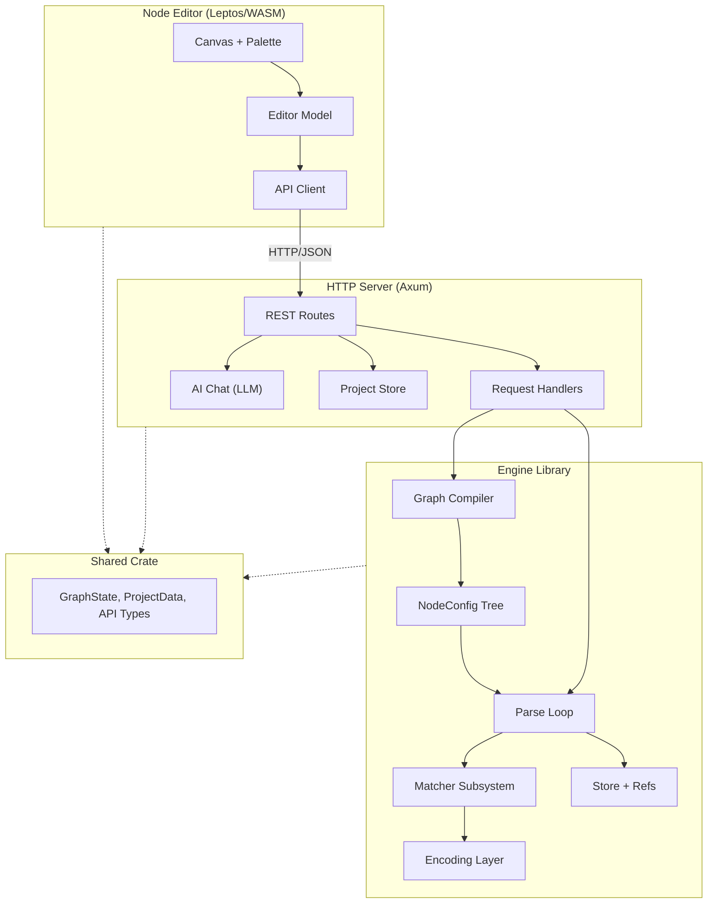

### 1.2 Crate Dependencies

| Crate | Role | Key Dependencies |
|-------|------|------------------|
| `ds3-shared` | Shared types for API transport | `serde`, `serde_json` |
| `datasplitter-rs` (engine) | Core parsing engine + compiler | `regex`, `fancy-regex`, `encoding_rs`, `quick-xml` |
| `ds3-server` | HTTP API server | `axum`, `tokio`, `tower-http`, engine crate |
| `ds3-node-editor` | Visual editor (Leptos/WASM) | `leptos`, `uuid`, shared crate |

### 1.3 API Surface

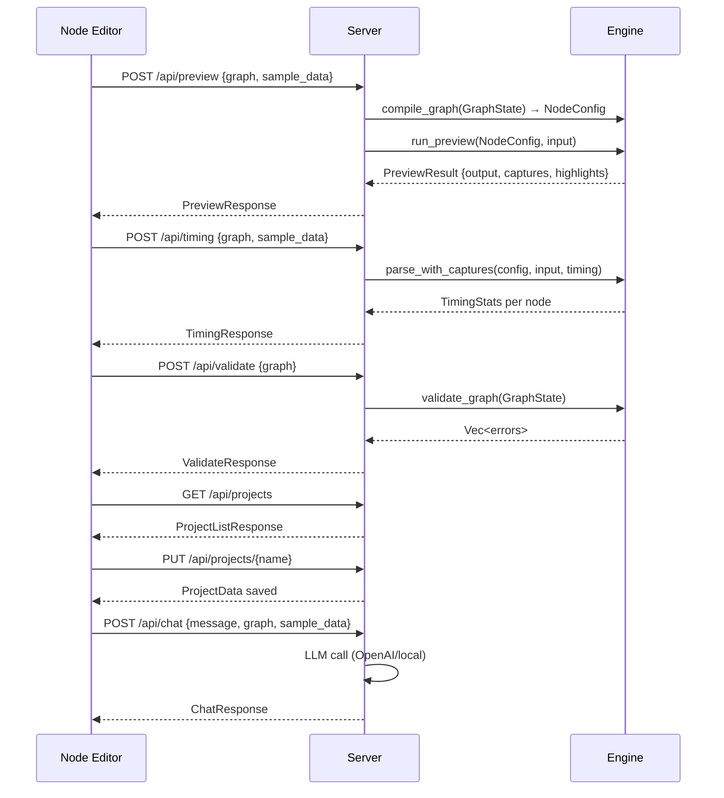

**Server endpoints:**

| Method | Path | Purpose |
|--------|------|---------|
| `POST` | `/api/preview` | Compile graph + run engine on sample data |
| `POST` | `/api/timing` | Per-node timing profiling |
| `POST` | `/api/validate` | Graph validation (no execution) |
| `POST` | `/api/chat` | AI assistant for config help |
| `GET` | `/api/ai/models` | List available AI models |
| `GET` | `/api/projects` | List saved projects |
| `GET/PUT/DELETE` | `/api/projects/{name}` | CRUD for project files |
| `GET/PUT` | `/api/templates` | Template library persistence |

---

## 2. Engine

### 2.1 Bytes-First Philosophy

The engine operates on **raw `&[u8]` byte streams** throughout the entire hot path. Text decoding only occurs at the output boundary when stored values are consumed for conditions or output emission.

#### Core Principle

```
Raw input (&[u8])
    │
    ├─ fill_buffer() → BOM detection → resolve root encoding
    │
    ├─ compile_byte_literals()  ← ONE-TIME: encode all string configs to bytes
    ├─ compile_regexes()        ← ONE-TIME: compile all regex patterns
    │
    ▼
┌───────────────────────────────────────────────────────┐
│  HOT PATH: all matching operates on &[u8]             │
│                                                        │
│  try_match(node, data: &[u8]) → MatchRes              │
│  ├─ Split:     delimiter_bytes vs data (byte compare)  │
│  ├─ Regex:     regex::bytes::Regex on &[u8]            │
│  ├─ MatchTag:  data.starts_with(text_bytes)            │
│  ├─ TakeUntil: data.windows(pattern_bytes.len())       │
│  ├─ TakeWhile: predicate.matches_byte(b) per byte     │
│  └─ All:       consume entire buffer slice             │
│                                                        │
│  Store captures: group_bytes.to_vec() → Store          │
└───────────────────────────────────────────────────────┘
    │
    ▼  OUTPUT BOUNDARY (lazy decode)
┌───────────────────────────────────────────────────────┐
│  resolve_ref() → decode(&[u8], encoding) → String     │
│  ├─ UTF-8: Cow::Borrowed (zero-copy via from_utf8)    │
│  └─ Other: encoding_rs decode (allocates)             │
└───────────────────────────────────────────────────────┘
```

#### Eager Byte Compilation

String literals in the configuration are stored as `String` for portability and serialisation. After BOM detection reveals the input encoding, `compile_byte_literals()` performs a **one-time tree walk** that encodes every string literal into its `_bytes` companion field using the resolved encoding:

```
Config Build Time            First Read                 Matching
─────────────────       ──────────────────────      ──────────
NodeConfig stores       fill_buffer() → BOM →       try_match reads
String values           compile_byte_literals()     compiled byte fields
(encoding-agnostic)     fills byte fields in-place  directly — zero lookup
                        compile_regexes() runs
```

**No HashMap. No cache. No per-match encoding.** The `try_match` function reads `_bytes` fields directly.

#### Encoding Inheritance

Encodings resolve via CSS-style cascade. Each node can optionally override the encoding; unset nodes inherit from their parent. The root defaults to UTF-8 or the BOM-detected encoding.

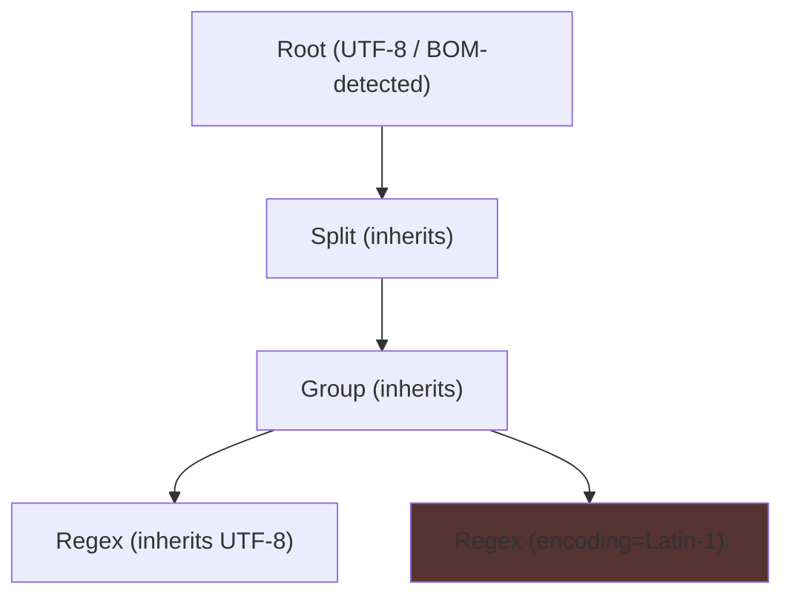

31 encodings are supported via `encoding_rs`, including UTF-8, all ISO-8859 variants, Windows code pages, UTF-16LE/BE, EUC-JP, Shift_JIS, GBK, Big5, and KOI8-R.

#### Encoding Safety Matrix

| Encoding Category | Status | Notes |
|---|---|---|
| UTF-8 | ✅ Safe | Self-synchronising — no continuation byte matches ASCII |
| Single-byte (Latin-1, Windows-1252, etc.) | ✅ Safe | `code_unit_size()` = 1 |
| UTF-16LE / UTF-16BE | ✅ Safe | `code_unit_size()` = 2; delimiters compiled to correct 2-byte form |
| EUC-JP / EUC-KR | ⚠️ Low risk | Variable-length; trail bytes don't overlap common ASCII delimiters |
| Shift_JIS / GBK / Big5 | ❌ Unsafe | Trail bytes overlap ASCII — false-match risk for single-byte delimiters |

### 2.2 Composable Node Structure

The engine's node system is organised into **five layers of abstraction**, from raw byte operations up to reusable template compositions.

#### Layer Architecture

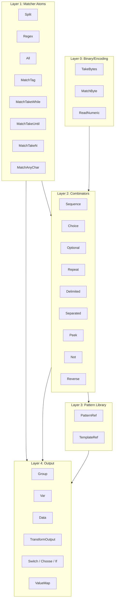

#### The NodeConfig Enum

All nodes are represented as variants of a single `NodeConfig` enum (30+ variants). This flat enum replaces the Java class hierarchy with Rust's algebraic data types, giving exhaustive match checking at compile time.

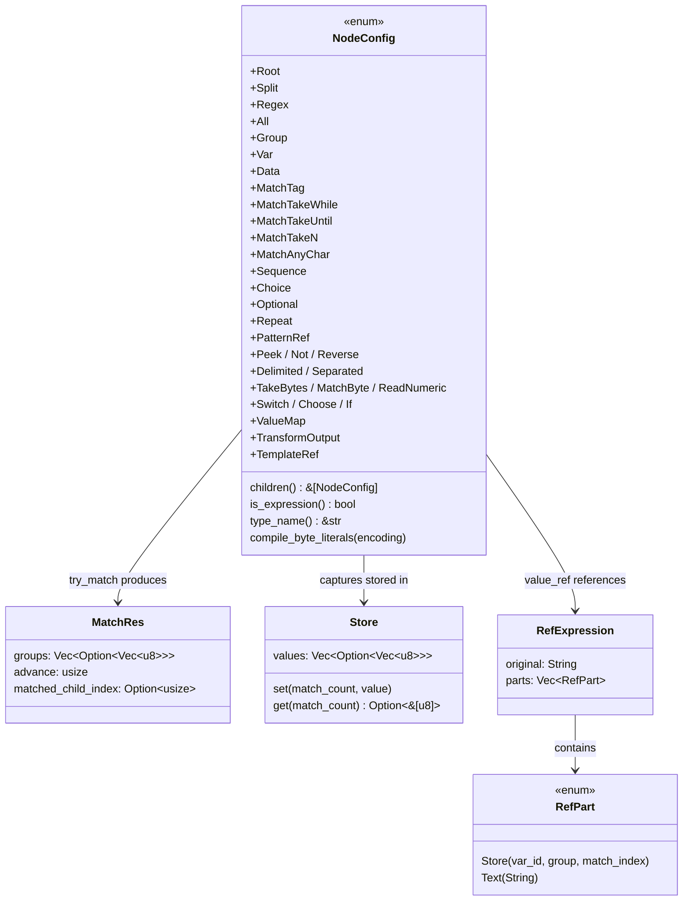

#### Engine Parse Loop

The engine has two nested loop levels:

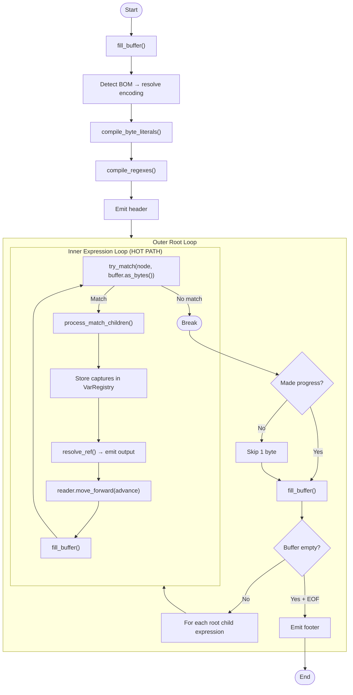

For a 100 MB log file with 1M records, the inner loop runs ~1M+ times.

### 2.3 Graph Model vs NodeConfig and Compilation

The system maintains **two distinct representations** of a data splitter configuration, connected by a bidirectional compilation pipeline.

#### Two Models

| Aspect | Graph Model (`GraphState`) | Engine Model (`NodeConfig`) |
|--------|---|---|
| **Purpose** | Visual editing in the node editor | Runtime execution by the engine |
| **Shape** | **Flat**: arrays of nodes + connections | **Tree**: recursive enum with children |
| **Identity** | String IDs, port-level wiring | Optional string IDs, children inline |
| **Settings** | `serde_json::Value` (flexible) | Typed Rust fields (type-safe) |
| **Extras** | Position (x,y), header colour, port metadata | Compiled byte fields, regex cache |
| **Storage** | `ProjectData` JSON files | Transient (compiled on demand) |

```mermaid
graph LR
    subgraph Editor["Graph Model (Editor)"]
        GS["GraphState"]
        GN["GraphNode[]"]
        GC["GraphConnection[]"]
        GS --> GN
        GS --> GC
    end

    subgraph EngineModel["Engine Model"]
        NC["NodeConfig (tree)"]
        RC["RegexCache"]
        VR["VarRegistry"]
    end

    GS -->|"compile_graph()"| NC
    NC -->|"decompile()"| GS
    NC -->|"compile_regexes()"| RC
    NC -->|"register_vars()"| VR

    style Editor fill:#1a3a5a
    style EngineModel fill:#3a1a3a
```

#### Compilation Pipeline

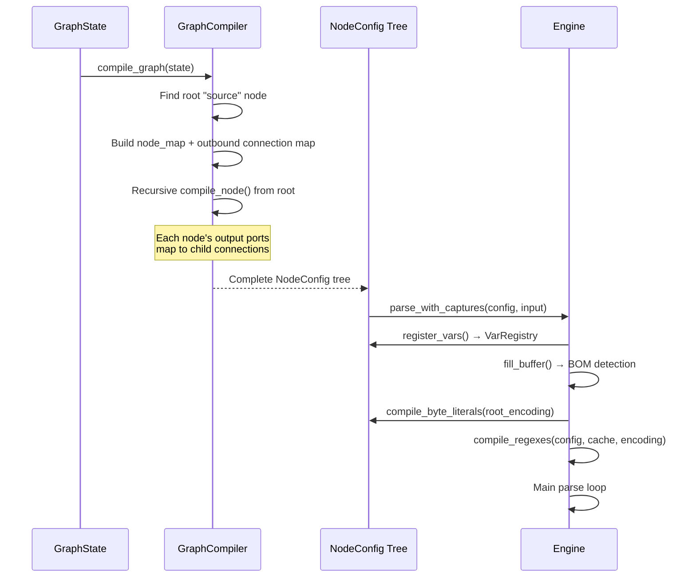

The **compiler** (`compiler.rs`) walks the flat graph starting from the root `source` node, following output connections to build the tree. The **decompiler** (`decompiler.rs`) performs the reverse, creating flat nodes and connections from the tree, emitting all nodes at position (0,0) for the UI to auto-layout.

#### Validation vs Compilation

`validate_graph()` simply attempts `compile_graph()` and reports any errors. Since compilation is the single source of truth for structural validity, this ensures the validation and execution always agree.

### 2.4 Legacy DS3 XML Migration

The engine supports loading legacy Data Splitter v3.0 XML configurations via a two-stage pipeline:

```mermaid
flowchart LR
    XML["DS3 XML Config"] -->|"parse_config()"| LN["LegacyNode Tree"]
    LN -->|"migrate_legacy()"| NC["NodeConfig Tree"]
    NC -->|"decompile()"| PD["ProjectData (Graph)"]

    style XML fill:#553322
    style LN fill:#335522
    style NC fill:#223355
```

#### Stage 1: XML Parsing (`legacy_config.rs`)

The `parse_config()` function reads DS3 v3.0 XML using `quick-xml` and produces a `LegacyNode` tree. `LegacyNode` is a semantic intermediate representation that captures raw attribute values **without any output formatting**:

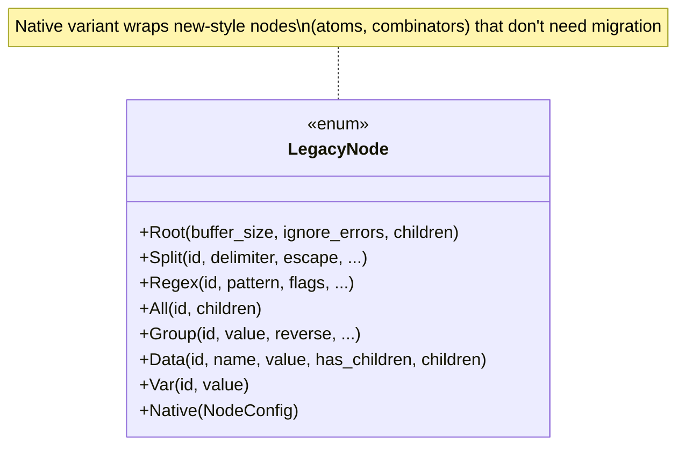

New-style XML elements (`<tag>`, `<takeWhile>`, `<sequence>`, etc.) are parsed directly into `NodeConfig` and wrapped in the `LegacyNode::Native` variant, bypassing migration.

#### Stage 2: Migration (`migration.rs`)

`migrate_legacy()` converts a `LegacyNode` tree to a `NodeConfig` tree, applying all XML output formatting:

| Transformation | What it does |
|---|---|
| **Records envelope** | Adds `<?xml ...>` header + `<records>` wrapper |
| **Record wrapping** | Groups at the top level get `<record>...</record>` tags |
| **Data formatting** | `<data name="x" value="y"/>` XML with depth-aware indentation |
| **XML escaping** | Dynamic values get `TemplateRef("xml_escape_attr")` nodes injected |
| **Reverse extraction** | `<group reverse="true">` becomes `Reverse { children }` |
| **Template resolution** | All `TemplateRef` nodes resolved via the built-in template registry |

#### Legacy Mapping Table

| Legacy XML | Migrated To |
|---|---|
| `<dataSplitter>` | `Root` with records:2 envelope |
| `<split delimiter=",">` | `Split` (preserved, drives record iteration) |
| `<regex pattern="...">` | `Regex` (direct pass-through) |
| `<all>` | `All` (preserved) |
| `<group reverse="true">` | `Group` + `Reverse` wrapper |
| `<data name="x" value="$1"/>` | `Data` with fused XML ref expression |
| `<var id="x">` | `Var` (direct mapping) |

### 2.5 Byte-Level Performance

#### Node Encoding Assessment

| Node | Encoding at Build? | Encoding at Match? | How |
|------|---|---|---|
| **Split** | ✅ `compile_byte_literals()` | ❌ Zero | Reads `delimiter_bytes` directly |
| **MatchTag** | ✅ `compile_byte_literals()` | ❌ Zero | `starts_with(text_bytes)` |
| **MatchTakeUntil** | ✅ `compile_byte_literals()` | ❌ Zero | `windows(pattern_bytes.len())` |
| **MatchTakeWhile** | — No literals | ❌ Zero | `predicate.matches_byte(b)` |
| **MatchTakeN** | — No literals | ⚡ Trivial | `code_unit_size()` — O(1) |
| **MatchAnyChar** | — No literals | ⚡ Trivial | `code_unit_size()` — O(1) |
| **Regex (bytes)** | ✅ `compile_regexes()` | ❌ Zero | `regex::bytes::Regex` on `&[u8]` |
| **Regex (fancy)** | ✅ `compile_regexes()` | ⚠️ Validation | `fancy_regex` requires `&str` |
| **Reverse** | — | ⚠️ Full decode+encode | Dynamic input must be reversed |
| **All** | — | ❌ Zero | Consumes entire buffer slice |
| **Structural nodes** | — | ❌ Zero | Pass bytes to children |
| **Output nodes** | — | ❌ Zero | Resolution at `resolve_ref` time |
| **Byte-level atoms** | — | ❌ Zero | Pure byte operations |

#### Per-Operation Cost on the Hot Path

| Operation | Cost | Allocations | Notes |
|-----------|------|-------------|-------|
| `buffer.as_bytes()` | O(1) | 0 | Pointer+length into existing `Vec<u8>` |
| `try_match` (Regex bytes) | O(n × pattern) | 0 per attempt | Groups allocate on success only |
| `try_match` (Split) | O(d) per position | 0 | Byte-slice comparison, zero encode |
| `try_match` (MatchTag) | O(t) | 0 | `starts_with` on pre-compiled bytes |
| `try_match` (TakeUntil) | O(n × p) | 0 | `windows()` scan, pre-compiled |
| `try_match` (TakeWhile) | O(n) | 0 | Pure byte predicate |
| `reader.move_forward(n)` | O(n) | 0 | Line/column tracking scan |
| Store capture | O(g) | 1 per group | `group_bytes.to_vec()` |
| `resolve_ref` | O(parts) | 0–1 | Builds `String` from parts; UTF-8 derived vars with no transforms bypass via `resolve_ref_bytes` (zero-alloc) |
| `decode()` | O(n) | 0–1 | Zero-copy for UTF-8 via `Cow::Borrowed` |

#### Allocation Profile (Typical CSV Record)

| Phase | Allocations |
|-------|-------------|
| Match (Split on `\n`) | 1 |
| Inner match (Split on `,`) | 3 |
| Store captures (Var) | 0–3 |
| Resolve refs (Data output) | 0–3 |
| **Total per record** | **~5–8** (vs ~20+ pre-refactor) |

#### Key Performance Characteristics

1. **Zero-allocation matching** — regex on `&[u8]`, no string conversion
2. **Zero-copy buffer access** — `buffer.as_bytes()` is a pointer
3. **Lazy decoding** — `decode()` only at output boundary
4. **UTF-8 zero-copy decode** — `Cow::Borrowed` via `from_utf8_lossy`
5. **Single-byte delimiter fast path** — degenerates to byte equality
6. **Zero per-match encode** — all literals pre-compiled in `_bytes` fields
7. **Encoding-aware regex** — `compile_regexes()` uses BOM-detected encoding
8. **`resolve_ref_bytes` fast path** — derived vars with UTF-8 + no transforms skip decode→encode
9. **Pre-compiled Replace regexes** — `TransformNode::Replace` patterns in `RegexCache`
10. **Stack-based integer formatting** — `itoa::Buffer` for `ForEach` counters

#### Throughput Comparison

| Parser | MB/s | Architecture |
|--------|------|-------------|
| `awk '{print $3}'` | 200–400 | Interpreted, line-at-a-time |
| `grep -oP` (PCRE) | 500–1000 | Compiled NFA/DFA, streaming |
| `jq .field` | 100–300 | Interpreted, full JSON parse |
| Hand-coded Rust (`nom`/`winnow`) | 800–2000 | Zero-copy combinator |
| **DS3 engine** | **300–800** | Byte-level regex+split, recursive tree |

**Why DS3 is competitive despite not matching hand-coded parsers:**
- **Configuration-driven** — one engine handles CSV, fixed-width, regex, XML, syslog
- **Composability** — arbitrarily deep node nesting
- **Maintainability** — config change via UI, not code change

#### Operations NOT on the Hot Path

| Operation | When | Cost |
|-----------|------|------|
| `compile_byte_literals()` | Once, after BOM | O(nodes × fields) |
| `compile_regexes()` | Once, after BOM | O(regex count × pattern) |
| BOM detection | Once, first read | O(4) |
| `encode()`/`decode()` | `Reverse` + `resolve_ref` | O(n) per call |

### 2.6 Future Performance Improvements

| Technique | Impact | Effort | Status |
|-----------|--------|--------|--------|
| **`memchr` for single-byte split** | 1.3–2× for split-heavy | Low | ✅ Implemented |
| **`SmallVec` for groups** | ~10% allocation reduction | Low | ✅ Implemented |
| **`resolve_ref_bytes` fast path** | Moderate | Low | ✅ Implemented |
| **Pre-compiled Replace regexes** | Eliminates per-call compilation | Low | ✅ Implemented |
| **`itoa` stack formatting** | Eliminates heap alloc per iteration | Low | ✅ Implemented |
| **`resolve_ref` Cow return** | Moderate | Medium | Not started |
| **Regex-to-combinator compilation** | 2–3× for simple patterns | High | Not started |
| **`memchr` for `move_forward`** | Medium for large records | Low | Not started |
| ~~**Group slice borrowing**~~ | ~~1.2–1.5× fewer allocs~~ | ~~Medium~~ | Dropped — lifetime propagation through ~15 functions, split ownership at Var store boundary, and buffer invalidation risk outweigh the modest gain over `SmallVec` |
| ~~**Arena allocator for stores**~~ | ~~Medium~~ | ~~Medium~~ | Dropped — same lifetime/ownership tension as group slice borrowing; `Vec<u8>` values cross scope boundaries |
| ~~**Batch/parallel processing**~~ | ~~2–4× on multi-core~~ | ~~High~~ | Dropped — parallelism is achieved at the pipeline level (multiple parser instances); intra-parser threading adds complexity without benefit |

#### Implemented: Compile-Time Strategy Resolution

All hot-path dispatch decisions are resolved **once** during `compile_byte_literals()` and stored as `#[serde(skip)]` fields on `NodeConfig` variants. The `try_match` function reads pre-computed values — no runtime condition checks, no per-match filtering.

| Optimisation | Node Type(s) | Compiled Field | Hot-Path Benefit |
|---|---|---|---|
| SIMD split scan | `Split` | `use_memchr: bool` | Replaces 3-condition guard with single bool branch; dispatches to `memchr::memchr` for 16–32 bytes/cycle |
| SIMD take-until scan | `MatchTakeUntil` | `use_memchr: bool` | Single-byte patterns use `memchr` instead of `windows().position()` |
| Predicate lookup table | `MatchTakeWhile` | `byte_lookup_table: Box<[bool; 256]>` | Array index `table[b]` replaces `match` dispatch + method call per byte |
| Pre-computed code unit size | `MatchTakeWhile`, `MatchTakeN`, `MatchAnyChar` | `compiled_code_unit_size: usize` | Direct `usize` read replaces `encoding.code_unit_size()` match on 31 variants |
| Pre-computed single-byte flag | `MatchTakeN`, `MatchAnyChar` | `compiled_is_single_byte: bool` | Eliminates runtime `encoding.is_single_byte()` dispatch; fixes UTF-8 vs single-byte ambiguity |
| Pre-filtered child indices | `Sequence`, `Choice`, `Delimited`, `Separated` | `compiled_expr_indices: Vec<usize>` | Index iteration replaces `.filter(\|c\| c.is_expression())` (20-variant match per child) |
| Pre-found first child | `Optional`, `Repeat`, `Peek`, `Not`, `Reverse` | `compiled_expr_index: Option<usize>` | Direct index replaces `.find(\|c\| c.is_expression())` scan |
| Root expression indices | `Root` | `compiled_expr_indices: Vec<usize>` | Eliminates per-buffer `is_expression()` on root children |
| Root group-record flags | `Root` | `compiled_has_group_record: Vec<bool>` | Eliminates recursive `has_group_with_record()` tree walk per buffer iteration |
| Choice child lookup | `Choice` (in `process_match_children`) | uses `compiled_expr_indices` | Direct index replaces `.filter(\|c\| c.is_expression())` on every Choice match |
| Ref strategy classification | `RefExpression` | `compiled_strategy: RefStrategy` | `SimpleLocal($N)` skips parts loop, intermediate strings, and concatenation — one index + one decode |

#### Hot-Path Audit: Remaining Runtime Logic

Compile-time lifting is now **exhaustive** — all dispatch decisions, predicate evaluations, encoding queries, child filtering, tree walks, and ref resolution strategies have been moved to the one-time `compile_byte_literals()` phase. The remaining runtime logic in the hot path is irreducible:

| Category | Location | Why It Cannot Be Pre-Computed |
|---|---|---|
| Core matching | `try_match` outer `match node` | Irreducible variant dispatch; compiles to a jump table |
| Regex execution | `regexes.get(pattern)` + `captures_bytes` | Pattern matching is inherently runtime work |
| General split scan | `split_find_bytes` (non-memchr path) | Only reached for multi-byte delimiters with escapes/containers |
| Output processing | `resolve_ref` (Complex path), `decode`, `apply_transforms` | Depends on match results and var registry state |
| Match constraints | `get_match_constraints` (20-arm match) | Called once per expression, not per match — negligible |
| Encoding resolution | `resolve_encoding` / `node.get_encoding()` | Called once per expression entry, not per match |
| Capture recording | `node.id()`, `node.type_name()` | Only when `captures`/`timing` is `Some` (editor features, not production) |


---

## 3. Node Editor

The node editor is a **Leptos/WASM** single-page application providing a visual graph editor for constructing data splitter configurations.

### 3.1 Architecture

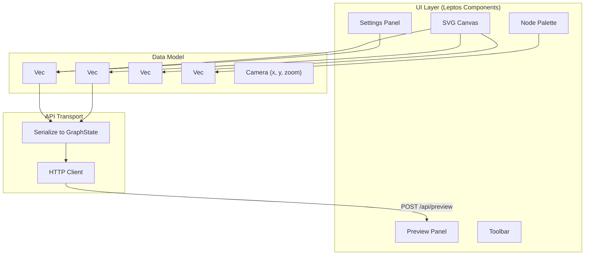

### 3.2 Editor Data Model

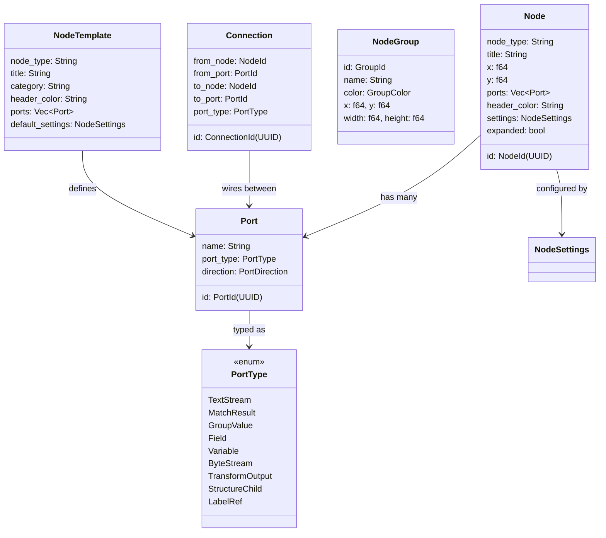

### 3.3 Port Type Colour Coding

| Port Type | Colour | Purpose |
|-----------|--------|---------|
| `TextStream` | `--port-textstream` | Raw text flowing into expressions |
| `MatchResult` | `--port-matchresult` | Output from split/regex match |
| `GroupValue` | `--port-groupvalue` | Extracted capture group |
| `Field` | `--port-field` | Named output field |
| `Variable` | `--port-variable` | Stored variable |
| `ByteStream` | `--port-bytestream` | Raw bytes for binary atoms |
| `TransformOutput` | `--port-transform` | Value after transformation |
| `StructureChild` | `--port-structure` | Structure nesting |
| `LabelRef` | `--port-label` | Virtual wiring |

### 3.4 Node Categories and Layout

The palette organises 35+ node types into categories:

| Category | Colour | Node Types |
|----------|--------|------------|
| **Root** | `#445566` | Source |
| **Expressions** | `#234056` / `#584527` | Split, Regex, All |
| **Selectors** | `#593068` | Group |
| **Output** | `#2a5435` / `#806030` | Data, Var |
| **Atoms** | `#1a5c5c` (teal) | Tag, TakeWhile, TakeUntil, TakeN, AnyChar |
| **Combinators** | `#3a3a6e` (indigo) | Sequence, Choice, Optional, Repeat |
| **Advanced Combinators** | `#3a3a6e` | Peek, Not, Reverse, Delimited, Separated |
| **Patterns** | `#28686e` (cyan) | PatternRef |
| **Binary** | `#4a4a2e` (olive) | TakeBytes, MatchByte, ReadNumeric |
| **Transforms** | `#5c3a1a` (orange) | Concat, Format, Replace, Map, Coalesce, Lowercase, Uppercase, Trim, ToNumber, Translate |
| **Conditional** | `#6b3a3a` (dark red) | Switch, Choose, If, ValueMap |
| **Structure** | `#4a2a6a` (purple) | StructObject, StructArray, StructField, StructLiteral, StructIterate, StructConditional |
| **Labels** | `#3a5a3a` (sage) | LabelOutput, LabelInput |

### 3.5 Expand/Collapse Drill-Down

Combinator nodes (Sequence, Choice, Optional, Repeat, Delimited, Separated, Peek, Not, Reverse, PatternRef) support an expand/collapse interaction:

- **Collapsed** — Compact node showing type + summary with a single output port
- **Expanded** — Shows internal structure with inner matcher nodes visible

### 3.6 Graph ↔ Project Serialisation

The editor persists projects as `ProjectData` JSON:

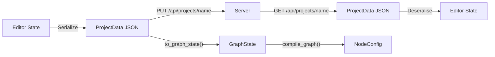

`ProjectData` includes editor-specific fields (position, colour, groups) that are stripped when converting to `GraphState` for compilation.

### 3.7 Preview Integration

The node editor provides a live preview panel that:

1. Sends the current graph + sample data to `POST /api/preview`
2. Displays the output text with syntax highlighting
3. Shows input data with **capture highlighting** — colour-coded spans showing which nodes matched which input regions
4. Provides per-node performance timing via `POST /api/timing`
5. Displays validation errors and warnings

---

## Appendix A — Node Type Reference

### Expression Nodes

| Node | Purpose | Key Settings |
|------|---------|-------------|
| **Split** | Divide input by delimiter | `delimiter`, `escape`, `container_start/end`, `min/max_match`, `only_match` |
| **Regex** | Match by regular expression | `pattern`, `case_insensitive`, `dot_all`, `advance`, `min/max_match` |
| **All** | Consume entire input | — |

### Matcher Atoms

| Node | Purpose | Key Settings | Nom Equivalent |
|------|---------|-------------|----------------|
| **MatchTag** | Exact literal match | `text` | `tag("...")` |
| **MatchTakeWhile** | Consume while predicate holds | `predicate` | `take_while(pred)` |
| **MatchTakeUntil** | Consume until pattern found | `pattern` | `take_until("...")` |
| **MatchTakeN** | Take exactly N characters | `count` | `take(N)` |
| **MatchAnyChar** | Single character | — | `anychar` |

### Combinators

| Node | Purpose | Key Settings | Nom Equivalent |
|------|---------|-------------|----------------|
| **Sequence** | All children match in order | `output_labels` | `tuple((a, b, c))` |
| **Choice** | First matching child wins | — | `alt((a, b, c))` |
| **Optional** | Match or skip | — | `opt(inner)` |
| **Repeat** | Match N times | `min_repeat`, `max_repeat` | `many_m_n(m, n, inner)` |
| **Delimited** | Match between open/close | 3 children: open, content, close | `delimited(...)` |
| **Separated** | List with separator | 2 children: element, delimiter | `separated_list0(...)` |
| **Peek** | Match without consuming | — | `peek(inner)` |
| **Not** | Fail if inner succeeds | — | `not(inner)` |
| **Reverse** | Reverse matched content | — | — |

### Byte-Level Atoms

| Node | Purpose | Key Settings |
|------|---------|-------------|
| **TakeBytes** | Take N raw bytes | `count` |
| **MatchByte** | Match hex byte pattern | `pattern` (hex) |
| **ReadNumeric** | Read numeric from binary | `numeric_type` (short/int/long/float/double), `signed`, `endian` |

### Selector & Output Nodes

| Node | Purpose | Key Settings |
|------|---------|-------------|
| **Group** | Scope resolution, record boundary | `value_ref`, `match_order`, `record_header/footer`, `deferred_output` |
| **Data** | Emit resolved value as output | `value_ref`, `data_footer` |
| **Var** | Store value for later reference | `id`, `value_ref`, `transforms` |

### Transform Nodes

| Node | Purpose | Key Settings |
|------|---------|-------------|
| **Concat** | Join values | `separator` |
| **Format** | Template string | `template` (`{0}`, `{1}` placeholders) |
| **Replace** | Search and replace | `pattern`, `replacement`, `is_regex` |
| **Map** | Value lookup table | `entries`, `default` |
| **Translate** | Character translation | `from`, `to` (character lists) |
| **Coalesce** | First non-empty value | — |
| **Lowercase / Uppercase / Trim** | String transforms | — |
| **ToNumber** | Parse as number | — |

### Conditional Nodes

| Node | Purpose | Key Settings |
|------|---------|-------------|
| **Switch** | Value-based branching | `on_ref`, `cases`, `default_children` |
| **Choose** | Predicate-based branching | `when_branches` (condition + children), `otherwise` |
| **If** | Conditional guard | `condition`, `children` |
| **ValueMap** | Value translation table | `on_ref`, `entries`, `default_value` |

### Reference Nodes

| Node | Purpose | Key Settings |
|------|---------|-------------|
| **PatternRef** | Reference a pattern template | `template_id` |
| **TemplateRef** | Reference a transform/pattern template | `template_id`, `inputs` |
| **LabelOutput** | Publish value to named channel | `label_name` |
| **LabelInput** | Subscribe to named channel | `label_name`, `fallback` |

---

## Appendix B — Parser Combinators

### Relationship to `nom` / `winnow`

The DS3 combinator layer is directly inspired by Rust parser combinator libraries like `nom` and `winnow`. Each DS3 combinator node maps to a well-known parser combinator pattern:

| Combinator Pattern | nom/winnow | DS3 Node |
|---|---|---|
| **Sequence** | `(a, b, c)` / `tuple` | `Sequence` with N ordered children |
| **Alternative** | `alt((a, b, c))` | `Choice` — first match wins |
| **Optional** | `opt(p)` | `OptionalCombinator` — match or zero-width success |
| **Repetition** | `many_m_n(min, max, p)` | `RepeatCombinator` with `min_repeat`/`max_repeat` |
| **Delimited** | `delimited(open, content, close)` | `Delimited` with 3 expression children |
| **Separated list** | `separated_list0(sep, item)` | `Separated` with element + delimiter children |
| **Lookahead** | `peek(p)` | `Peek` — match without consuming (advance = 0) |
| **Negative lookahead** | `not(p)` | `Not` — succeeds if inner fails |
| **Literal** | `tag("...")` | `MatchTag` — exact byte-level literal match |
| **Take while** | `take_while(pred)` | `MatchTakeWhile` — byte predicate |
| **Take until** | `take_until("...")` | `MatchTakeUntil` — scan for delimiter pattern |
| **Take N** | `take(N)` | `MatchTakeN` — encoding-aware character count |
| **Any char** | `anychar` | `MatchAnyChar` — single code unit |

### Key Differences from Library Combinators

1. **Configuration-driven** — DS3 combinators are data structures (JSON/XML config), not compiled code. They can be edited at runtime via the UI.
2. **Dynamic dispatch** — `try_match()` uses `match node { ... }` on the `NodeConfig` enum, whereas nom/winnow combinators compile to direct function calls.
3. **Recursive tree** — Combinators form a tree with function-call overhead per level, versus nom's flat, inlined combinator chain.
4. **Children carry output nodes** — DS3 combinator children include both matcher children (other atoms/combinators) and output children (Group, Data, Var). The `is_expression()` method distinguishes them.
5. **Byte-level with encoding** — DS3 combinators operate on raw bytes but remain encoding-aware via the cascade system, whereas nom typically operates on `&str` or `&[u8]` without built-in encoding support.

### Predicate System

The `TakeWhile` atom uses a `Predicate` enum for character classification:

| Predicate | Matches | Byte Check |
|-----------|---------|------------|
| `Alphabetic` | `a-zA-Z` + Unicode | `is_alphabetic` on decoded char |
| `Alphanumeric` | `a-zA-Z0-9` + Unicode | `is_alphanumeric` on decoded char |
| `Numeric` | `0-9` + Unicode | `is_numeric` on decoded char |
| `Whitespace` | Space, tab, etc. | `is_whitespace` on decoded char |
| `NonWhitespace` | Negation of whitespace | `!is_whitespace` |
| `Any` | Everything | Always true |
| `CustomCharset(expr)` | User-defined: `[a-zA-Z0-9_.-]` | Parsed charset expression |

At the byte level, predicates use `matches_byte(b: u8)` for single-byte encodings, falling back to full character decode only for multi-byte encodings.

### NFA/DFA in Regex Matching

- **NFA** (Non-deterministic Finite Automaton): Regex compiles to a graph with multiple possible transitions per input byte. The `regex` crate tracks all active states simultaneously.
- **DFA** (Deterministic Finite Automaton): One transition per (state, byte) pair — table lookup. Blazingly fast but tables can be large. The `regex` crate uses a lazy/hybrid DFA.
- **The gap**: Even the fast DFA needs one table lookup per byte. A hand-coded parser for `^(\S+) (\S+)` just calls `memchr(' ')` twice. This is why the future `memchr` optimisation and regex-to-combinator compilation could yield significant gains.
