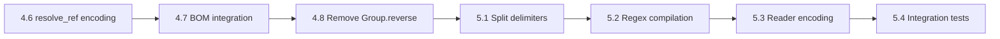

# Encoding Completion — Execution Plan

Remaining work to complete encoding support in the byte-level engine. Covers Phase 4 loose ends and Phase 5 encoding-aware matching.

---

## Phase 4 Remaining (3 items)

### 4.6 `resolve_ref` Encoding Wiring

**Goal**: Replace hardcoded `from_utf8_lossy` with encoding-aware `decode()`.

#### [MODIFY] [engine.rs](file:///home/stroomdev66/stroomworks_work/ds-rs/engine/src/engine.rs)

- Add `encoding: Encoding` parameter to `resolve_ref()` signature
- Line 1807: `String::from_utf8_lossy(buf).into_owned()` → `decode(buf, encoding).into_owned()`
- Line 1815: `String::from_utf8_lossy(text).into_owned()` → `decode(text, encoding).into_owned()`
- Update all ~12 call sites to pass the current encoding through

**Verify**: All 207 tests pass unchanged (UTF-8 decode produces identical results to `from_utf8_lossy`).

---

### 4.7 BOM Integration

**Goal**: Auto-detect encoding from input BOM on first buffer fill.

#### [MODIFY] [reader.rs](file:///home/stroomdev66/stroomworks_work/ds-rs/engine/src/reader.rs)

- Add `detected_encoding: Option<Encoding>` field to `DS3Reader`
- In `fill_buffer()`, on first fill: call `detect_bom(&buf)`, set `detected_encoding`, skip BOM bytes
- Add `pub fn detected_encoding(&self) -> Option<Encoding>` accessor

#### [MODIFY] [engine.rs](file:///home/stroomdev66/stroomworks_work/ds-rs/engine/src/engine.rs)

- In `parse()`, after first `fill_buffer()`: if root encoding is `Auto` and reader detected a BOM, use the detected encoding as the root default

**Verify**: Add test with UTF-8 BOM prefix — verify BOM bytes are skipped and encoding detected.

---

### 4.8 Remove `Group.reverse` Field

**Goal**: Remove the `reverse` field from `NodeConfig::Group`. Migration handles reverse via Reverse nodes.

#### [MODIFY] [node.rs](file:///home/stroomdev66/stroomworks_work/ds-rs/engine/src/node.rs)

- Remove `reverse: bool` from `NodeConfig::Group` variant
- Update all pattern matches throughout codebase

#### [MODIFY] [migration.rs](file:///home/stroomdev66/stroomworks_work/ds-rs/engine/src/migration.rs)

- In `migrate_legacy_node` for `LegacyNode::Group { reverse: true, .. }`: wrap the group's children in a `NodeConfig::Reverse { children: [...] }` node instead of copying `reverse: true` through
- Groups with `reverse: false` remain unchanged

#### [MODIFY] [engine.rs](file:///home/stroomdev66/stroomworks_work/ds-rs/engine/src/engine.rs)

- Remove `reverse` from Group pattern matches in `process_match_children`

#### Update all test constructors

- Remove `reverse: false` from all `NodeConfig::Group` constructors in tests

**Verify**: All tests pass. Legacy configs with `reverse="true"` produce a Reverse node wrapping the group's children.

---

## Phase 5: Encoding-Aware Matching (4 items)

### 5.1 Encoding-Aware Split Delimiter Compilation

**Problem**: Split delimiter is compiled as UTF-8 bytes regardless of node encoding. For UTF-16, `"\n"` should be `[0x0A, 0x00]` not `[0x0A]`.

#### [MODIFY] [engine.rs](file:///home/stroomdev66/stroomworks_work/ds-rs/engine/src/engine.rs)

- `split_find_bytes`: accept `encoding: Encoding` parameter
- When encoding is UTF-16, advance scan by 2 bytes (code unit size) not 1
- Add helper: `fn code_unit_size(enc: Encoding) -> usize` — returns 2 for UTF-16, 1 for everything else

#### [MODIFY] [encoding.rs](file:///home/stroomdev66/stroomworks_work/ds-rs/engine/src/encoding.rs)

- Add `Encoding::code_unit_size(&self) -> usize` method

#### [MODIFY] [compiler.rs](file:///home/stroomdev66/stroomworks_work/ds-rs/engine/src/compiler.rs)

- When compiling Split nodes, encode delimiter/escape/container strings using `encode(text, node_encoding)` instead of `.as_bytes()`

#### [MODIFY] [migration.rs](file:///home/stroomdev66/stroomworks_work/ds-rs/engine/src/migration.rs)

- Legacy delimiter compilation uses encoding (default UTF-8 — no behaviour change for existing configs)

**Verify**: Add test with UTF-16LE delimiter `"\n"` → scans for `[0x0A, 0x00]`.

---

### 5.2 Encoding-Aware Regex Compilation

**Problem**: `regex::bytes::Regex` assumes UTF-8 byte sequences. Non-UTF-8 input may not match correctly.

#### [MODIFY] [engine.rs — compile_regexes](file:///home/stroomdev66/stroomworks_work/ds-rs/engine/src/engine.rs)

- Accept encoding when compiling each regex node
- Single-byte encodings (Latin-1, Windows-1252, etc.): prefix pattern with `(?-u)` to disable Unicode mode — allows matching raw bytes 0x80–0xFF
- Multi-byte non-UTF-8 (Shift_JIS, GBK, Big5, UTF-16): mark regex for decode-match-reencode at match time

#### [MODIFY] [engine.rs — try_match](file:///home/stroomdev66/stroomworks_work/ds-rs/engine/src/engine.rs)

- When a regex is flagged for decode-match-reencode:
  1. `decode(data, encoding)` → `&str`
  2. Match against decoded text (reuse Fancy regex path)
  3. Map UTF-8 byte offsets back to source encoding byte offsets via `encode()` length mapping
- This is the same pattern already used for `CompiledRegex::Fancy` — extend it

#### [MODIFY] [encoding.rs](file:///home/stroomdev66/stroomworks_work/ds-rs/engine/src/encoding.rs)

- Add `Encoding::is_utf8_compatible(&self) -> bool` — true for UTF-8, ASCII, Auto
- Add `Encoding::is_single_byte(&self) -> bool` — true for all ISO-8859-x, Windows-125x, KOI8-R

**Verify**: Add test: regex `^\S+` on Windows-1252 input with 0x93 (curly quote) — verify it matches as non-whitespace.

---

### 5.3 Encoding-Aware Reader

**Problem**: Reader strips `\r` as single byte `0x0D`. For UTF-16, `\r` is `[0x0D, 0x00]` — single-byte strip corrupts the stream.

#### [MODIFY] [reader.rs](file:///home/stroomdev66/stroomworks_work/ds-rs/engine/src/reader.rs)

- Accept `stream_encoding: Encoding` at construction (from BOM detection or config)
- `fill_buffer()`: use encoding-aware `\r\n` → `\n` replacement
  - UTF-16LE: scan for `[0x0D, 0x00, 0x0A, 0x00]` → replace with `[0x0A, 0x00]`
  - UTF-16BE: scan for `[0x00, 0x0D, 0x00, 0x0A]` → replace with `[0x00, 0x0A]`
  - All others: current single-byte logic unchanged
- `move_forward()`: scan for `\n` using encoding-aware pattern

**Verify**: Add test: UTF-16LE input with `\r\n` line endings — verify correct stripping and line counting.

---

### 5.4 Integration Tests

- [ ] UTF-16LE CSV: BOM + UTF-16LE encoded `"a,b,c\r\n"` — verify field extraction
- [ ] Windows-1252: Input with `€` (0x80) and curly quotes (0x93/0x94) — verify correct decode in output
- [ ] Shift_JIS: Japanese text with `|` delimiter — verify no false match on trail bytes

**Verify**: `cargo test -p datasplitter-rs` — all new + existing tests pass.

---

## Execution Order

Items 4.6–4.8 are independent and can be done in any order. Phase 5 items should be done in order (5.1 → 5.2 → 5.3 → 5.4) since each builds on the encoding infrastructure.
