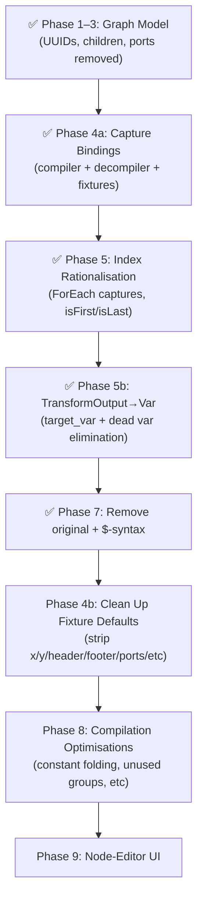

# DS3 Engine Modernisation — Full Roadmap

## Completed Phases

### ✅ Phase 1–3: Graph Model Simplification (Complete)
- Node IDs migrated to UUID v4
- Children arrays as sole structural mechanism
- Connections and ports removed from data model
- Var nodes have `name` field

### ✅ Phase 4a: Structured Capture Bindings (Complete)
- `capture_ref` and `parts` replace text-based `value_ref` in project.json
- Compiler resolves UUID-based references via `get_resolved_ref()`
- Decompiler emits structured refs via `emit_ref_settings()`
- All 11 project.json fixtures migrated

### ✅ Phase 5: Index Rationalisation (Complete)
- ForEach exposes captures: index, count, value, is_first, is_last
- `IsFirst` / `IsLast` condition variants added
- Structured `index` on `OutputPart::Var` replaces `[+N]` text syntax
- `MatchIndex.is_last` support added

### ✅ Phase 5b: TransformOutput→Var + Dead Var Elimination (Complete)
- `target_var` field on TransformOutput
- Dead var elimination pass in `wiring.rs`

### ✅ Phase 6 (renumbered as 7): Remove `original` Field & Eliminate `$`-Syntax (Complete)
- Removed `original` field from `RefExpression`
- Migrated all compiler paths to `get_resolved_ref()` / `emit_ref_settings()`
- Removed `parse_ref` import from compiler, `ref_to_json` from decompiler
- Stripped `"original"` from all project.json fixtures
- 294/294 tests passing

### ✅ Comment Audit (Complete)
- All 40+ engine source files audited
- 16 stale comments fixed across 10 files
- Migration module doc corrected (was claiming atom/combinator conversion)

---

## Remaining Phases

### Phase 4b: Clean Up Project.json Default Values

Strip unnecessary default values from project.json fixtures to reduce noise.

| Property | Default | Remove When |
|---|---|---|
| `x`, `y` | `0.0` | Both are `0.0` |
| `header_color` | (varies) | Could standardize |
| `expanded` | `true` | Is `true` |
| `ports` | `[]` | Is `[]` (deprecated) |
| `connections` | `[]` | Is `[]` (deprecated) |
| `groups` | `[]` | Is `[]` |
| `header`, `footer` | `""` / `null` | Is empty/null |
| `record_header`, `record_footer` | `""` / `null` | Is empty/null |
| `data_footer` | `""` / `null` | Is empty/null |
| Settings keys with empty string values | `""` | Is `""` (e.g. `escape: ""`, `container_start: ""`) |

> [!NOTE]
> All removed fields must have `#[serde(default)]` on their struct definitions so deserialization still works. Check and add `#[serde(default)]` where missing.

---

### Phase 8: Compilation Optimisation Pass (Future)

> [!NOTE]
> This phase collects future compile-time optimisations beyond dead var elimination.

Potential optimisations:
- **Constant folding**: `parts: [text("a"), text("b")]` → single `text("ab")`
- **Unused group elimination**: If a regex captures 13 groups but only groups 1 and 3 are referenced, skip storing the others
- **Scope narrowing**: Vars only used within a single Group don't need global registration
- **ForEach specialisation**: If ForEach body doesn't reference `__foreach_idx`, skip the synthetic var

---

### Phase 9: Node-Editor UI

> [!WARNING]
> This phase is NOT part of the current engine work.

#### Decisions

| Decision | Resolution |
|---|---|
| Children display | Children shown as ordered list in node panel, not as connection wires |
| Visual connections | Inferred from parent→child relationships, drawn automatically |
| Capture display | Expression nodes show captures list (auto-detected from pattern) |
| Value editor | Parts builder UI replaces text `value_ref` field |
| Port removal | Ports fully removed from data model and rendering |
| Template ports | `TemplateEntry.ports` replaced with template-level capture definitions |
| Connection removal | Connections replaced by children arrays — visual wires derived from parent→child |

#### 9a: Remove Ports from Model and UI

Ports are no longer used by the engine — all wiring is via `children` arrays and `capture_ref`/`parts`. The UI still defines port arrays per node type for rendering, but these can be derived from node type at runtime.

##### shared/src/types.rs
- Remove `ports: Vec<ProjectPort>` from `ProjectNode`
- Remove `ports: Vec<ProjectPort>` from `TemplateEntry`
- Remove `ProjectPort` struct entirely

##### node-editor/src/model.rs
- Remove all `ports: vec![...]` definitions from `template_entry_ports()` (lines 638–776+)
- Remove `Port`, `PortDirection`, `PortType` types
- Remove `input_ports()` / `output_ports()` methods from `EditorNode`
- Remove port serialization in save/load (L1505)
- Update node rendering to not draw port circles

##### engine/src/decompiler.rs
- Already emits `ports: vec![]` — remove the field entirely from `ProjectNode` construction

#### 9b: Remove Connections from Model and UI

Connections are superseded by the `children` array on each `ProjectNode`. Visual parent→child wires should be derived from the `children` relationships.

##### shared/src/types.rs
- Remove `connections: Vec<serde_json::Value>` from `ProjectData`

##### node-editor/src/model.rs
- Remove `Connection` struct and `ConnectionId`
- Remove connection serialization/deserialization in save/load (L1513, L1579)
- Replace connection rendering with auto-derived parent→child wires
- Remove `connections: RwSignal<Vec<Connection>>` from app state (main.rs:138)
- Remove `hidden_connections` signal

##### node-editor/src/main.rs
- Remove all connection management: creation, deletion, dragging, hit-testing
- Replace with visual lines drawn from parent node → each child node (derived from `children` arrays)
- Remove connection-related event handlers

#### 9c: Simplify Groups Model

The current `ProjectGroup` is over-engineered — it carries `member_nodes`, `internal_connections`, `port_map`, `saved_positions`, and manual `x`/`y` positioning, all inherited from the old connection-based architecture. The simpler model: each node optionally references a group, and the group is just metadata.

##### New model

```rust
// On ProjectNode — add:
#[serde(default, skip_serializing_if = "Option::is_none")]
pub group: Option<String>,  // UUID of the group this node belongs to

// Simplified ProjectGroup — replace current struct:
pub struct ProjectGroup {
    pub id: String,
    pub name: String,
    pub color: String,
    #[serde(default, skip_serializing_if = "Option::is_none")]
    pub parent_group: Option<String>,  // for nested groups
}
```

##### What changes

| Current | New |
|---------|-----|
| `ProjectGroup.member_nodes: Vec<String>` | **Removed** — derived by scanning nodes with matching `group` UUID |
| `ProjectGroup.internal_connections` | **Removed** — dead code (connections removed in 9b) |
| `ProjectGroup.port_map` | **Removed** — dead code (ports removed in 9a) |
| `ProjectGroup.x`, `ProjectGroup.y` | **Removed** — bounding box auto-derived from member node positions |
| `ProjectGroup.saved_positions` | **Removed** — node positions live on nodes themselves |
| `ProjectPortMapping` struct | **Removed** entirely |
| `ProjectSavedPosition` struct | **Removed** entirely |
| `ProjectNode.group` | **New** — optional UUID reference to a group |

##### UI rendering
- Group bounding box computed at render time from the positions of member nodes
- Collapse/expand still works: toggling a group hides/shows its member nodes
- Drag-group moves all member nodes together (same as today but derived from `node.group` instead of `group.member_nodes`)

##### Migration
- For each existing `ProjectGroup`, scan its `member_nodes` and set `group: "<group-id>"` on each referenced `ProjectNode`
- Drop all removed fields from `ProjectGroup`

#### 9d: UI Feature Additions

##### Capture Display
- Expression nodes (Regex, Split, All, ForEach) show a captures list in the node panel
- Auto-detected from pattern (regex group count) or node type (ForEach: index/value/count/is_first/is_last)

##### Parts Builder UI
- Replace text `value_ref` field on Data/Var/Group nodes
- Visual builder for `capture_ref` (dropdown of parent captures) and `parts` array (add text/capture/var parts)
- Drag-to-reorder parts

---

## Execution Summary


