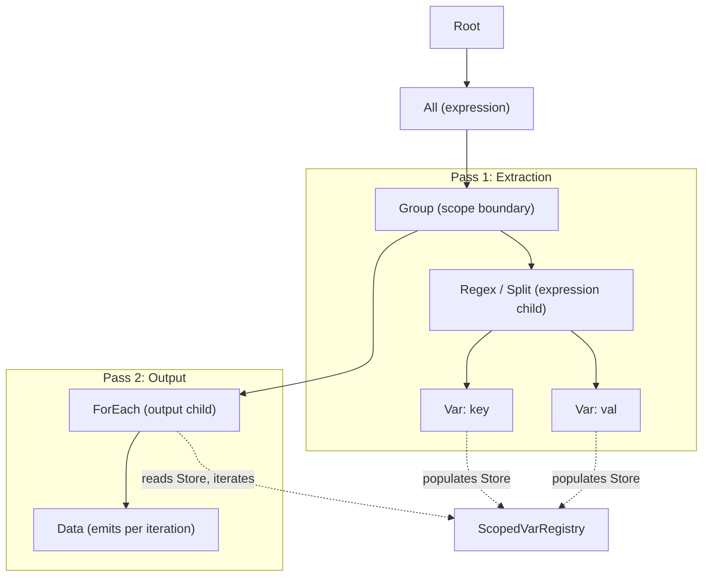

# ForEach Engine Node — Design Document

## Overview

The `ForEach` node enables **list-style iteration** over multi-valued variables in the DS3 engine. When a Split or Regex matches N times within a scope, captured Var values accumulate N entries in a `Store` (indexed by match count). ForEach iterates over all populated entries, executing its children once per stored value — enabling transformations like XML→JSON and JSON→XML without external XSLT.

---

## Problem Statement

The existing engine captures multi-valued data (e.g., Split on `,` produces N segments) but can only reference individual values at a fixed match index (`$var$0`). There was no way to **iterate over all captured values** after the extraction phase to emit structured output. Users resorted to XSLT pipelines for any list-to-list transformation.

### Example: Without ForEach

```
Input:  "Alice,Bob,Charlie"
Split:  Captures 3 segments as Var "name"
Output: Can only emit $name$0 at match_count=1, $name$0 at match_count=2, etc.
        No way to emit ALL names in a loop after extraction is complete.
```

### Example: With ForEach

```
Input:  "Alice,Bob,Charlie"  
Split → Var "name" captures 3 values
ForEach(var="name") → Data("<item>"+$name$0+"</item>")
Output: <item>Alice</item><item>Bob</item><item>Charlie</item>
```

---

## Key Design Decisions

### 1. ForEach is an Output-Side Node (Not an Expression)

ForEach is classified alongside Switch, Choose, If, and ValueMap — it is an **output-side control flow node** that runs within a match context, not an expression that consumes input text.

- `is_expression()` returns `false`
- ForEach does not consume input — it reads from the var registry
- ForEach must be placed inside a **Group** or as a child of an expression (Split/Regex/All)

### 2. Two-Pass Group Processing is Required

ForEach relies on the Group's **two-pass processing** architecture:

| Pass | What Runs | Purpose |
|------|-----------|---------|
| **Pass 1** | Expression children (Split, Regex, etc.) | Capture variables into the Store |
| **Pass 2** | Output children (Data, ForEach, Switch, etc.) | Emit structured output using captured vars |

The idiomatic pattern for ForEach is:

```
All → Group {
    Regex/Split   (extraction — populates vars)     ← expression child (pass 1)
    ForEach       (iteration — reads vars, emits)   ← output child (pass 2)
}
```

> [!IMPORTANT]
> ForEach **cannot** be placed at Root level. The root child loop only dispatches expression children via `compiled_expr_indices`. Output-side nodes like ForEach are invisible to the root loop and will silently produce no output.

### 3. Apply/TemplateRef is Unnecessary

`TemplateRef` already supports template instantiation at load time, including recursive templates (a template can reference itself). There is no need for a separate `Apply` node. ForEach addresses the remaining gap: iterating over captured multi-valued data at runtime.

### 4. Match Count Indexing

ForEach iterates from `0` to `Store::len()`, skipping indices where no value was stored. The var's Store is indexed by the `match_count` parameter used during extraction:

```rust
// During extraction (Split match loop):
// match_count = 1: store.set(1, "Alice")
// match_count = 2: store.set(2, "Bob")  
// match_count = 3: store.set(3, "Charlie")

// During ForEach iteration:
// Store::len() = 4 (indices 0..4)
// idx=0: no value (skipped)
// idx=1: "Alice" → process children with match_count=1
// idx=2: "Bob"   → process children with match_count=2
// idx=3: "Charlie" → process children with match_count=3
```

Children of ForEach use `match_count = idx`, so `$var$0` resolves to the current iteration's value.

### 5. Group Index Support

ForEach has a `group` parameter (default 0) that selects which Store within a var's entry to iterate. This supports regex capture groups where a var may have multiple stores (group 0 = full match, group 1 = first capture, etc.).

---

## Data Model

### NodeConfig Variant

```rust
NodeConfig::ForEach {
    id: Option<String>,
    /// Var name to iterate over (e.g. "field")
    var_id: String,
    /// Group index within the var's stores (default 0)
    group: usize,
    children: Vec<NodeConfig>,
}
```

### Store Extension

```rust
impl Store {
    /// Number of match indices (some may be None).
    pub fn len(&self) -> usize {
        self.values.len()
    }
}
```

### Graph Node (Editor)

```json
{
    "id": "foreach_1",
    "node_type": "for_each",
    "title": "ForEach: field_key",
    "settings": {
        "var": "field_key",
        "group": 0
    },
    "ports": [
        { "name": "match", "port_type": "MatchResult", "direction": "Input" },
        { "name": "output", "port_type": "Field", "direction": "Output" }
    ]
}
```

---

## Implementation

### Files Modified

| File | Change |
|------|--------|
| `engine/src/store.rs` | Added `Store::len()` |
| `engine/src/node.rs` | Added `ForEach` variant; updated `children()`, `children_mut()`, `type_name()`, `id()`, `is_expression()` |
| `engine/src/engine.rs` | Added ForEach handler in `process_match_children` and `process_children_slice` |
| `engine/src/compiler.rs` | Added `"for_each"` case reading `var` and `group` from settings |
| `engine/src/decompiler.rs` | Added `ForEach` graph node creation with green header |
| `engine/src/template_registry.rs` | Added `ForEach` to `get_id_mut` traversal |

### Engine Handler (process_match_children)

```rust
NodeConfig::ForEach { var_id, group, children: foreach_children, .. } => {
    let count = vars.get(var_id)
        .and_then(|stores| stores.get(*group))
        .map(|s| s.len())
        .unwrap_or(0);

    for idx in 0..count {
        let has_value = vars.get(var_id)
            .and_then(|stores| stores.get(*group))
            .and_then(|s| s.get(idx))
            .is_some();
        if !has_value { continue; }

        process_children_slice(
            regexes, vars, foreach_children, mr, idx,
            writer, messages, ignore_errors, timing, parent_encoding,
        )?;
    }
}
```

The same handler is duplicated in `process_children_slice` (for nested Switch/Choose/If/ForEach branches).

---

## Test Cases

### Test 1: Basic Iteration

**Input:** `"a,b,c"`
**Structure:** `All → Group { Split(",") → Var("item"), ForEach("item") → Data("<item>"+$item$0+"</item>") }`
**Output:** `<item>a</item><item>b</item><item>c</item>`

### Test 2: XML → JSON

**Input:** `"<name>Alice</name><age>30</age><city>London</city>"`
**Structure:** `All → Group { Regex("<(\\w+)>([^<]*)</\\1>") → Var("key")+Var("val"), ForEach("key") → Data('"'+$key$0+'":"'+$val$0+'"') }`
**Output:** `{"name":"Alice""age":"30""city":"London"}`

### Test 3: JSON → XML

**Input:** `"name:Alice|age:30|city:London"`
**Structure:** `All → Group(record_header="<record>") { Regex("(\\w+):([^|]+)\\|?") → Var("key")+Var("val"), ForEach("key") → Data("<"+$key$0+">"+$val$0+"</"+$key$0+">") }`
**Output:** `<record><name>Alice</name><age>30</age><city>London</city></record>`

### Test 4: ForEach in Group (Nested Records)

**Input:** `"Alice:30,Bob:25"`
**Structure:** `Split(",") → Group(record_header="<person>") { Regex("(\\w+):(\\d+)") → Var("name")+Var("age"), Data(...) }`
**Output:** `<person><name>Alice</name><age>30</age></person><person><name>Bob</name><age>25</age></person>`

---

## Architecture Diagram



---

## Limitations and Future Work

### Current Limitation: Nested Split→Regex inside ForEach Groups

When a Group contains Split→Regex nesting (two levels of expression), the vars captured by the inner Regex during the Group's pass-1 extraction may not be visible to ForEach in pass 2. This is because `process_group_children` runs expressions sequentially in the group text, and the nested expression's var captures may be stored in a different scope context.

**Workaround:** Use a single Regex pattern instead of Split→Regex nesting when vars need to be accessed by ForEach. For example, instead of `Split("|") → Regex("^(\\w+):(.+)$")`, use `Regex("(\\w+):([^|]+)\\|?")`.

### Future: Node Editor UI

The node editor needs a `for_each` node type with:
- Settings panel: var name dropdown, group index selector
- Visual: green header (`#3a6b4a`), MatchResult input, Field output
- Children panel support for ordering ForEach output children

### Future: Separator/Comma Logic

ForEach currently has no built-in separator between iterations. For JSON output, comma separation between elements requires either:
- A `separator` field on ForEach (future enhancement)
- A `first_iteration` flag or index counter accessible to children
- Post-processing via a Transform node

---

## Verification Results

| Check | Result |
|-------|--------|
| `cargo test --package datasplitter-rs` | **234 passed**, 0 failed, 6 ignored |
| `cargo check --target wasm32-unknown-unknown` (node-editor) | **Clean** |
| ForEach tests (6 total) | All passing |
