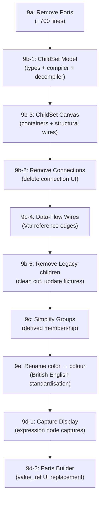

# Node-Editor UI Refactor — Implementation Plan

Reference: [node_editor_ui_refactor.md](file:///home/jon/work/ds-rs/design/node_editor_ui_refactor.md)

---

## Phase 9a: Remove Ports (Backend + Model) ✅ COMPLETE

Pure deletion — removed the port system from shared types, engine, and node-editor model.

### Step 1: Remove ports from shared types ✅
- [x] Removed `ports: Vec<ProjectPort>` from `ProjectNode`
- [x] Removed `ports: Vec<ProjectPort>` from `TemplateEntry`
- [x] Deleted `ProjectPort` struct

### Step 2: Remove ports from engine ✅
- [x] Removed all 18 `ports: vec![]` from decompiler
- [x] Engine compiles, 294 tests pass

### Step 3: Remove ports from node-editor model ✅ (partial — see deferred)
- [x] Removed `ports: Vec<Port>` from `Node` struct
- [x] Removed `ports: Vec<Port>` from `NodeTemplate` struct
- [x] Removed `inputs()` / `outputs()` methods
- [x] Removed 46 `ports: vec![...]` blocks from `demo_templates()`
- [x] Removed port serialization in `to_project_data()`
- [x] Removed port deserialization in `from_project_data()`
- [x] Replaced demo_scene connections with children-based hierarchy

### Step 4: Remove port rendering ✅ (partial — see deferred)
- [x] Removed port circle SVG rendering (~85 lines)
- [x] Removed port hit-testing and event handlers
- [x] Stubbed out `start_connection` (functionally dead)

### Deferred to later phases
The following types still exist because they have live consumers in Connection/Group code:
- `PortType`, `PortDirection`, `Port`, `PortId` → deferred to **9b-2** (connection removal)
- `ConnectionDrag` struct + signal → deferred to **9b-2**
- `PortMapping` cleanup → deferred to **9c** (group simplification)

### Verification ✅
- Engine: 294 tests pass
- Workspace builds clean
- Node-editor compiles (warnings only)

---

## Phase 9b-1: ChildSet Model (Types + Compiler + Decompiler) ✅ COMPLETE

Added the ChildSet data model to shared types and updated the compiler/decompiler to resolve them. Resolution happens in `to_graph_state()` — the compiler itself needed no changes.

### Step 1: Add ChildSet to shared types ✅
- [x] Added `ProjectChildSet` struct to `shared/src/types.rs`
- [x] Added `child_sets: Vec<ProjectChildSet>` to `ProjectData` (with `#[serde(default)]`)
- [x] Added `children_ref: Option<String>` to `ProjectNode` (with `#[serde(default)]`)
- [x] Kept existing `children: Vec<String>` on `ProjectNode` for backward compat

### Step 2: Update `to_graph_state()` ✅
- [x] Resolves `children_ref` → ChildSet → child IDs (with HashMap index for O(1) lookup)
- [x] Falls back to inline `children` if `children_ref` absent or ChildSet not found
- [x] No changes to `GraphNode` — resolution happens before passing to compiler

### Step 3: Compiler — no changes needed ✅
- [x] Compiler works on `GraphNode.children` which `to_graph_state()` already resolves

### Step 4: Update decompiler ✅
- [x] Added `child_sets: Vec<ProjectChildSet>` to `DecompileCtx`
- [x] `decompile_children()` creates a `ProjectChildSet` with fresh UUID for each non-empty children list
- [x] Sets `children_ref` on parent `ProjectNode` and populates inline `children` for backward compat
- [x] `decompile()` emits `child_sets` array on `ProjectData`

### Step 5: Migrate fixtures ✅
- [x] Migrated all 11 project.json fixtures (285 total ChildSets created)
- [x] Inline `children` kept for backward compat

### Verification ✅
- 294 engine tests pass with migrated fixtures
- Workspace + node-editor compile clean
- `grep -rn 'children_ref' engine/tests/fixtures/projects/` shows UUIDs on all parent nodes

---

## Phase 9b-2: Remove Connections from UI ✅ COMPLETE

Now that ChildSets handle parent→child relationships, delete the connection system from the node-editor. Also deletes port types deferred from 9a.

### Step 1: Remove connection model ✅
- [x] Deleted `Connection` struct, `ConnectionId`, `ConnectionDrag` from model.rs
- [x] Removed connection serialization in `to_project_data()` (emits `connections: vec![]` for DTO compat)
- [x] Removed connection deserialization from `from_project_data()`
- [x] Removed `connections` from `demo_scene()` return type

### Step 2: Remove connection UI state ✅
- [x] Removed `connections`, `hidden_connections`, `connection_drag` signals
- [x] Removed all connection event handlers and SVG rendering
- [x] Removed `complete_connection` and `start_connection` closures
- [x] Replaced `ConnectionsLayer` with empty SVG stub
- [x] Removed connection props from `NodesLayer`
- [x] Rewrote group system (`on_group`/`on_ungroup`/`can_group_selected`) without connections
- [x] Simplified `collapse_scopes_to`/`collapse_single_scope` (removed connection params)
- [x] Fixed `auto_layout` to use `node.children` instead of connection adjacency

### Step 3: Remove connections from shared types — deferred to 9c
- [ ] Remove `connections: Vec<serde_json::Value>` from `ProjectData` (shared/src/types.rs) → moved to 9c Step 3

### Step 4: Delete port types (deferred from 9a) ✅
- [x] Deleted `PortType`, `PortDirection`, `Port`, `PortId`, `parse_port_type()` from model.rs
- [x] Removed `PORT_ROW_H`, `INPUT_PORT_X` constants from main.rs
- [x] Pulled forward: removed `internal_connections` and `port_map` from `NodeGroup` (was planned for 9c)

### Verification ✅
- Node-editor compiles (warnings only)
- 294 tests pass
- No connection wires visible
- Save/load works via ChildSets

---

## Phase 9b-3: ChildSet Canvas Rendering ✅ COMPLETE

Added ChildSet containers as visual elements on the canvas, with structural wires from parent nodes.

### Step 1: Add ChildSet to editor model ✅
- [x] Added `ChildSet` struct and `ChildSetId` type alias to model.rs
- [x] Added `children_ref: Option<ChildSetId>` to `Node` struct
- [x] Added `child_sets: RwSignal<Vec<ChildSet>>` to app state
- [x] Load ChildSets from `ProjectData` in `from_project_data()` (including `children_ref` on nodes)
- [x] Save ChildSets to `ProjectData` in `to_project_data()` (including `children_ref` on nodes)

### Step 2: Render ChildSet containers ✅
- [x] `ChildSetsLayer` component renders each ChildSet as a rounded-rect container
- [x] Header: "▾ Children ({count})" / "▸ Children ({count})" with collapse toggle
- [x] Numbered child items with: color dot, name, node type label
- [x] Collapsed mode: just shows header with count
- [x] CSS: `.childset`, `.childset-header`, `.childset-item`, `.childset-toggle`, `.childset-empty`

### Step 3: Structural wires ✅
- [x] `StructuralWiresLayer` component draws dashed purple bezier curves from parent nodes to ChildSets
- [x] Uses `children_ref` for proper UUID-based matching (supports shared ChildSets)
- [x] Wire anchors at right edge of parent node → left edge of ChildSet
- [x] CSS: `.structural-wire` with dashed stroke

### Step 4: ChildSet interactions (partial)
- [x] Drag to reposition ChildSet on canvas (persists x/y via DragState reuse)
- [x] Collapse/expand toggle
- [ ] Click child item to select/focus the child node — deferred to 9d
- [ ] Drag-to-reorder children within the ChildSet — deferred to 9d
- [ ] Drag node from palette into ChildSet to add as child — deferred to 9d
- [ ] Click "×" on child item to remove from ChildSet — deferred to 9d
- [ ] Drag child from one ChildSet to another to reparent — deferred to 9d
- [ ] Right-click parent node → "Add child" creates node in its ChildSet — deferred to 9d

### Step 5: Auto-layout
- [ ] Update `layout.rs` to position ChildSets — deferred to 9d

### Verification ✅
- 294 engine tests pass
- Workspace + node-editor compile clean
- ChildSet containers render on canvas for loaded projects
- Structural wires connect parents to ChildSets via `children_ref`
- Save/load round-trips ChildSet positions and expanded state

---

## Phase 9b-4: Data-Flow Wire Rendering ✅ COMPLETE

Add derived data-flow wires for Var cross-references.

### Step 1: Derive data-flow edges ✅
- [x] Added `DataFlowEdge` struct to model.rs (var_node_id, consumer_node_id, var_name)
- [x] Implemented `derive_data_flow_edges(nodes: &[Node]) -> Vec<DataFlowEdge>`:
  - Scans `value_ref`, `name_ref` for `parts[].type = "var"` → ref_id is a Var node UUID
  - Scans `on_ref` for embedded var parts and direct ref_id pointing to var nodes
  - Does NOT include `capture_ref` (local parent→child references)
- [x] Edges derived reactively inside `DataFlowWiresLayer` component from `nodes.get()`

### Step 2: Render data-flow wires ✅
- [x] Amber/gold bezier curves between Var writer and consumer node
- [x] Distinct from structural wires: solid line + animated flowing dash overlay
- [x] Var name label appears on hover (`.data-flow-label`)
- [ ] Click wire to select both endpoints — deferred
- [ ] Hover wire to highlight the Var node and all its readers — deferred

### Verification ✅
- 294 tests pass, compilation clean
- Data-flow wires rendered for all var references
- No wire for `capture_ref` (correctly excluded)
- Wires update reactively from `nodes` signal

---

## Phase 9b-5: Remove Legacy `children` Property ✅ COMPLETE

Removed the legacy inline `children: Vec<String>` from `ProjectNode`. ChildSets via `children_ref` are now the sole child mechanism. `GraphNode.children` retained as the resolved flat list for the compiler.

### Step 1–7: All complete ✅
- [x] Removed `children: Vec<String>` from `ProjectNode` in shared types
- [x] Removed `to_graph_state()` fallback — ChildSet resolution is the only path
- [x] Updated `from_project_data()` to resolve children from ChildSets
- [x] Updated `to_project_data()` — no longer emits inline `children`
- [x] Removed `parent.children` assignment from decompiler's `decompile_children()`
- [x] Stripped `"children"` from all 11 project.json fixtures
- [x] Updated decompiler tests to assert via `children_ref` and ChildSets

### Verification ✅
- 294 tests pass
- Zero `"children"` keys on ProjectNodes in fixtures
- `shared/src/types.rs` — only `children_ref` and `child_sets` references

---

## Phase 9c: Simplify Groups ✅ COMPLETE

Replaced `NodeGroup` with `VisualGroup` (id, name, color, parent_group). Group membership is now stored on each node via `node.group: Option<GroupId>`. Bounding box derived at render time from member positions.

### Steps 1–6: All complete ✅
- [x] Added `group: Option<GroupId>` to `Node` and `group: Option<String>` to `ProjectNode`
- [x] Replaced `NodeGroup` with `VisualGroup` — removed member_nodes, x, y, saved_positions
- [x] Simplified `ProjectGroup` — legacy fields kept with `skip_serializing_if` for backward compat
- [x] Deleted `ProjectPortMapping` and `ProjectSavedPosition` structs
- [x] Added `skip_serializing_if` to `ProjectData.connections`
- [x] Updated `on_group` — sets `node.group = Some(group_id)` on selected nodes
- [x] Updated `on_ungroup` — finds members via `node.group`, clears on restore
- [x] Updated `collapse_single_scope` — derives members from `node.group`
- [x] Updated group scope viewer — filters by `node.group`
- [x] Updated heatmap aggregation — finds members via `hidden_nodes.group`
- [x] Updated `from_project_data` — migrates legacy `member_nodes` to `node.group`
- [x] Updated `to_project_data` — derives `member_nodes` from `nodes.group`
- [x] All 18 decompiler ProjectNode constructors updated with `group: None`

### Verification ✅
- 294 tests pass
- Clean compilation

---

## Phase 9d-1: Capture Display ✅ COMPLETE

### Steps 1–2: All complete ✅
- [x] Added `CaptureInfo` struct, `is_expression_node()`, `extract_node_captures()` utility functions to model.rs
- [x] Added `collect_capture_refs()` helper to detect capture references in child value_ref/name_ref fields
- [x] Added reactive captures panel in node rendering (between settings and children panel)
- [x] Shows capture group index, name, and source (for ForEach captures)
- [x] Referenced captures shown with green ● indicator and bright text
- [x] Unused captures shown with dim ○ indicator and grey text
- [x] Added CSS styles (`.captures-panel`, `.capture-item.referenced`, `.capture-item.unused`)

### Verification ✅
- 294 tests pass
- Clean compilation

---

## Phase 9d-2: Parts Builder UI ✅ COMPLETE

### Step 1: capture_ref model ✅
- [x] Added `capture_ref: String` to `NodeSettings::Group`, `NodeSettings::Data`, `NodeSettings::Var`
- [x] Updated `to_json()` to emit `capture_ref` when non-empty
- [x] Updated `parse_settings` to read `capture_ref` from settings JSON via `s("capture_ref")`
- [x] Updated all constructors: palette templates, default_node_collection, render_settings

### Step 2: Value source display ✅
- [x] Group/Data/Var show value source as `settings-value-display` (read-only):
  - capture_ref set → `⊕ capture:8fd5cb59...`
  - value_ref is JSON object → `⊕ parts`
  - value_ref is plain string → shown as-is
- [x] Full UUID shown in tooltip on hover
- [x] Added `.settings-value-display` CSS class

### Steps 3-4: Deferred
Steps 3 (composite parts builder) and 4 (mode switching) require interactive editing UI and are deferred to a future phase. The current implementation preserves capture_ref round-trip and displays the value source correctly.

### Verification ✅
- 294 tests pass
- Clean compilation
- capture_ref now round-trips through the node editor (previously lost)

---

## Phase 9e: Rename `color` → `colour` ✅ COMPLETE

### Steps 1-5: All complete ✅
- [x] Renamed `header_color` → `header_colour` on `ProjectNode` with `#[serde(alias = "header_color")]`
- [x] Renamed `color` → `colour` on `ProjectGroup` with `#[serde(alias = "color")]`
- [x] Renamed `GroupColor` → `GroupColour` enum
- [x] Renamed `bar_color` → `bar_colour`, `css_color()` → `css_colour()`, `parse_group_color` → `parse_group_colour`
- [x] Renamed `color_index` → `colour_index` on `Highlight` struct (+ server handler)
- [x] Updated all engine refs: decompiler.rs, capture.rs, preview.rs
- [x] Updated all node-editor refs: model.rs, main.rs
- [x] Updated all fixture project.json files (647 header_colour + colour values)
- [x] Serde aliases kept for backward compat (reading old files)

### Verification ✅
- 294 tests pass
- Clean compilation
- Zero old names in Rust source (only serde aliases intentionally remain)
- Zero old names in fixtures

---

## Execution Summary

### Dependencies

| Phase | Depends On | Safe to Ship Independently? |
|-------|-----------|---------------------------|
| 9a | — | ✅ Yes — pure deletion, everything still works |
| 9b-1 | — | ✅ Yes — backward compat, existing `children` still works |
| 9b-3 | 9b-1 | ✅ Yes — adds ChildSet UI alongside existing connections |
| 9b-2 | 9a, 9b-3 | ⚠️ Only after 9b-3 (need ChildSet UI before removing connections) |
| 9b-4 | 9b-2 | ✅ Yes — adds data-flow wires |
| 9b-5 | 9b-1, 9b-3, 9b-2 | ✅ Yes — clean cut, all consumers use ChildSets |
| 9c | 9a, 9b-5 | ✅ Yes — simplifies after full cleanup |
| 9e | — | ✅ Yes — mechanical rename, can be done anytime (best after 9c to avoid churn) |
| 9d-1 | — | ✅ Yes — display only, no model changes |
| 9d-2 | 9d-1 | ✅ Yes — but best after captures are visible |

### Recommended Order

1. **9a** + **9b-1** — can be done in parallel (independent model changes)
2. **9b-3** — add ChildSet canvas rendering (connections still exist as fallback)
3. **9b-2** — now safe to delete connections (ChildSet UI is active)
4. **9b-4** — add data-flow wires
5. **9b-5** — remove legacy `children`, update all fixtures (clean cut)
6. **9c** — simplify groups (ports, connections, and legacy children all gone)
7. **9e** — rename color → colour (mechanical, best after groups stabilise)
8. **9d-1** → **9d-2** — sequential UI additions
