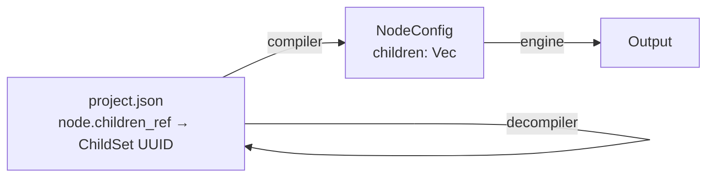
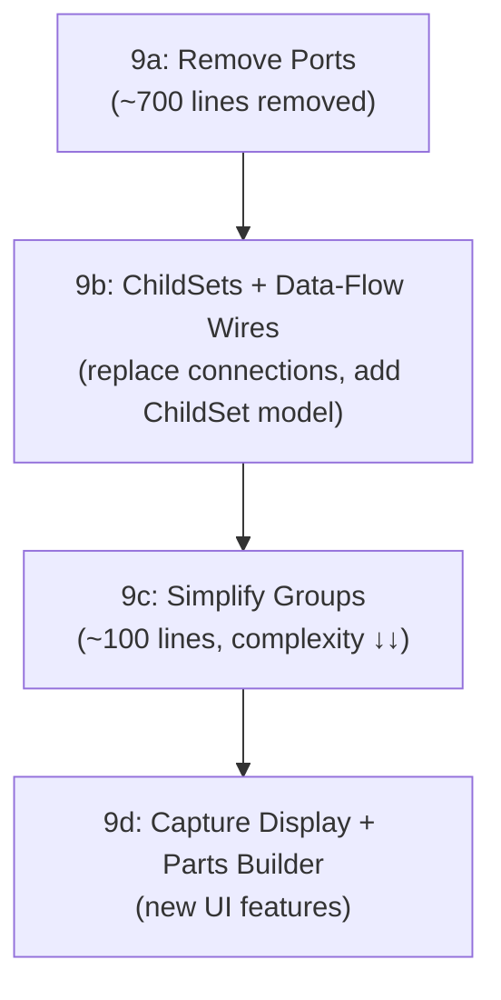

# Node-Editor UI Refactor — Design Document

## Overview

The engine has been modernised to use UUID-based `children` arrays, structured `capture_ref`/`parts` bindings, and `RefExpression` for all variable wiring. The node-editor UI still uses the legacy port/connection architecture from the original design. This document describes the changes needed to align the UI with the new engine model.

## Current UI Architecture

```
node-editor/src/
├── model.rs   (1829 lines) — data model: Node, Port, Connection, Group, Settings
├── main.rs    (3577 lines) — rendering, events, signals, SVG canvas
├── layout.rs  (327 lines)  — auto-layout algorithms
└── api.rs     (178 lines)  — HTTP API calls to engine server
```

### Key Types (current)

| Type | Lines | Purpose | Status |
|------|-------|---------|--------|
| `PortType` (9 variants) | 17–66 | Color-coded connector types | **Remove** — children arrays replace port connections |
| `Port` | 78–103 | Individual port on a node | **Remove** |
| `Connection` | 449–457 | Wire between two ports | **Remove** — children are nested; data-flow wires derived from var refs |
| `ConnectionDrag` | 617–625 | In-progress connection dragging | **Remove** |
| `NodeGroup` | 551–568 | Visual grouping with member lists | **Simplify** |
| `PortMapping` | 573–582 | Group port ↔ internal port mapping | **Remove** |
| `NodeTemplate` | 596–603 | Palette entry with ports | **Simplify** |
| `Node` | 375–443 | Core node with ports array | **Simplify** |

### What's Wrong

1. **Ports define node topology** — every template has hardcoded `ports: vec![...]` arrays (lines 638–1230). These define input/output connections but the engine ignores them — it uses `children` arrays exclusively.

2. **Connections are redundant** — the `Connection` struct (from_node/from_port → to_node/to_port) duplicates what `children` arrays already express. Children should be nested inline; the only wires worth drawing are cross-branch Var data-flow references.

3. **NodeGroup is bloated** — carries `member_nodes`, `internal_connections`, `port_map`, `saved_positions`, `x`, `y` — most of which are dead code from the connection era.

4. **value_ref is a raw string** — Data/Var/Group settings have `value_ref: String` which the UI treats as raw text. The engine now uses structured `capture_ref`/`parts`, but the UI has no builder for these.

---

## Phase 9a: Remove Ports

### What Ports Did

Ports provided typed endpoints (input/output) for connection wires. Each node type declared its ports in `demo_templates()`:

```rust
// Current: Split has an input and output port
ports: vec![
    Port::input("text", PortType::TextStream),
    Port::output("match", PortType::MatchResult),
],
```

The engine never reads these. The compiler uses `children` arrays to determine parent→child relationships.

### What Replaces Them

**Nothing** — ports were a visual affordance for creating connections. Since connections are also being removed (Phase 9b), ports have no purpose.

Node rendering currently draws small colored circles for each port. These will be replaced by:
- A **children list** showing child nodes as an ordered list in the node panel
- **Drop targets** for drag-and-drop reparenting

### Changes

#### model.rs
- Delete `PortType` enum (lines 17–66)
- Delete `PortDirection` enum (lines 68–72)
- Delete `Port` struct and its `impl` (lines 78–103)
- Delete `PortId` type alias (line 8)
- Remove `ports: Vec<Port>` from `Node` (line 381)
- Remove `ports: Vec<Port>` from `NodeTemplate` (line 601)
- Remove `inputs()` / `outputs()` methods from `impl Node` (lines 436–442)
- Remove all `ports: vec![...]` from `demo_templates()` (lines 638–1230, ~600 lines)
- Remove port serialization in `to_project_data()` and `from_project_data()`

#### main.rs
- Remove port circle rendering in node SVG
- Remove port hit-testing (click/hover detection on ports)
- Remove `ConnectionDrag` state and port-to-port dragging

#### shared/src/types.rs
- Remove `ports: Vec<ProjectPort>` from `ProjectNode`
- Remove `ports: Vec<ProjectPort>` from `TemplateEntry`
- Delete `ProjectPort` struct

#### engine/src/decompiler.rs
- Remove `ports: vec![]` from `ProjectNode` construction (lines 98, 128, 160, 184)

**Estimated reduction:** ~700 lines removed

---

## Phase 9b: Canvas Layout & Data-Flow Wires

### Key Insight

Children are **ordered** — they execute in sequence within their parent. This is a tree, not a graph. But real configs are **wide and deep** — apache_httpd has a Regex with 13 children at depth 4, ausearch reaches depth 12 with 25 nodes. Deep inline nesting creates unreadable boxes-in-boxes.

The right approach: every node is a **standalone box on the canvas**. Parent→child relationships are shown via **children containers** — lightweight visual groups that sit alongside the parent and hold its ordered children. The only free-form wires are for **cross-branch Var data flow**.

### Layout Approach: Children Containers

Each node that has children gets a **children container** rendered nearby. The parent node shows a "children" output connector, and a structural wire links it to the container. Inside the container, children are listed in execution order.

```
 ┌──────────────┐          ┌─────────────────────────────────┐
 │   Source     │          │ ▸ Children                      │
 │  buffer: 20k ├─────────▶│  ┌──────────────┐              │
 └──────────────┘          │  │  1. Split     │──┐           │
                           │  │  delim: \n    │  │           │
                           │  └──────────────┘  │           │
                           └────────────────────│───────────┘
                                                │
                            ┌───────────────────▼───────────┐
                            │ ▸ Children                     │
                            │  ┌──────────────┐              │
                            │  │  1. Group    │──┐           │
                            │  │  value: $1   │  │           │
                            │  └──────────────┘  │           │
                            └────────────────────│──────────┘
                                                 │
                             ┌───────────────────▼──────────┐
                             │ ▸ Children                    │
                             │  1. Regex ──┐                 │
                             │  2. Var: monthNum             │
                             │  3. MapTransform              │
                             │  4. Data: EventTime           │
                             │  5. If (hasReferer)           │
                             │  6. Data: Size                │
                             └─────────────│────────────────┘
                                           │
                              ┌────────────▼────────────────┐
                              │ ▸ Children (Regex)           │
                              │  1. Var: clientIP            │
                              │  2. Var: user                │
                              │  3. Var: day                 │
                              │  ... (13 children)           │
                              └─────────────────────────────┘
```

#### Key Properties

- **No deep nesting** — every node and every children container is a top-level canvas element. No boxes-in-boxes.
- **Structural wires** are thin, subtle lines connecting a node to its children container. Visually distinct from data-flow wires (grey/dotted vs amber/solid).
- **Children containers are collapsible** — click to expand/collapse. When collapsed, shows just "{N} children".
- **Children are ordered** — numbered list, drag-to-reorder within the container.
- **Leaf nodes** (Var, Data with no children) have no children container — they terminate the branch.
- **Auto-layout** positions children containers to the right of or below their parent, cascading naturally.

#### Model: UUID-Referenced Child Sets

Child sets are **first-class objects** in the project data model. Each node references its children via a ChildSet UUID. The compiler resolves these into the engine's flat `children` arrays at compile time — exactly like `capture_ref` and `parts` are resolved into `RefExpression` today.



##### project.json types

```rust
// ProjectNode — replace children: Vec<String> with:
#[serde(default, skip_serializing_if = "Option::is_none")]
pub children_ref: Option<String>,   // UUID of a ChildSet

// New top-level collection in ProjectData:
pub child_sets: Vec<ProjectChildSet>,

#[derive(Debug, Clone, Serialize, Deserialize)]
pub struct ProjectChildSet {
    pub id: String,                // UUID
    pub children: Vec<String>,     // ordered node IDs
    #[serde(default, skip_serializing_if = "is_zero_f64")]
    pub x: f64,                    // canvas position (user-draggable)
    #[serde(default, skip_serializing_if = "is_zero_f64")]
    pub y: f64,
    #[serde(default = "default_true", skip_serializing_if = "is_true")]
    pub expanded: bool,            // collapsed state for UI
}
```

##### How it flows through the system

| Layer | What Happens |
|-------|-------------|
| **project.json** | Nodes have `children_ref: "abc-123"`. ChildSets are stored as a flat list alongside nodes. |
| **node-editor UI** | ChildSets render as draggable containers on the canvas. A structural wire connects each node to its ChildSet. |
| **compiler** | `compile_node()` resolves `children_ref` → looks up the ChildSet → recursively compiles each child node ID → produces `NodeConfig { children: vec![...] }`. No ChildSet concept reaches the engine. |
| **decompiler** | Reverse: for each `NodeConfig` with children, create a `ProjectChildSet` with a fresh UUID, set `children_ref` on the parent `ProjectNode`. |
| **engine** | Unchanged. `NodeConfig.children` is a `Vec<NodeConfig>` as today. Engine never sees ChildSets. |

> [!IMPORTANT]
> This is the same pattern used for captures and parts: the project.json format uses UUID references for editability, the compiler flattens them into the engine's internal representation, and the decompiler reconstructs them for round-tripping.

##### Why ChildSets over inline children

| Concern | Inline `children: Vec<NodeId>` | UUID ChildSet |
|---------|-------------------------------|---------------|
| Canvas positioning | Node positions only — children have no layout | ChildSet has its own `x`/`y`, user-draggable |
| Collapse state | Would need a separate collapsed map | `expanded` field on ChildSet |
| Structural wiring | Implicit (parent "owns" children) | Explicit wire from node → ChildSet box |
| Visual clarity | Children invisible unless node is expanded | ChildSets are always visible on canvas as distinct boxes |
| Consistency | Different from captures/vars (which use UUIDs) | Same UUID-reference pattern as the rest of the model |
| Compiler impact | Already works — `children` on `GraphNode` | Small change: look up `children_ref` → resolve ordered node IDs |
| **Reuse** | Children are owned — no sharing | **Multiple parents can reference the same ChildSet** |

##### Shared ChildSets

Because `children_ref` is a UUID reference, multiple parent nodes can point to the **same ChildSet**. This gives reuse for free — if several expression nodes need the same output pipeline (e.g. the same set of Data/Var children), they share one ChildSet rather than duplicating the subtree.

```
 ┌─────────────────┐
 │ Regex (pattern A)├──────┐
 └─────────────────┘      │
                           ▼
 ┌─────────────────┐    ┌─────────────────────────┐
 │ Regex (pattern B)├───▶│ ▸ Shared Children        │
 └─────────────────┘    │  1. Var: timestamp       │
                        │  2. Var: hostname        │
 ┌─────────────────┐    │  3. Data: EventTime      │
 │ Split (delim: ,)├───▶│  4. Data: Host           │
 └─────────────────┘    └─────────────────────────┘
```

**Use case**: a project parses multiple log formats (syslog, JSON, CSV) that all emit the same output fields. Each expression has different matching logic but shares the same output ChildSet.

##### ChildSets as Templates

Shared ChildSets are effectively **inline templates** — a reusable subtree without the overhead of the template/pattern registry. This sits between two existing mechanisms:

| Mechanism | Scope | Granularity | Storage |
|-----------|-------|-------------|---------|
| **PatternRef** (existing) | Global (template registry) | Single node + settings | `templates.json` |
| **Shared ChildSet** (new) | Project-local | Ordered subtree of nodes | `project.json` (inline) |
| **TemplateRef** (existing) | Global | Full subtree as template | `templates.json` |

A shared ChildSet is lighter than a full template — no registry entry, no separate file, no template parameters. It's simply "these three parents use the same children."

##### Compiler implications

The compiler already visits each child node independently. Shared ChildSets mean a node may be compiled multiple times (once per parent). This is correct — each parent provides its own capture context, so the compiled `NodeConfig` subtree may differ even for shared children:

```rust
fn compile_children(&self, node: &GraphNode, captures: &HashMap<String, usize>)
    -> Result<Vec<NodeConfig>, CompileError>
{
    let child_ids = self.resolve_children(node);
    
    // Each child is compiled with THIS parent's capture context.
    // If two parents share a ChildSet but have different captures,
    // each gets its own compiled subtree — correct by construction.
    child_ids.iter()
        .map(|id| {
            let child_node = self.lookup(id)?;
            self.compile_node(child_node, captures)
        })
        .collect()
}
```

> [!NOTE]
> The compiler supports both `children_ref` (new) and inline `children` (legacy) for backward compatibility. The decompiler always emits `children_ref`. Over time, inline `children` can be dropped.

#### Child Interactions

| Action | Interaction |
|--------|-------------|
| Add child | Drag from palette into a ChildSet container, or right-click parent → "Add child" |
| Reorder children | Drag child up/down within the ChildSet |
| Remove child | Click "×" on child row, or drag out of ChildSet |
| Move child to different parent | Drag child from one ChildSet to another |
| Collapse/expand | Click chevron on ChildSet header |
| Reposition | Drag the ChildSet box on the canvas (position persisted) |
| Navigate deep | Click a child to focus it and show its own ChildSet |

#### View Modes

Three complementary views of the same tree:

| Mode | Best For | Description |
|------|----------|-------------|
| **Canvas** (default) | Building & exploring | Nodes and children containers on a 2D canvas, auto-laid-out |
| **Outline** | Large configs (100+ nodes) | Flat tree sidebar with indentation, click to select/scroll |
| **Focus** | Deep editing | Shows one node + its settings + its immediate children; breadcrumb trail for navigation |

### Data-Flow Wires: Var References Only

The only visual wires on the canvas connect **Var writers** to **Var readers**. This shows cross-branch data flow that isn't visible from the tree structure alone.

```
┌─ Split (\\n) ──────────────────────┐
│  ┌─ Group ($1) ──────────────────┐ │
│  │  ┌─ Regex ──────────────────┐ │ │
│  │  │  Var (id:"heading") ──●  │ │ │     ● = Var write
│  │  └─────────────────────────┘ │ │
│  │  ┌─ ForEach ────────────────┐ │ │
│  │  │  Data (value: ◆heading)  │ │ │     ◆ = Var read
│  │  └─────────────────────────┘ │ │
│  └─────────────────────────────┘ │
└──────────────────────────────────┘
        ●─────────────────────◆         ← data-flow wire
```

#### What Gets a Wire

A data-flow wire is drawn when a node's `parts` array contains `{ type: "var", ref_id: "<uuid>" }` — the wire connects the referenced Var node to the consuming node.

| Reference Type | Wire? | Why |
|---------------|-------|-----|
| `capture_ref` (local group) | **No** — parent→child is visible from nesting | Capture is always from immediate parent expression |
| `parts[].type = "capture"` | **No** — same reason | |
| `parts[].type = "var"` | **Yes** ← data-flow wire | Cross-branch reference, not visible from tree |
| `parts[].type = "text"` | **No** — static literal | |
| `Switch.on_ref` / `ValueMap.on_ref` | **Yes** if ref is a var | Cross-branch read |
| `Condition.ref_expr` (If/Choose) | **Yes** if ref is a var | Cross-branch read |

#### Wire Appearance

- **Color**: amber/gold (matching Var header color `#806030`)
- **Style**: bezier curve with subtle animation (flowing dots or dashed line)
- **Label**: show var name on hover
- **Interaction**: click wire to select both endpoints; hover to highlight the Var node and all its readers

### Changes

#### shared/src/types.rs
- Add `ProjectChildSet` struct
- Add `child_sets: Vec<ProjectChildSet>` to `ProjectData`
- Replace `children: Vec<String>` with `children_ref: Option<String>` on `ProjectNode`
- Remove `connections: Vec<serde_json::Value>` from `ProjectData`

#### model.rs
- Delete `Connection` struct (lines 449–457)
- Delete `ConnectionId` type alias (line 9)
- Delete `ConnectionDrag` struct (lines 617–625)
- Add `ChildSet` struct (id, children, x, y, expanded)
- Add `DataFlowEdge` struct (derived, not persisted)
- Remove connection serialization in `to_project_data()` (L1513)
- Remove connection deserialization in `from_project_data()` (L1579)
- Add ChildSet serialization/deserialization

```rust
/// A derived data-flow edge: Var write → Var read.
/// Not persisted — computed at render time from settings.parts / on_ref.
pub struct DataFlowEdge {
    pub var_node_id: NodeId,     // the Var that stores the value
    pub consumer_node_id: NodeId, // the node that reads it
    pub var_name: String,        // for hover label
}

fn derive_data_flow_edges(nodes: &[Node]) -> Vec<DataFlowEdge> {
    // Walk all nodes, inspect settings for var refs,
    // match ref_id UUIDs back to Var node IDs
}
```

#### engine/src/compiler.rs
- Update `compile_node()` to resolve `children_ref` → look up ChildSet → compile child node IDs
- Keep legacy `children` fallback for backward compatibility

#### engine/src/decompiler.rs
- For each decompiled `NodeConfig` with children, create a `ProjectChildSet` with a fresh UUID
- Set `children_ref` on the parent `ProjectNode`

#### main.rs
- Remove `connections: RwSignal<Vec<Connection>>` (line 138)
- Remove `hidden_connections` signal (line 140)
- Remove `connection_drag` signal (line 386)
- Remove all connection event handlers (create, delete, click, hover)
- Remove port-to-port wire rendering
- Add `child_sets: RwSignal<Vec<ChildSet>>` — ChildSet rendering on canvas
- Add structural wire rendering (node → ChildSet, grey/dotted)
- Add ChildSet container UI (ordered children list, drag reorder, collapse)
- Add `data_flow_edges` computed signal derived from node settings
- Render data-flow wires as amber bezier curves between Var and consumer nodes

**Estimated changes:** ~400 lines removed (connections), ~300 lines added (ChildSet UI + data-flow derivation)

---

## Phase 9c: Simplify Groups

### Current Model

```rust
pub struct NodeGroup {
    pub id: GroupId,
    pub name: String,
    pub color: GroupColor,
    pub parent_group: Option<GroupId>,
    pub member_nodes: Vec<NodeId>,
    pub internal_connections: Vec<ConnectionId>,    // dead code after 9b
    pub port_map: Vec<PortMapping>,                 // dead code after 9a
    pub x: f64,                                     // manual position
    pub y: f64,
    pub saved_positions: Vec<(NodeId, f64, f64)>,   // for ungroup restore
}
```

### New Model

Group membership moves onto the node. The group definition becomes pure metadata.

```rust
// On Node — add:
pub group: Option<GroupId>,  // which visual group this node belongs to

// Simplified group definition:
pub struct VisualGroup {
    pub id: GroupId,
    pub name: String,
    pub color: GroupColor,
    pub parent_group: Option<GroupId>,
}
```

### Shared types changes

```rust
// ProjectNode — add:
#[serde(default, skip_serializing_if = "Option::is_none")]
pub group: Option<String>,

// ProjectGroup — simplify to:
pub struct ProjectGroup {
    pub id: String,
    pub name: String,
    pub color: String,
    #[serde(default, skip_serializing_if = "Option::is_none")]
    pub parent_group: Option<String>,
}
```

### What Gets Removed

| Field | Reason |
|-------|--------|
| `member_nodes` | Derived: all nodes where `node.group == Some(group.id)` |
| `internal_connections` | Dead code — connections removed in 9b |
| `port_map` | Dead code — ports removed in 9a |
| `x`, `y` | Auto-derived: bounding box of member node positions + padding |
| `saved_positions` | No longer needed — node positions live on nodes |
| `PortMapping` struct | Dead code |
| `ProjectPortMapping` struct | Dead code |
| `ProjectSavedPosition` struct | Dead code |

### Rendering

```
Group bounding box = {
    min_x: min(member.x) - PADDING,
    min_y: min(member.y) - PADDING,
    max_x: max(member.x + NODE_WIDTH) + PADDING,
    max_y: max(member.y + NODE_HEIGHT) + PADDING,
}
```

Group label rendered at top of bounding box. Background fill uses `GroupColor.bg_css()`.

### Interactions

| Action | Behavior |
|--------|----------|
| Create group | Select nodes → "Group" → assigns `group: Some(new_id)` to each |
| Ungroup | Set `group: None` on all members |
| Add to group | Set `node.group = Some(group_id)` |
| Remove from group | Set `node.group = None` |
| Move group | Move all member nodes by the same delta |
| Collapse group | Hide member nodes, show single group node at bounding box center |

### Migration

For existing `ProjectGroup` data with `member_nodes`:
1. For each `node_id` in `group.member_nodes`, set `node.group = group.id`
2. Drop `member_nodes`, `internal_connections`, `port_map`, `saved_positions`, `x`, `y` from the group

**Estimated reduction:** ~100 lines removed, significant complexity reduction

---

## Phase 9d: Capture Display & Parts Builder

### Capture Display

Expression nodes (Regex, Split, All, ForEach) should display their captures in the node panel. This makes wiring visible and discoverable.

#### Regex Captures

Auto-detected from the regex pattern by counting groups:

```
Regex: (\d+)-(\w+)-(\d{4})
┌─────────────────────────────┐
│ Captures:                   │
│   0: Entire match           │
│   1: (\d+)                  │
│   2: (\w+)                  │
│   3: (\d{4})                │
└─────────────────────────────┘
```

Each capture has a UUID (from `settings.captures` in project.json). Child Data/Var nodes reference these UUIDs via `capture_ref`.

#### Split / All Captures

Single capture: group 0 (entire match content).

#### ForEach Captures

Five built-in captures:

```
ForEach: var="fields"
┌─────────────────────────────┐
│ Captures:                   │
│   Value (current iteration) │
│   Index (0-based)           │
│   Count (total)             │
│   Is First                  │
│   Is Last                   │
└─────────────────────────────┘
```

### Parts Builder UI

Replaces the raw `value_ref` text field on Data, Var, and Group nodes.

#### Simple mode: Capture Reference

For the common case of referencing a single capture group:

```
┌─────────────────────────────┐
│ Value: [▼ Group 1 (parent)] │
└─────────────────────────────┘
```

Dropdown lists captures from the parent expression node. Selecting one sets `capture_ref: "<uuid>"`.

#### Composite mode: Parts Array

For building composite output (text + captures + vars):

```
┌─────────────────────────────────────┐
│ Output parts:                       │
│  ┌──────┐ ┌───────────┐ ┌────────┐ │
│  │ "<"  │ │ ▼ Tag Name│ │ ">"    │ │
│  │ text │ │  capture   │ │ text   │ │
│  └──────┘ └───────────┘ └────────┘ │
│            [+ Add Part]             │
└─────────────────────────────────────┘
```

Each part is one of:
- **Text**: literal string input
- **Capture**: dropdown of parent captures → `{ type: "capture", ref_id: "<uuid>" }`
- **Var**: dropdown of all Var nodes in scope → `{ type: "var", ref_id: "<uuid>" }`

Parts are drag-reorderable. The array is serialized as `settings.parts`.

### Settings Model Changes

```rust
// Update NodeSettings to support structured refs:
Data {
    name: String,        // was name_ref — now just the data element name
    value_mode: ValueMode,
},
Var {
    id: String,
    value_mode: ValueMode,
    transforms: Vec<Transform>,  // was serialized JSON string
},
Group {
    value_mode: ValueMode,
    // ... other fields
},

enum ValueMode {
    CaptureRef(String),          // UUID of parent capture
    Parts(Vec<OutputPart>),      // composite parts array
    None,                        // no value (used by some nodes)
}
```

This replaces the raw `value_ref: String` with typed data.

---

## Execution Order



9a is a pure deletion. 9b replaces connections with ChildSets (model + compiler + UI) and adds data-flow wire derivation — this is the largest sub-phase. 9c simplifies groups. 9d adds new UI features.

## Impact Summary

| Metric | Before | After |
|--------|--------|-------|
| model.rs lines | ~1830 | ~1100 (est.) |
| main.rs lines | ~3577 | ~3000 (est.) |
| Types removed | — | Port, PortType, PortDirection, Connection, ConnectionId, ConnectionDrag, PortMapping, ProjectPort, ProjectPortMapping, ProjectSavedPosition |
| Types simplified | — | Node, NodeGroup, NodeTemplate, ProjectNode, ProjectGroup |
| New types | — | ProjectChildSet, ChildSet, DataFlowEdge, ValueMode, VisualGroup |
| New UI features | — | ChildSet containers on canvas, Capture display, Parts builder, Var data-flow wires |

### Design Pattern Consistency

The ChildSet model follows the same UUID-reference pattern established throughout the modernisation:

| Feature | project.json (UUID refs) | Engine (resolved) |
|---------|-------------------------|-------------------|
| **Variable wiring** | `capture_ref: "<uuid>"` / `parts[].ref_id` | `RefExpression { parts: vec![...] }` |
| **Captures** | `settings.captures: [{id: "<uuid>", ...}]` | Compiler resolves UUIDs → group indices |
| **Children** (new) | `children_ref: "<uuid>"` → `ProjectChildSet` | `NodeConfig { children: vec![...] }` |

All three follow: **UUID in project.json → compiler resolves → flat engine representation → decompiler reconstructs UUIDs**.

