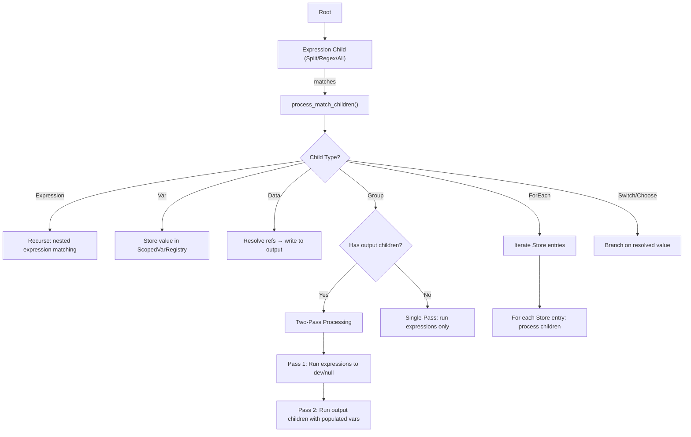

# Ordered Children Engine Refactor — Design Document

## Overview

The DS3 engine processes data via a **tree** of `NodeConfig` nodes. Children under a parent expression execute in order against the same match result. The node editor presents this as a **graph** (DAG) where connections go from output ports to input ports.

A fundamental problem existed: **child execution order was implicit** — determined either by connection creation order (arbitrary) or positional heuristics. This produced unpredictable results when order mattered, particularly for Groups that run two-phase processing (extraction then output).

This refactor introduces **explicit ordered children** via a `children` array on each graph node, replaces the `deferred_output` flag with auto-detected two-pass processing, adds compile-time scope analysis for Var lifetime, and builds a Children Panel UI for drag-and-drop reordering.

---

## Problem Statement

### The Fan-Out Ordering Problem

When a single output port feeds multiple children, the engine executes them sequentially — but the order was determined by connection creation order in the editor, which is non-deterministic:

```
Regex (event_match)
    ├──→ Var (eventContent)      ← must run first (stores match)
    └──→ Group (event_record)    ← must run second (reads var)
```

If the user creates the Group connection before the Var connection, the Var never stores the value before the Group tries to read it.

### The Deferred Output Problem

Groups with both extraction and output children use `deferred_output: true` to run a two-pass execution:
- **Pass 1**: Run expression children (Regex/Split) to capture vars — suppress output
- **Pass 2**: Run output children (Data/Choose) with vars populated

This flag was manually set and easy to forget. Incorrect configuration produced silent data loss.

### The Var Scope Problem

Var lifetime was global by default — vars created inside a Group persisted across iterations, causing stale data from previous matches to leak into subsequent ones.

---

## Key Design Decisions

### 1. Explicit `children` Array on Every Graph Node

Every node in `project.json` gains a `children` field — an ordered array of child node IDs:

```json
{
    "id": "event_match",
    "node_type": "regex",
    "settings": { "pattern": "<Event>(.+?)</Event>" },
    "children": ["n5_var", "event_record_group"]
}
```

The compiler reads children directly from this array instead of inferring order from connections.

**Rationale**: Explicit ordering is deterministic, serializable, and user-editable. Connection-based ordering was inherently ambiguous for fan-out scenarios.

### 2. No Backward Compatibility for `project.json`

All 6 fixture `project.json` files were rewritten with native `children` arrays. Migration code (`migrate_children_order()`) was removed entirely. Only legacy inline tests (constructing `NodeConfig` directly in Rust) remain unchanged.

**Rationale**: The project is pre-release. Carrying migration code adds complexity with no user benefit.

### 3. Auto-Detected Two-Pass Processing (No `deferred_output`)

The `deferred_output` flag was removed from `NodeConfig::Group`. The engine now **auto-detects** whether a Group needs two-pass processing:

```rust
let has_output_children = child.children().iter().any(|c| !c.is_expression());
```

If a Group has both expression children (Split/Regex/All) and output children (Data/ForEach/Choose/Switch), the engine automatically runs two passes.

**Rationale**: The flag was error-prone and redundant — the presence of output children alongside expressions is sufficient to determine two-pass need.

### 4. Compile-Time Var Scope Analysis

No `scope` attribute on Var nodes. The engine determines var lifetime automatically:

| Scope Type | Behaviour |
|-----------|-----------|
| Split/Regex children | Vars freed after each match iteration |
| Group with output children | Vars freed when Group scope pops |
| Promoted vars | Written in inner scope but read in outer scope — pre-registered at appropriate depth |

**Algorithm:**

1. **Collect writes**: Walk `NodeConfig` tree, record each `Var` node and its containing scope boundary
2. **Collect reads**: Scan all `RefExpression` in Data/Choose/If/Switch nodes, record scope boundary
3. **Determine scope**: Find narrowest scope containing both write and all reads
4. **Annotate promotions**: If written at scope X but consumed at ancestor scope Y → register at Y before X runs

**Dynamic var IDs** (e.g. `id: "$1"`) use structural analysis: if all consumers are within the same Group, scope = that Group. Otherwise, default to parent scope.

### 5. `ScopedVarRegistry` with Push/Pop

The var registry uses a scope stack:

```rust
pub struct ScopedVarRegistry {
    scopes: Vec<HashMap<String, Vec<Store>>>,
}
```

- `push_scope()` → enters a Group boundary, creates new scope level
- `pop_scope()` → exits Group, drops all vars created in that scope
- `entry_mut()` → always writes to current (top) scope
- Lookups search from top scope downward (inner scopes shadow outer)

---

## Implementation Phases

### Phase 1: Data Model + `children` Field

- Added `children: Vec<String>` to `ProjectNode` in `types.rs`
- Compiler reads `children` directly for child ordering
- All existing connection-based child inference remains as fallback (temporary)

### Phase 2: ScopedVarRegistry + Push/Pop

- Implemented scope stack with push/pop semantics
- Group boundaries push/pop scope
- `entry_mut()` writes to current scope only
- Lookups traverse scope stack from top

### Phase 3: Fixture Rewrite + Migration Code Removal

- Rewrote all 6 `project.json` fixtures with native `children` arrays
- Removed `migrate_children_order()` from `types.rs`
- Removed `project.migrate_children_order()` call from `projects.rs`
- Removed connection-based fallback from `compile_children()` in `compiler.rs`

### Phase 4: Compile-Time Scope Analysis + Promotion

- Auto-scope analysis for static and dynamic var IDs
- Promotion mechanism for vars consumed outside their defining scope
- CSV header test: header vars promoted to FILE scope → persist across Split iterations
- Deferred scope isolation test: vars created in inner Group freed on exit

### Phase 5: Remove `deferred_output`

- Removed `deferred_output` flag from `NodeConfig::Group`
- Engine auto-detects two-pass need from presence of output children
- Single-pass sequential execution for Groups without output children
- Updated compiler, decompiler, all fixtures

### Phase 6: Children Panel UI

- Expanded nodes show ordered children list with drag handles
- Click row → select + pan to child node
- Drag-and-drop reorder updates `children` array and triggers recompile
- Visual phase boundary marker between extraction and output children

### Phase 7: ForEach Engine Node

See [foreach_design.md](foreach_design.md) for full details.

- `ForEach` iterates multi-valued vars stored in `Store`
- Output-side control flow node (not an expression)
- Requires Group two-pass processing context
- 6 comprehensive tests: basic, XML→JSON, JSON→XML, in-group, inline, multi-line

### Phase 8: Visual Polish (Future)

- Sequence badges on connections
- Scope annotations (`⟨RECORD⟩`, `⟨FILE⟩`) on Group nodes
- Phase markers in children panel

---

## Architecture

### Engine Execution Flow



### Two-Pass Group Processing

```
Group (auto-detected)
├── Pass 1: Expression children → capture vars
│   ├── Split/Regex #1 → Var("key")
│   ├── Split/Regex #2 → Var("val")
│   └── ... (output suppressed)
│
└── Pass 2: Output children → emit structured data
    ├── Data("header")
    ├── ForEach("key") → Data("<"+$key$0+">"+$val$0+"</"+$key$0+">")
    └── Data("footer")
```

### `children` in project.json

```json
{
    "nodes": [
        {
            "id": "split_1",
            "node_type": "split",
            "settings": { "delimiter": "," },
            "children": ["var_item", "group_output"]
        },
        {
            "id": "var_item",
            "node_type": "var",
            "settings": { "id": "item", "value": "$1" }
        },
        {
            "id": "group_output",
            "node_type": "group",
            "children": ["regex_parse", "foreach_emit"]
        }
    ]
}
```

---

## Files Modified

| File | Phase | Change |
|------|-------|--------|
| `shared/src/types.rs` | 1, 3 | `children` field on `ProjectNode`; removed `migrate_children_order()` |
| `engine/src/node.rs` | 2, 5, 7 | `ScopedVarRegistry`; removed `deferred_output`; added `ForEach` variant |
| `engine/src/engine.rs` | 2, 4, 5, 7 | Push/pop scope; auto-detect two-pass; ForEach handler |
| `engine/src/compiler.rs` | 1, 3, 5, 7 | `children`-based compilation; removed fallback; ForEach compilation |
| `engine/src/decompiler.rs` | 5, 7 | Removed `deferred_output` emission; ForEach decompilation |
| `engine/src/store.rs` | 7 | `Store::len()` |
| `engine/src/template_registry.rs` | 7 | ForEach traversal |
| `server/src/projects.rs` | 3 | Removed migration call |
| `node-editor/src/main.rs` | 6 | Children panel component |
| 6× `project.json` fixtures | 3 | Rewritten with native `children` arrays |

---

## Test Coverage

| Test | Phase | What It Verifies |
|------|-------|------------------|
| `test_csv_header_scope` | 4 | Header vars promoted to FILE scope persist across iterations |
| `test_deferred_scope_isolation` | 4 | Vars created in inner Group freed on exit |
| `test_foreach_basic` | 7 | Basic iteration over comma-delimited items |
| `test_foreach_xml_to_json` | 7 | XML-to-JSON conversion via ForEach |
| `test_foreach_json_to_xml` | 7 | JSON-to-XML conversion via ForEach |
| `test_foreach_in_group` | 7 | Nested ForEach within Group scope boundaries |
| `test_foreach_inline` | 7 | Inline ForEach as expression child |
| `test_foreach_multi_line` | 7 | Multi-line input processing |
| All 6 fixture tests | 3 | Round-trip compile/decompile with `children` arrays |

**Total: 234 tests pass, 0 failures, 6 ignored.**

---

## Verification

```bash
# Full test suite
cargo test --package datasplitter-rs

# ForEach tests only
cargo test --package datasplitter-rs test_foreach

# WASM build (node editor)
cargo check --target=wasm32-unknown-unknown --manifest-path node-editor/Cargo.toml
```
