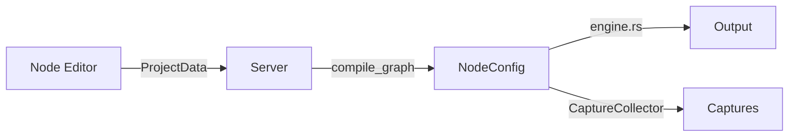
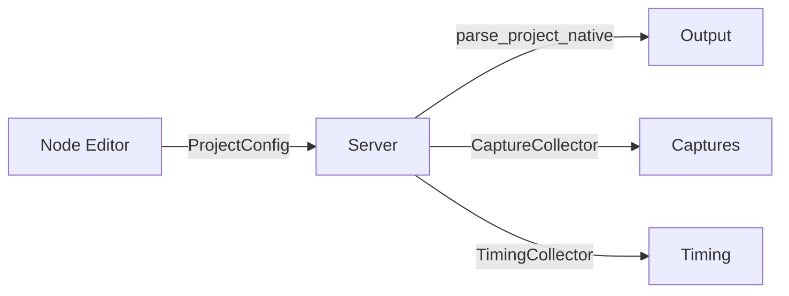

# Phase 7: Single Template Engine — Full Stack Migration

Everything moves to `ProjectConfig` as the canonical format. No legacy `ProjectData` graph format, no old `engine.rs` execution path.

## Architecture Overview

### Current (legacy)


### Target


---

## Phase 7a: Capture Support in Native Engine

Add `CaptureCollector` instrumentation to `native_engine.rs` so match spans are recorded during template execution.

#### [MODIFY] [native_engine.rs](file:///home/jon/work/ds-rs/engine/src/native_engine.rs)

- Add `captures: Option<&CaptureCollector>` parameter to `parse_project_native` and `execute_template`
- Record a `CaptureRecord` on each successful match in `execute_template`:
  - `node_id` = template ID
  - `node_name` = template name
  - `node_type` = match expression type (Regex/Delimiter/etc.)
  - `input_span` = (byte_offset, byte_length) from match result
  - `depth` = recursion depth
  - `match_index` = match count within template
- Thread `captures` through `execute_body`, `execute_apply`, and recursive calls

#### [NEW] `run_native_preview` helper

Convenience function (in `preview.rs` or `native_engine.rs`) that wraps `parse_project_native` with capture collection and returns a `PreviewResult`.

---

## Phase 7b: Timing Support in Native Engine

#### [MODIFY] [native_engine.rs](file:///home/jon/work/ds-rs/engine/src/native_engine.rs)

- Add `timing: Option<&TimingCollector>` parameter alongside captures
- Record template-level timing: invocation count, match count, duration per template

> [!NOTE]
> The old engine times per-node. The native engine times per-template — this is actually better since templates are the user-visible unit.

---

## Phase 7c: Switch Server Handlers

#### [MODIFY] [handlers.rs](file:///home/jon/work/ds-rs/server/src/handlers.rs)

**`handle_preview`**: During transition, the server still receives `ProjectData` from the UI. Convert server-side:
```
ProjectData → compile_graph → NodeConfig → nodeconfig_to_project → ProjectConfig → parse_project_native
```

Once the UI sends `ProjectConfig` directly (Phase 7e), simplify to:
```
ProjectConfig → parse_project_native
```

**`handle_timing`**: Same pattern — compile server-side, run native engine with timing.

**`handle_validate`**: Keep graph validation during transition; replace with `ProjectConfig` validation once UI migrates.

---

## Phase 7d: Project Persistence to ProjectConfig

#### [MODIFY] [projects.rs](file:///home/jon/work/ds-rs/server/src/projects.rs)

- **Save**: Convert `ProjectData` → `ProjectConfig` before persisting to disk
- **Load**: Read `ProjectConfig` from disk
- **Fixtures**: Already in `ProjectConfig` format — loading works directly
- **Return to UI**: During transition, decompile `ProjectConfig` → `ProjectData` for the editor. Once UI migrates (7e), return `ProjectConfig` directly.

#### [MODIFY] [types.rs](file:///home/jon/work/ds-rs/shared/src/types.rs)

- Add `ProjectConfig` to shared types (or re-export from engine)
- Update `PreviewRequest` to accept `ProjectConfig`
- Update `TimingRequest`, `ValidateRequest`, `ExportRequest` similarly

---

## Phase 7e: Node Editor Migration

> [!IMPORTANT]
> This is the largest sub-phase. The node editor currently uses a tree of `Node` objects with `NodeSettings` enums, serialized as `ProjectData`. It needs to work with `ProjectConfig` (flat template list) directly.

#### [MODIFY] [model.rs](file:///home/jon/work/ds-rs/node-editor/src/model.rs)

- Replace `build_project_data` / `editor_project_to_project_data_v2` with `build_project_config`
- Replace `from_project_data_binding_aware` with `from_project_config`
- The editor's internal model (`Node`, `NodeSettings`, `EditorProject`) either:
  - **(A)** Stays as-is with conversion to/from `ProjectConfig` (preserves editing UX), or
  - **(B)** Migrates to template-first internal model (bigger change, better long-term)

#### [MODIFY] [api.rs](file:///home/jon/work/ds-rs/node-editor/src/api.rs)

- `fetch_preview` / `fetch_timing` send `ProjectConfig` instead of `ProjectData`
- `fetch_project` / `save_project` use `ProjectConfig`

#### [MODIFY] [fixtures.rs](file:///home/jon/work/ds-rs/node-editor/src/fixtures.rs)

- Load `ProjectConfig` format directly (already done in engine fixtures)

---

## Phase 7f: Legacy Code Removal

Once all paths use `ProjectConfig` + native engine:

#### [DELETE] Dead engine code
- `engine.rs` — old tree-walking execution engine (~3300 lines)
- `compiler.rs` — `ProjectData` → `NodeConfig` graph compiler (~1300 lines)
- `decompiler.rs` — `NodeConfig` → `ProjectData` reverse compiler
- `template_compiler.rs` — `NodeConfig` → `ProjectConfig` converter (no longer needed if UI produces `ProjectConfig` directly)
- `preview.rs` — old preview wrapper (replaced by native preview)
- `ProjectData`, `ProjectNode`, `ProjectBinding` from shared types

#### [MODIFY] Consolidate
- `node.rs` — `NodeConfig` enum can be removed or reduced to legacy XML support only
- `wiring.rs` — dead var elimination, only needed if `NodeConfig` is retained for XML import

---

## Execution Order

| Sub-phase | Scope | Risk | Blocks |
|-----------|-------|------|--------|
| **7a** Captures in native | Engine only | Low | — |
| **7b** Timing in native | Engine only | Low | — |
| **7c** Server handlers | Server | Medium | 7a, 7b |
| **7d** Persistence | Server + shared | Medium | 7c |
| **7e** Node editor | UI (WASM) | High | 7d |
| **7f** Legacy removal | All crates | Low | 7e |

> [!IMPORTANT]
> **Phases 7a–7c are safe to execute now** — they add native engine capabilities and switch the server without changing the UI wire format. The server compiles `ProjectData` → `ProjectConfig` internally during the transition.
>
> **Phase 7d** changes persistence but can use a conversion layer.
>
> **Phase 7e** is the UI rewrite — largest effort, can be done incrementally.
>
> **Phase 7f** is cleanup — only after everything is proven stable.

## Verification Plan

### Automated Tests
- All 336 existing tests continue to pass
- New capture tests: verify native engine produces same `CaptureRecord` spans as old engine
- Server integration: preview output matches for all fixtures

### Manual Verification
- Start server + node editor
- Load project, run preview — verify output and highlighting
- Click in sample data — verify match stack works
- Run timing — verify per-template stats
- Save/load project — verify round-trip through `ProjectConfig`
