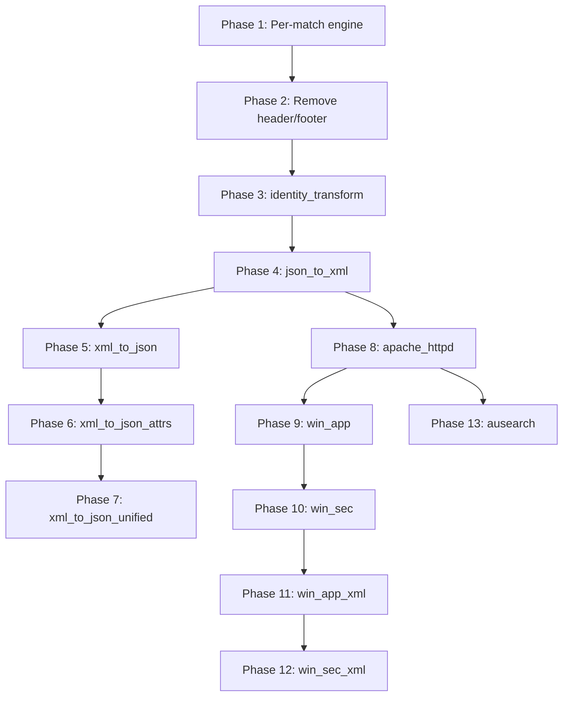

# XSLT-Aligned Template Engine Simplification

Eliminate legacy concepts and align the engine with XSLT's streaming template model. Every template body is a flat sequence of instructions, each writing to the output stream.

Full design document: [xslt_template_simplification.md](file:///home/jon/work/ds-rs/design/xslt_template_simplification.md)

---

## Instruction Model

### Terminology

| Term | XSLT Equivalent | Meaning |
|------|-----------------|---------|
| **Capture** | `regex-group(N)` | A regex match group value from the current match |
| **Variable** | `xsl:variable` | A user-defined named binding |

### Body Instructions

A template body is a flat sequence of instructions. Each writes to the output stream:

| Instruction | XSLT Equivalent | Purpose |
|------------|-----------------|---------|
| `Text` | `xsl:text` | Write literal string → output |
| `ValueOf` | `xsl:value-of` | Write capture or variable value → output |
| `Apply` | `xsl:apply-templates` | Dispatch to sub-templates → output |
| `If` | `xsl:if` | Conditional block |
| `Choose` | `xsl:choose/when/otherwise` | Multi-branch conditional |
| `Variable` | `xsl:variable` | Capture child instruction output into a named variable |

### ValueOf References

`ValueOf` writes a single value to output:

```json
{ "ValueOf": { "capture": 1 } }        // regex group 1
{ "ValueOf": { "capture": 0 } }        // entire match
{ "ValueOf": { "var": "myVar" } }      // named variable
{ "ValueOf": "__match_idx" }            // built-in
```

### Conditions

Conditions test **one ref** against a literal. No composition — if you need a composed value, bind a `Variable` first:

```json
{ "GreaterThan": { "ref": "__match_idx", "value": 0 } }
{ "Contains": { "ref": { "capture": 2 }, "substring": "<" } }
{ "Equals": { "ref": { "capture": 1 }, "value": "oldName" } }
{ "Equals": { "ref": { "var": "tag" }, "value": "record" } }
```

### Variable (xsl:variable)

Captures child instruction output into a named variable for later use:

```json
{ "Variable": { "name": "full_tag", "body": [
    { "Text": "<" },
    { "ValueOf": { "capture": 1 } },
    { "Text": ">" }
]}}
```

### Apply

Dispatches content to sub-templates:

```json
{ "Apply": { "content": { "capture": 0 }, "mode": "fields" } }
{ "Apply": { "content": { "capture": 1 } } }
{ "Apply": { "content": { "var": "extracted" }, "mode": "parse" } }
```

---

## Phase 1: Engine — Per-Match Body Execution

#### [MODIFY] [native_engine.rs](file:///home/jon/work/ds-rs/engine/src/native_engine.rs)

Simplify `execute_template` to **one path**: match → execute body → advance.

- Add `__match_idx` as built-in scoped variable (0-indexed per template execution)
- Remove `two_pass` flag, `scope_per_match` flag, `body_has_foreach` helper
- Remove `ForEach` body instruction
- Every template body executes per match — no accumulation

#### [MODIFY] [template.rs](file:///home/jon/work/ds-rs/engine/src/template.rs)

- Add `ValueOf` instruction (capture group or variable reference → output)
- Add `Variable` instruction (captures child output into named var)
- Remove `ForEach` from body instruction enum
- Rename/refactor `Store`/`Bind` to `Capture`/`Variable`

---

## Phase 2: Engine — Header/Footer → Root Template

#### [MODIFY] [native_engine.rs](file:///home/jon/work/ds-rs/engine/src/native_engine.rs)

- If no root template defined, auto-create: `{ match_expr: All, body: [Apply { capture: 0 }] }`
- Remove source header/footer emission

#### [MODIFY] [template.rs](file:///home/jon/work/ds-rs/engine/src/template.rs)

- Remove from `SourceConfig`: `header`, `footer`, `record_header`, `record_footer`
- Remove from `Template`: `record_header`, `record_footer`
- `SourceConfig` retains: `buffer_size`, `encoding`, `ignore_errors`

---

## Phase 3: Fixture — `identity_transform`

**Input**: `<oldName>Alice</oldName><age>30</age>...` per line
**Output**: `<newName>Alice</newName><age>30</age>...`

```json
{
  "templates": [
    {
      "name": "root",
      "match_expr": { "Delimiter": "\n" },
      "body": [
        { "Apply": { "content": { "capture": 0 }, "mode": "fields" } },
        { "Text": "\n" }
      ]
    },
    {
      "name": "field",
      "mode": "fields",
      "match_expr": { "Regex": "<(\\w+)>(.*?)</\\1>" },
      "body": [
        { "Choose": {
            "branches": [{
              "condition": { "Equals": { "ref": { "capture": 1 }, "value": "oldName" } },
              "body": [
                { "Text": "<newName>" },
                { "ValueOf": { "capture": 2 } },
                { "Text": "</newName>" }
              ]
            }],
            "otherwise": [
              { "Text": "<" },
              { "ValueOf": { "capture": 1 } },
              { "Text": ">" },
              { "ValueOf": { "capture": 2 } },
              { "Text": "</" },
              { "ValueOf": { "capture": 1 } },
              { "Text": ">" }
            ]
        }}
      ]
    }
  ]
}
```

---

## Phase 4: Fixture — `json_to_xml`

**Input**: `{"name":"Alice","age":"30",...}` per line
**Output**: `<records><record><name>Alice</name>...</record></records>`

```json
{
  "source": { "buffer_size": 20000, "encoding": "auto" },
  "templates": [
    {
      "name": "root",
      "match_expr": "All",
      "body": [
        { "Text": "<records>\n" },
        { "Apply": { "content": { "capture": 0 } } },
        { "Text": "</records>\n" }
      ]
    },
    {
      "name": "record",
      "match_expr": { "Delimiter": "\n" },
      "body": [
        { "Text": "<record>" },
        { "Apply": { "content": { "capture": 0 }, "mode": "fields" } },
        { "Text": "</record>\n" }
      ]
    },
    {
      "name": "field",
      "mode": "fields",
      "match_expr": { "Regex": "\"(\\w+)\":\"([^\"]+)\"" },
      "body": [
        { "Text": "<" },
        { "ValueOf": { "capture": 1 } },
        { "Text": ">" },
        { "ValueOf": { "capture": 2 } },
        { "Text": "</" },
        { "ValueOf": { "capture": 1 } },
        { "Text": ">" }
      ]
    }
  ]
}
```

---

## Phase 5: Fixture — `xml_to_json` (recursive)

**Input**: `<record><name>Alice</name><address><city>London</city></address></record>`
**Output**: `{"name":"Alice","address":"city":"London"}`

```json
{
  "templates": [
    {
      "name": "root",
      "match_expr": { "Delimiter": "\n" },
      "body": [
        { "Text": "{" },
        { "Apply": { "content": { "capture": 0 }, "mode": "record" } },
        { "Text": "}\n" }
      ]
    },
    {
      "name": "record_unwrap",
      "mode": "record",
      "match_expr": { "Regex": "<record>(.*)</record>", "flags": { "dot_all": true } },
      "body": [
        { "Apply": { "content": { "capture": 1 }, "mode": "element" } }
      ]
    },
    {
      "name": "element",
      "mode": "element",
      "match_expr": { "Regex": "<(\\w+)>(.*?)</\\1>" },
      "body": [
        { "If": {
            "condition": { "GreaterThan": { "ref": "__match_idx", "value": 0 } },
            "then": [{ "Text": "," }]
        }},
        { "Choose": {
            "branches": [{
              "condition": { "Contains": { "ref": { "capture": 2 }, "substring": "<" } },
              "body": [
                { "Text": "\"" },
                { "ValueOf": { "capture": 1 } },
                { "Text": "\":" },
                { "Apply": { "content": { "capture": 2 }, "mode": "element" } }
              ]
            }],
            "otherwise": [
              { "Text": "\"" },
              { "ValueOf": { "capture": 1 } },
              { "Text": "\":\"" },
              { "ValueOf": { "capture": 2 } },
              { "Text": "\"" }
            ]
        }}
      ]
    }
  ]
}
```

---

## Phase 6: Fixture — `xml_to_json_attrs`

Extends Phase 5 with attribute handling. Adds template for attribute regex with `ValueOf { capture: N }` output.

## Phase 7: Fixture — `xml_to_json_unified`

Combined element+attribute handling.

---

## Phase 8: Fixture — `apache_httpd`

**Current**: 7 templates (1 root + 6 capture-only), source.header/footer
**Proposed**: ~4 templates. Root wraps XML envelope via Text. One big regex body uses `ValueOf { capture: N }` to assemble XML. Sub-templates for CGI/query parsing.

## Phase 9–12: `win_app`, `win_sec`, `win_app_xml`, `win_sec_xml`

**Current**: 44–60 templates (mostly capture-only)
**Proposed**: ~5–7 each. Capture-only templates become sub-templates with `ValueOf`-based bodies or `Variable` bindings.

## Phase 13: Fixture — `ausearch`

**Current**: 8 templates
**Proposed**: ~5 templates with `ValueOf`-based output.

---

## Execution Order



## Verification

Each fixture phase:
1. Rewrite `project.json` by hand
2. `cargo test <fixture_name>` — output must match `example_output.xml`
3. Verify no two-pass or accumulation in execution path
4. Full `cargo test` after all fixtures complete
